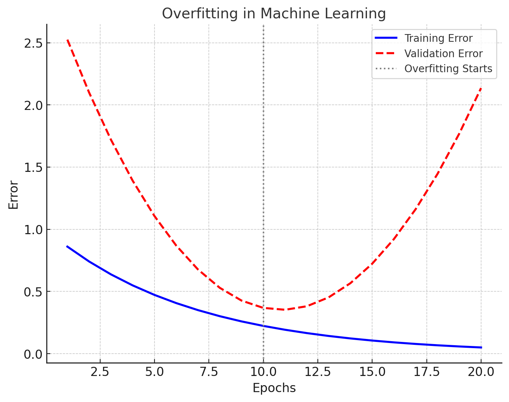

# ⚖️ Day 2 – Underfitting vs Overfitting vs Well-Fitting

Welcome to **Day 2** of **#DailyMLDose**!

Today, we’ll break down three fundamental model behaviors:

> **Underfitting**, **Overfitting**, and the sweet spot: **Well-Fitting** models.

---

## 1️⃣ Underfitting – Too Simple

📉 A model that is **too basic** to learn the patterns in the data.

### 🔍 Symptoms:
- High training error  
- High test/validation error  
- Learns almost nothing

### ⚠️ Causes:
- Model is too linear or shallow  
- Not trained long enough  
- Important features missing  
- Too much regularization

### ✅ Fixes:
- Try more complex models  
- Reduce regularization  
- Add more useful features  
- Train for more epochs

📊 **Visual:**  

---

## 2️⃣ Overfitting – Too Complex

📈 A model that learns **training data too well**, including noise and outliers.

### 🔍 Symptoms:
- Very low training error  
- Very high test error  
- Great at memorizing, bad at generalizing

### ⚠️ Causes:
- Too complex model  
- Not enough training data  
- Too many epochs  
- No regularization

### ✅ Fixes:
- Add regularization (L1/L2, dropout)  
- Use simpler models  
- Get more data  
- Early stopping

📊 **Visual:**  

---

## 3️⃣ Well-Fitting – Just Right 🎯

✨ A balanced model that captures the right patterns and generalizes well.

### 🔍 Characteristics:
- Low training error  
- Low validation/test error  
- Good generalization

### ✅ Achieved by:
- The right model complexity  
- Sufficient data  
- Proper training time  
- Balanced regularization

📊 **Visual:**  

---

## 🧠 Summary Table

| Model Fit         | Training Error | Validation Error | Generalization |
|-------------------|----------------|------------------|----------------|
| Underfitting      | High           | High             | Poor           |
| Overfitting       | Low            | High             | Poor           |
| Best/Well-Fitting | Low            | Low              | Good           |

---

## 🧒 Real-World Analogy:

- **Underfitting**: A toddler trying to classify animals using just color.  
- **Overfitting**: Memorizing each animal’s exact photo instead of learning general traits.  
- **Well-Fitting**: Recognizing animals by core features like number of legs, shape, and behavior.

---

## 🔁 Previous Post:
- [Day 1 → ML Models Overview (Cheat Sheet)](../day01-ml-models-overview/)

---

📌 Stay tuned for **Day 3 → Bias-Variance Tradeoff**

⭐ Star this repo  
📲 Follow [Shadabur Rahaman on LinkedIn](https://www.linkedin.com/in/shadabur-rahaman-1b5703249/) for daily drops  
🔖 Share if this helped you

---

Let’s learn smart, every day. 🚀
