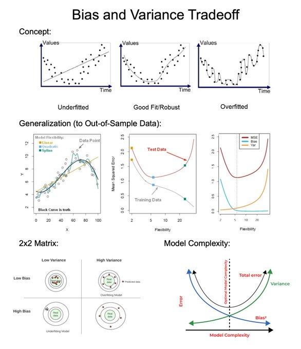
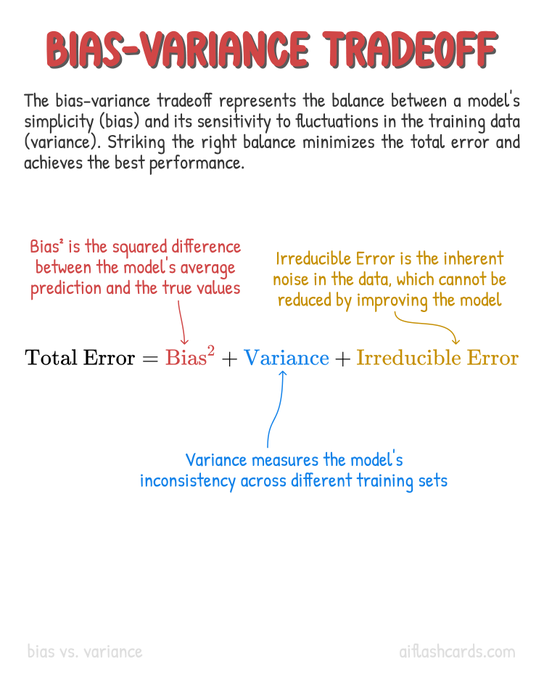
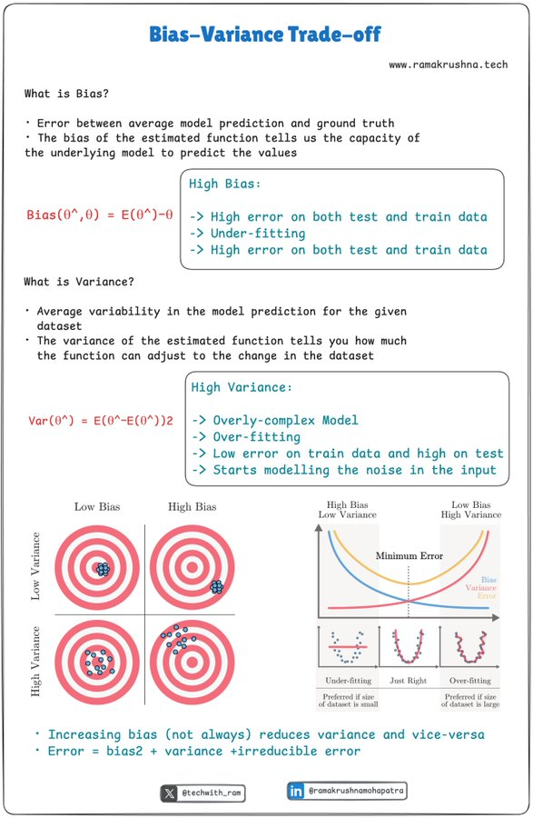

# ⚖️ Day 3 – Bias-Variance Tradeoff in Machine Learning

Welcome to **Day 3** of #DailyMLDose!

Today’s core ML concept is the **Bias-Variance Tradeoff**, one of the most important ideas for understanding model performance.

---

## 📌 What Is It?

The total error in a machine learning model =  
**Bias² + Variance + Irreducible Error**

- **Bias**: Error due to overly simplistic assumptions in the model (e.g., assuming linearity when the relationship is non-linear).  
- **Variance**: Error due to excessive model complexity that makes the model sensitive to small data fluctuations.

---

## 🔍 Symptoms of Each

| Aspect           | High Bias                           | High Variance                        |
|------------------|-------------------------------------|--------------------------------------|
| Behavior         | Underfitting                        | Overfitting                          |
| Training Error   | High                                | Low                                  |
| Validation Error | High                                | High                                 |
| Flexibility      | Too rigid                           | Too flexible                         |
| Example          | Linear model on non-linear data     | Deep neural network on small dataset |

📊 **Visual:**  

---

## 🎯 The Tradeoff

> "Reducing bias often increases variance, and vice versa.  
> The goal is to find the **sweet spot** that minimizes total error."

📈 **Visual Intuition:**  

---

## 🧠 Real-World Analogy

🎯 **Shooting Arrows at a Target**

- High Bias: Arrows are grouped but far from the bullseye  
- High Variance: Arrows are scattered all over  
- Optimal: Arrows are tightly grouped near the center

📷 Illustration:  

---

## 🛠️ How to Balance It

- **Use Cross-Validation**: Helps measure generalization error  
- **Choose Appropriate Model Complexity**  
- **Use Regularization (L1/L2, Dropout)**  
- **Increase Data Size**: Reduces variance  
- **Feature Engineering**: Reduces bias by adding better predictors

---

## 🧩 Summary

| Error Type     | Source                         | Fix                                      |
|----------------|--------------------------------|------------------------------------------|
| Bias           | Simplistic assumptions         | Complex models, more features            |
| Variance       | Too complex / overfit model    | Regularization, simpler model, more data |

---

## 🔁 Previous Post:
- [Day 2 → Underfitting vs Overfitting vs Well-Fitting](../day02-underfitting-overfitting-wellfitting/)

---

## 🎨 Visual & Concept Credits:

- 🧠 Concept Illustration by [@mdancho84](https://x.com/mdancho84)
- 🎯 Bias-Variance Tradeoff Cheatsheet by [@alec_helbling](https://x.com/alec_helbling/status/1897368850104266971)
- 📉 Bias-Variance Graph by [@chrisalbon](https://x.com/chrisalbon/status/1904587087883755813)
- 🎨 Bias-Variance Explanation by [@Hesamation](https://x.com/Hesamation/status/1894104762640900226)
- 🧠 Visual Breakdown by [@tinztwins](https://x.com/tinztwins/status/1920878468327206976)
- 📚 Additional Tradeoff Summary by [@gbertonini](https://x.com/gbertonini/status/1679178010162948096)
- 🎓 Clear Visual Summary by [@vijaykrishna101](https://x.com/vijaykrishna101/status/1647872543528574977)

> Big thanks to these incredible educators and creators for making ML easier to understand!

---

📌 **Follow for more** on [LinkedIn](https://www.linkedin.com/in/shadabur-rahaman-1b5703249)  
⭐ Star the [GitHub Repo](https://github.com/your-username/daily-ml-dose)  
🧠 Let’s keep learning, one smart step at a time.

---

Let’s balance our models and our learning. 🚀

