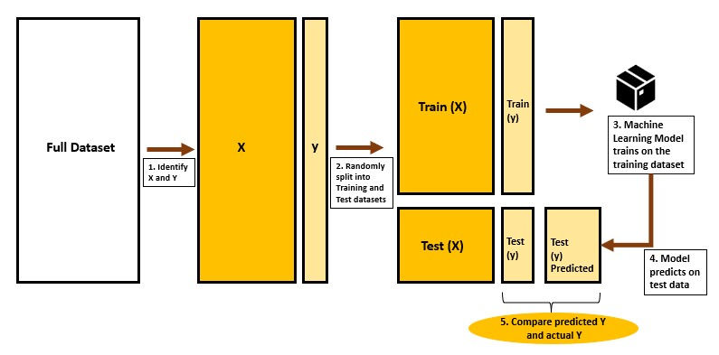
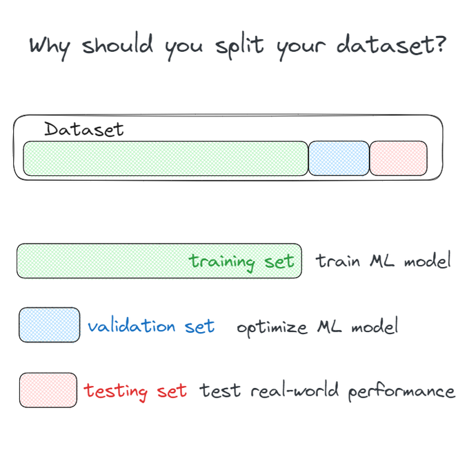
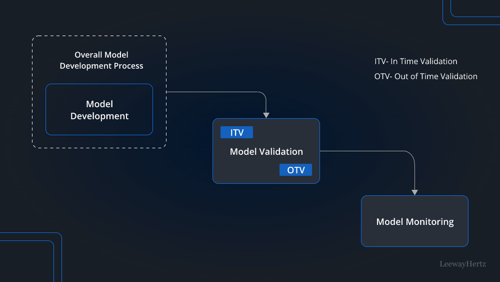

# 🧪 Day 4 – Train-Test Split & Validation Strategies

Welcome to **Day 4** of #DailyMLDose!

Today’s focus is on how to properly evaluate your machine learning models using **train-test splits** and different **validation strategies**.

---

## 📁 Folder Structure
```
day04-train-test-validation/
├── README.md
├── train_test_split_visual.jpg # Visualizing train-test split
├── model-validation-techniques.png # Comparison of validation methods
├── why_to_split_dataset.png # Intuition behind splitting datasets
└── train_test_code_example.py # Python script demonstrating all techniques
```
---

## 🎯 Why This Matters

Evaluating models on the same data they were trained on can lead to **overfitting** and **overconfident accuracy**.

To measure real-world performance, we use:
- ✅ **Train-Test Split**
- 🔄 **K-Fold Cross-Validation**
- ⚖️ **Stratified K-Fold** (for imbalanced datasets)
- 🔬 **Hold-Out Validation**  
- 🧪 **Leave-One-Out (LOO)** for tiny datasets

---

## 🖼️ Visual References

- 
- 
- 

---

## 🧑‍💻 How to Run the Code

### 🔧 Requirements
Make sure you have the following Python libraries installed:
```bash
pip install scikit-learn numpy
```

🚀 Run the Script
```
python train_test_code_example.py
```

This script will:


Load the Iris dataset

Run a basic train-test split

Perform K-Fold and Stratified K-Fold cross-validation

Print accuracy metrics for each strategy

🧠 Real-World Analogy
Think of validation like rehearsals before a live performance.
Your final test set is the real audience — you don’t rehearse in front of them.

🔑 Best Practices
Always reserve a final test set for final evaluation

Use cross-validation during model selection and hyperparameter tuning

Use stratified splits for classification tasks with imbalanced classes

🔁 Previous Days
Day 3 → Bias-Variance Tradeoff

Day 2 → Underfitting vs Overfitting

🖇️ Credits & References
Inspired by Scikit-learn Documentation

Visuals by @machinelearnflx & @sebastianraschka
