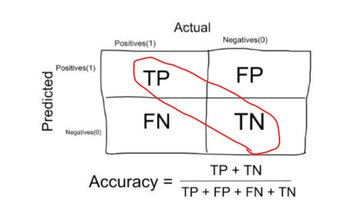
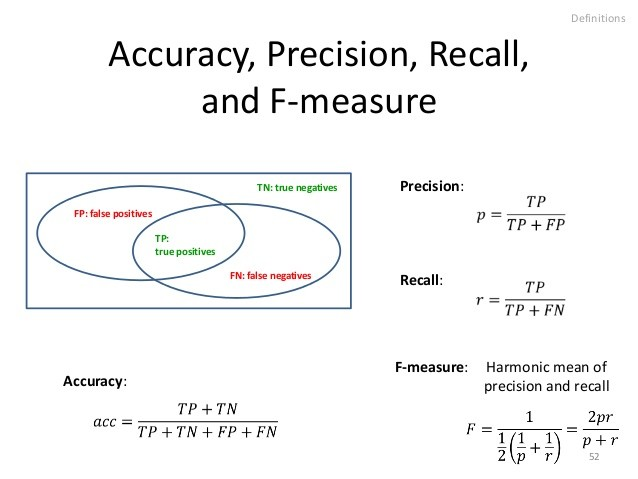
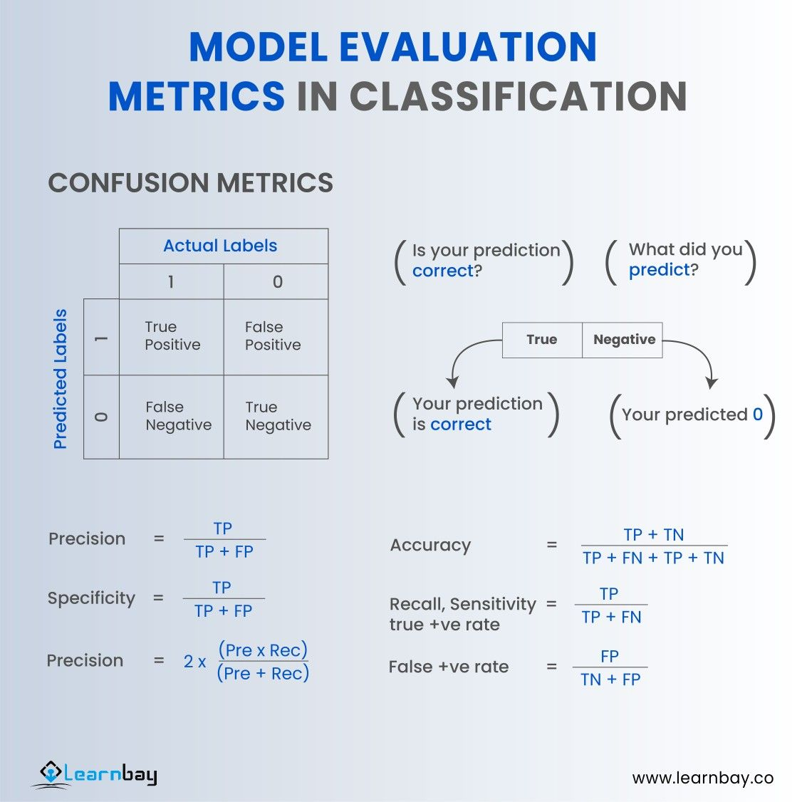

# 📊 Day 5 – Evaluation Metrics: Accuracy, Precision, Recall, F1

Welcome to **Day 5** of #DailyMLDose!

Today’s concept is **Evaluation Metrics** — essential tools to judge how well your machine learning model performs.

---
## Folder Structure
```

DailyMLDose/
└── day05-evaluation-metrics/
    ├── README.md
    ├── confusion_matrix.png
    └── metrics_formula.png
```
## 📌 Key Metrics in Classification

### ✅ Accuracy
The ratio of correctly predicted observations to the total observations.
```
\[
\text{Accuracy} = \frac{TP + TN}{TP + TN + FP + FN}
\]
```


### 🎯 Precision
How many of the predicted positives are actually positive?

\[
\text{Precision} = \frac{TP}{TP + FP}
\]


### ♻️ Recall (Sensitivity)
How many actual positives were correctly predicted?

\[
\text{Recall} = \frac{TP}{TP + FN}
\]


### ⚖️ F1-Score
Harmonic mean of Precision and Recall. Good when you need a balance.

\[
\text{F1} = 2 \times \frac{\text{Precision} \times \text{Recall}}{\text{Precision} + \text{Recall}}
\]

---

---

## 📊 Confusion Matrix

A great way to visualize performance across all metrics:



|               | Predicted Positive | Predicted Negative |
|---------------|--------------------|--------------------|
| **Actual Positive** | TP                 | FN                 |
| **Actual Negative** | FP                 | TN                 |

---

## 📍 When to Use What?

| Scenario                        | Best Metric        |
|---------------------------------|--------------------|
| Balanced classes                | Accuracy           |
| False positives are costly      | Precision          |
| False negatives are costly      | Recall             |
| You need a balance              | F1 Score           |

---

## 💡 Real-World Analogy

📬 **Spam Email Classification**

- **High Precision**: Very few non-spam emails marked as spam  
- **High Recall**: Most spam emails are correctly caught  
- **F1 Score**: Tradeoff between missing spam and flagging valid emails

---

## 🔗 Code Snippet (sklearn)

```python
from sklearn.metrics import accuracy_score, precision_score, recall_score, f1_score

y_true = [1, 0, 1, 1, 0, 1, 0]
y_pred = [1, 0, 1, 0, 0, 1, 1]

print("Accuracy:", accuracy_score(y_true, y_pred))
print("Precision:", precision_score(y_true, y_pred))
print("Recall:", recall_score(y_true, y_pred))
print("F1 Score:", f1_score(y_true, y_pred))

```
📎 Visual Aids

🔁 Previous Post:
Day 4 → [Train-Test Split](./day04-train-test-validation)

📌 Follow for more on [LinkedIn](https://www.linkedin.com/in/shadabur-rahaman-1b5703249/)
⭐ Star the GitHub repo
🎯 Let’s keep evaluating wisely!

