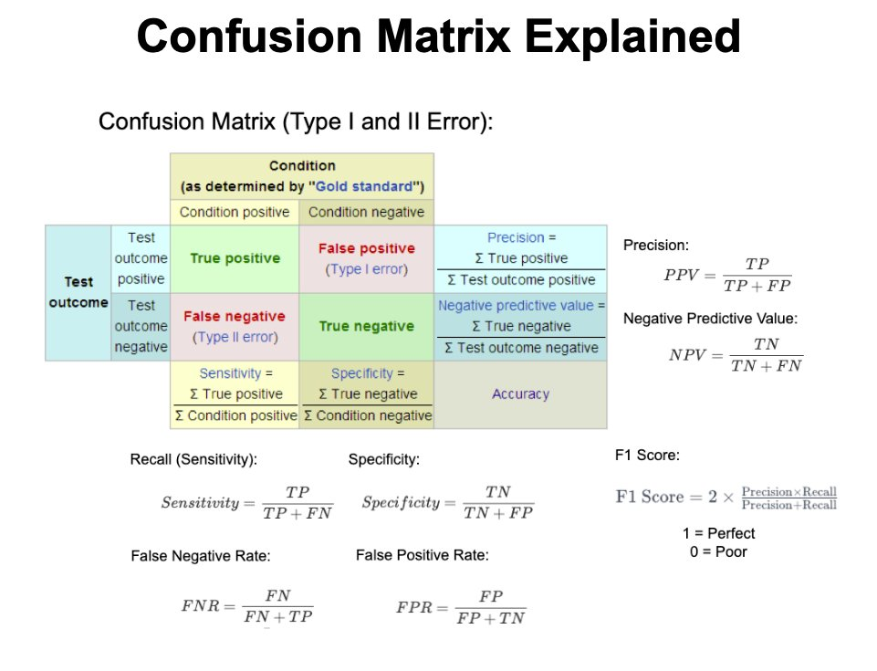
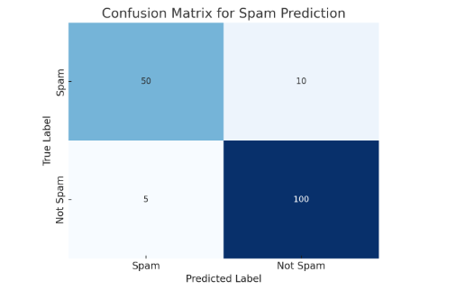
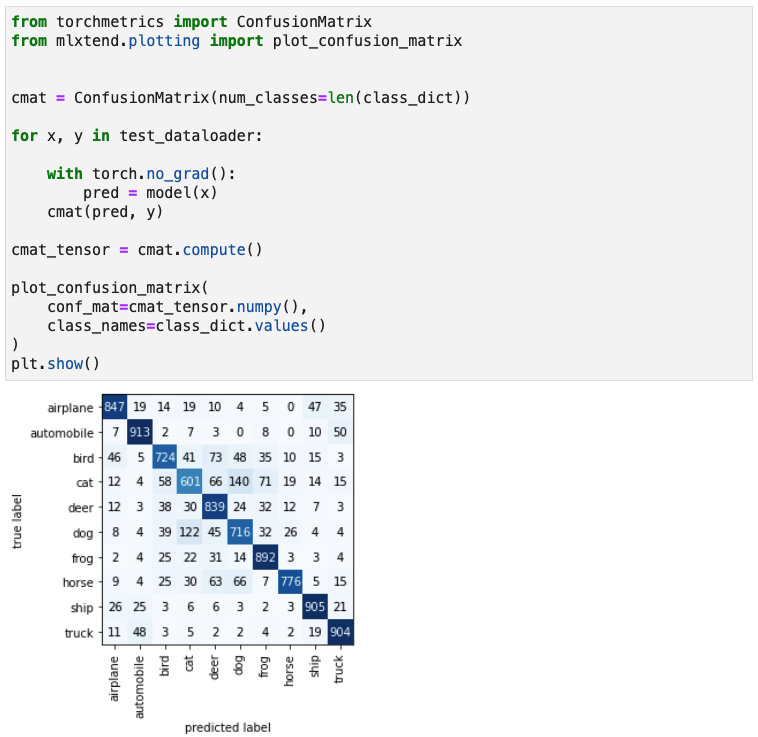
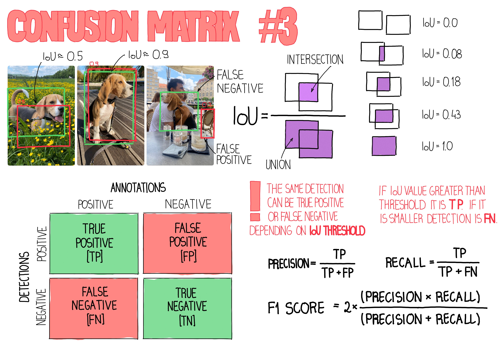

# 🧮 Day 6 – Confusion Matrix in ML

Welcome to **Day 6** of #DailyMLDose!

Today we dive into a **Confusion Matrix** — a fundamental evaluation tool for classification problems.

---
## 🗂️ Folder Structure – day06-confusion-matrix/
```

day06-confusion-matrix/
├── README.md
├── Demo
|     └── confusion_matrix_example.py                  # Python code 
├── confusion_matrix.jpeg                              # Visual explanation
├── confusion_matrix_example_spam_detection.png        # Spam detection confusion matrix
├── confusion_matrix_with_code_snippet.jpeg            # Code Snippet with matrix
└── confusion_matrix_values.jpeg                        # Labeled table version

```
---

## 📌 What Is a Confusion Matrix?

It’s a 2x2 table (for binary classification) showing:

|                | Predicted Positive | Predicted Negative |
|----------------|--------------------|--------------------|
| Actual Positive| True Positive (TP) | False Negative (FN)|
| Actual Negative| False Positive (FP)| True Negative (TN) |

📊 **Visual Representation:**  


---



---

  

---
---

 

---
## 🧠 Why Is It Useful?

It helps compute evaluation metrics like:

- **Accuracy** = (TP + TN) / (Total)
- **Precision** = TP / (TP + FP)
- **Recall** = TP / (TP + FN)
- **F1-Score** = 2 * (Precision * Recall) / (Precision + Recall)

---

## 🐍 Code Snippet (Sklearn Example)

```python
from sklearn.metrics import confusion_matrix, ConfusionMatrixDisplay
from sklearn.model_selection import train_test_split
from sklearn.datasets import load_iris
from sklearn.linear_model import LogisticRegression

X, y = load_iris(return_X_y=True)
y = (y == 0).astype(int)  # Binary classification

X_train, X_test, y_train, y_test = train_test_split(X, y, random_state=42)

model = LogisticRegression()
model.fit(X_train, y_train)

y_pred = model.predict(X_test)

cm = confusion_matrix(y_test, y_pred)
disp = ConfusionMatrixDisplay(confusion_matrix=cm)
disp.plot()
```
🖼️ Output:

🚦 Real-World Analogy
Imagine a COVID test:

TP: Sick person correctly diagnosed as sick

FP: Healthy person incorrectly diagnosed as sick

FN: Sick person wrongly cleared

TN: Healthy person rightly cleared

🔁 Previous Post:
Day 5 → ML Evaluation Metrics

🧠 Visual Credits:
📊 Illustrated table by @Hesamation

🧠 Concept Demo by @chrisalbon

📌 Stay Updated

⭐ Star the GitHub repo

 [Follow Shadabur Rahaman on LinkedIn](https://www.linkedin.com/in/shadabur-rahaman-1b5703249/)  
