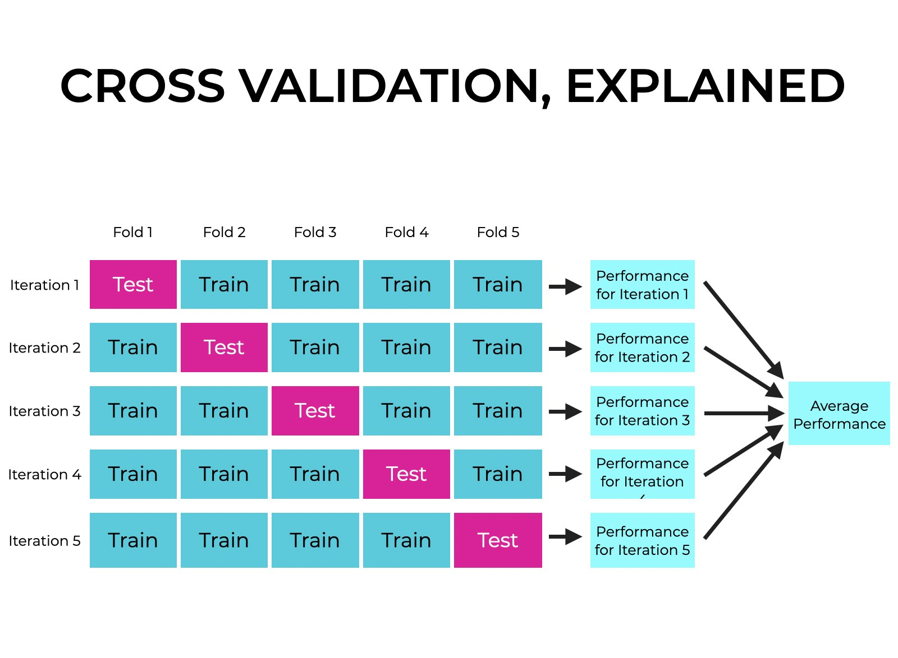
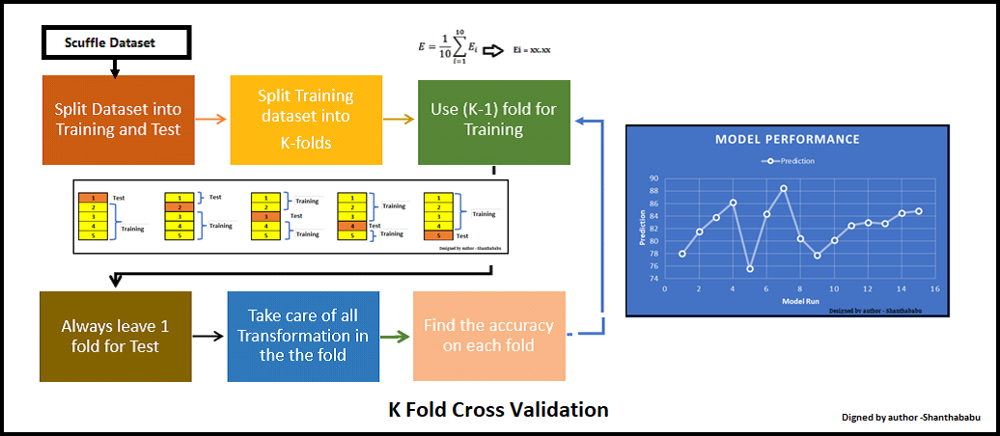
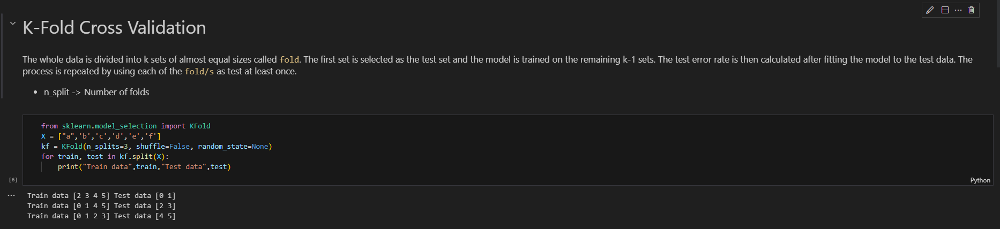
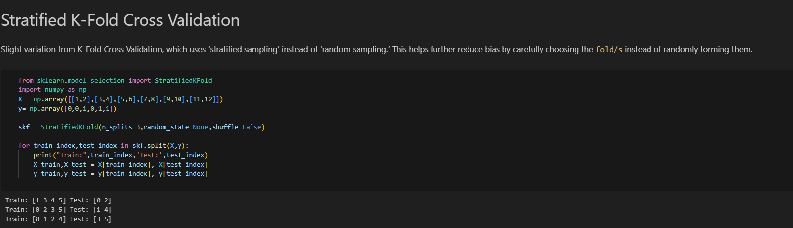
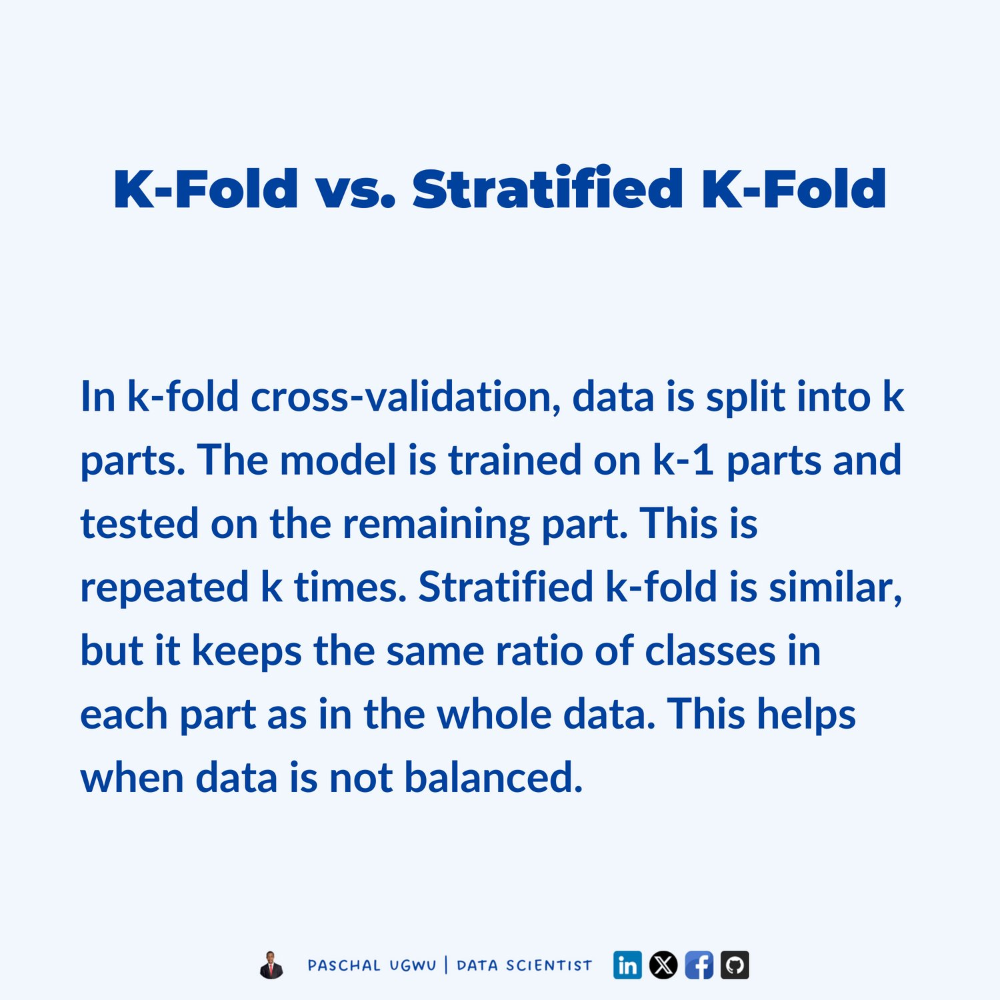

# 🔁 Day 8 – Cross Validation: K-Fold vs Stratified K-Fold

Welcome to **Day 8** of #DailyMLDose!

Today, we're exploring **Cross Validation**, a powerful technique to improve model generalization and reduce overfitting.

---
🗂️ Folder Structure – day08-cross-validation/
```
day08-cross-validation/
|   └──Demo
|      └──  kfold_vs_stratifiedkfold.py                 # Python script
├── README.md
│
├── cross_validation_code_snippet.png           # Code-only view
├── cross_validation_diagram.jpeg               # General CV visual
├── cross_validation_summary.jpeg               # Comparison table/summary visual
│
├── kfold_code_snippet.png                      # K-Fold code visual
├── kfold_diagram.webp                          # K-Fold process image
│
├── stratifiedkfold_code_snippet.png            # Stratified code visual
├── stratified_diagram.png                      # Stratified splitting visual
│
├── kfold_vs_stratifiedkfold_diagram.jpeg       # Side-by-side comparison visual
```
---
## 📌 What is Cross Validation?

Cross-validation is a resampling method used to:
- Estimate model performance on unseen data
- Detect overfitting during training
- Tune hyperparameters robustly

📈 It splits your data into **multiple train-test cycles**.

🧠 Visual Overview:  


---

## 🔍 K-Fold Cross Validation

- Dataset is split into **K equal parts** (folds)
- Model trains on (K-1) folds, tests on the 1 remaining fold
- This repeats **K times**, changing the test fold each time
- The final result is the **average score**

📊 Example: **K = 5**  


💻 Code Snippet:  


---

## 🎯 Stratified K-Fold Cross Validation

- Similar to K-Fold but ensures **class balance** in each fold
- Crucial for **imbalanced classification** problems

📊 Visual Comparison:  


💻 Code Snippet:  


---

## ⚖️ K-Fold vs Stratified K-Fold

📊 Side-by-Side Comparison:  


🧠 Use Stratified when:
- You're working on **classification tasks**
- You have **imbalanced data**

🛠️ Use K-Fold when:
- You're dealing with **regression** or **balanced datasets**

---

## 🧪 Python Demo

```python
from sklearn.datasets import load_iris
from sklearn.model_selection import KFold, StratifiedKFold, cross_val_score
from sklearn.linear_model import LogisticRegression
import numpy as np

X, y = load_iris(return_X_y=True)
model = LogisticRegression(max_iter=1000)

# K-Fold
kf = KFold(n_splits=5, shuffle=True, random_state=42)
kf_scores = cross_val_score(model, X, y, cv=kf)

# Stratified K-Fold
skf = StratifiedKFold(n_splits=5, shuffle=True, random_state=42)
skf_scores = cross_val_score(model, X, y, cv=skf)

print("K-Fold Scores:         ", np.round(kf_scores, 3))
print("Stratified K-Fold Scores:", np.round(skf_scores, 3))
🖼️ Combined Code Logic Snapshot:
```

🧩 Summary
📘 Quick Reference:


Use Case	Method
Balanced Dataset	K-Fold
Imbalanced Dataset	Stratified K-Fold
Classification Tasks	Prefer Stratified
Regression Tasks	Use K-Fold

🔁 Previous:
Day 7 → [ROC vs PR Curves](../day07-precision-vs-recall)

🎨 Visual & Concept Credits:
K-Fold & Stratified Concept: @chrisalbon

Visual Explanation Thread: @Hesamation

📌 Stay Connected:

📌 Follow Shadabur Rahaman

⭐ Star the GitHub repo

 [Follow Shadabur Rahaman on LinkedIn](https://www.linkedin.com/in/shadabur-rahaman-1b5703249/)  


