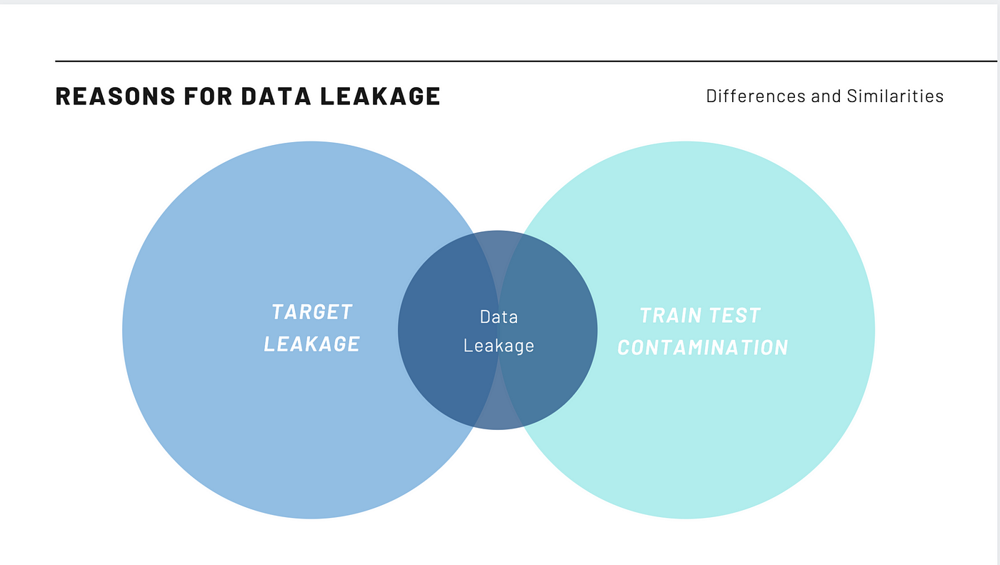

# 🛑 Day 9 – Data Leakage in Machine Learning

Welcome to **Day 9** of #DailyMLDose!

Today’s topic is a critical one: **Data Leakage**, a hidden model killer that silently inflates your model’s performance and destroys its generalization ability.

---

## 📌 What is Data Leakage?

Data leakage occurs when **information from outside the training dataset** is used to create the model. This causes your model to perform unrealistically well during training but fail in production.

---

## 🔍 Common Types of Leakage

📌 **Target Leakage**:  
Features used for training contain **future or label-based information**.

📌 **Train-Test Contamination**:  
Information from the test set "leaks" into the training data, often during preprocessing.

🧠 Visual – Reasons for Data Leakage:  


---

## ❌ Real-World Example of Leakage

```python
from sklearn.preprocessing import StandardScaler
from sklearn.linear_model import LogisticRegression
from sklearn.model_selection import train_test_split
from sklearn.datasets import load_breast_cancer
from sklearn.metrics import accuracy_score

# Load data
X, y = load_breast_cancer(return_X_y=True)
X_train, X_test, y_train, y_test = train_test_split(X, y, random_state=42)

# ⚠️ Incorrect: Fit scaler on entire dataset
scaler = StandardScaler()
X_scaled = scaler.fit_transform(X)  # Leakage happens here!
X_train_leak = X_scaled[:len(X_train)]
X_test_leak = X_scaled[len(X_train):]

model = LogisticRegression()
model.fit(X_train_leak, y_train)
preds = model.predict(X_test_leak)

print("Leaked Accuracy:", accuracy_score(y_test, preds))
📸 Architecture That Causes Leakage:
```
## ✅ Correct Way to Avoid Leakage
```
# Correct: Fit scaler ONLY on training data
scaler = StandardScaler()
X_train_scaled = scaler.fit_transform(X_train)
X_test_scaled = scaler.transform(X_test)

model.fit(X_train_scaled, y_train)
preds = model.predict(X_test_scaled)

print("Correct Accuracy:", accuracy_score(y_test, preds))
```
🧠 Why It’s Dangerous
False confidence from inflated metrics

Models break in production

Can be very subtle (especially with pipelines)

🧠 Visual Summary:

🔐 How to Prevent It
Use pipelines (sklearn.pipeline) to encapsulate transforms

Always split your dataset before preprocessing

Double-check time-based features (timestamps, outcomes)

Use cross-validation properly (folds must be independent)

🧩 Summary
Type	Cause	Example	Fix
Target Leakage	Label-related features	“Delivered” in training for delivery prediction	Remove or delay those features
Test Contamination	Preprocessing before split	Scaling entire dataset before split	Fit transforms only on training data

🔁 Previous:
[Day 8 → Cross Validation: K-Fold vs Stratified](../day08-cross-validation)

🎨 Visual Credits:
Venn + Concept: @ml_diagrams

Architecture & Scaling Flow: @MLTwist

Visual Summary: @krishnaik06

📌 Stay Connected:

⭐ Star the GitHub Repo

🔗  [Follow Shadabur Rahaman on LinkedIn](https://www.linkedin.com/in/shadabur-rahaman-1b5703249/)  
