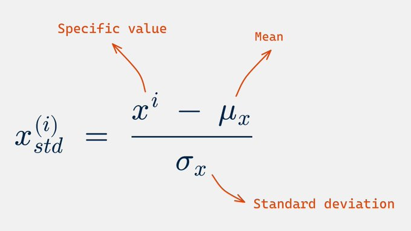
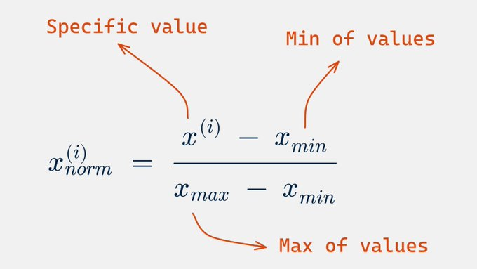
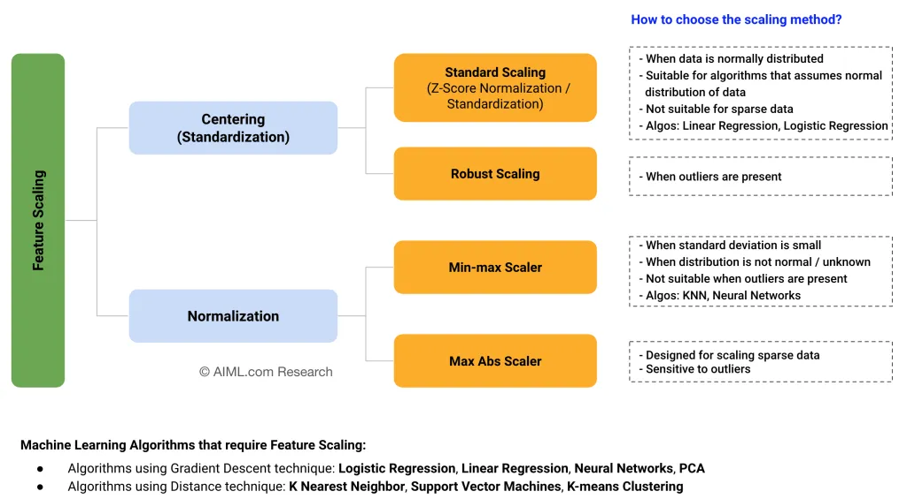
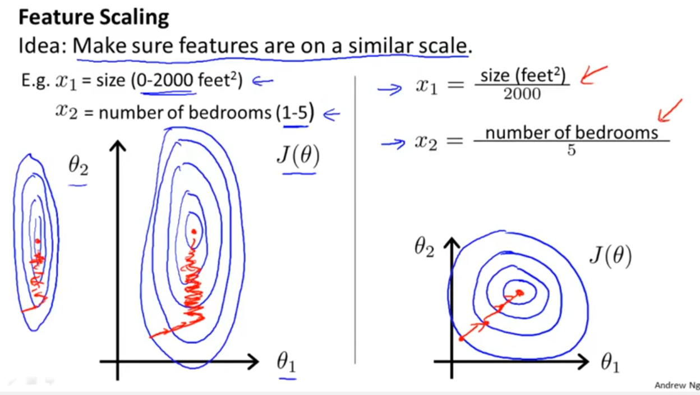
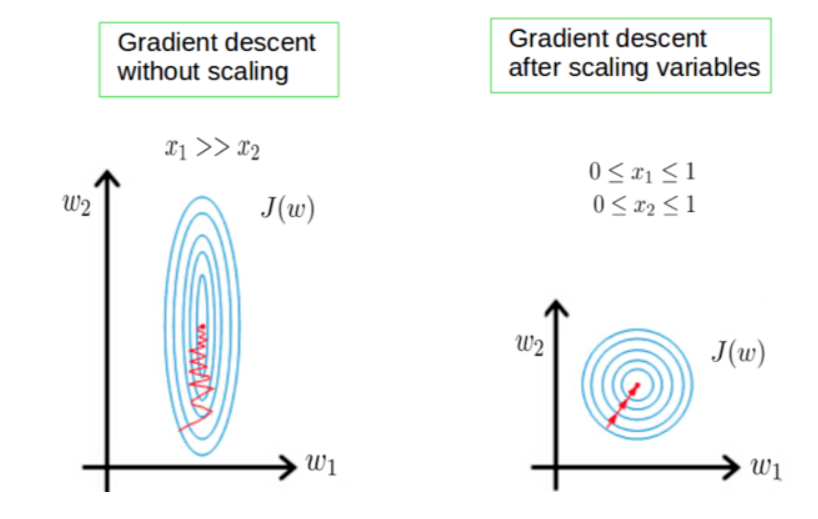

# 📊 Day 10 – Feature Scaling: Standardization vs Normalization

Welcome to **Day 10** of #DailyMLDose!

Today’s concept is crucial for many machine learning models — **Feature Scaling**.

---

## 📌 Why Feature Scaling?

Many ML algorithms perform better when input features are on a similar scale. Without scaling:
- Gradient Descent converges slowly or gets stuck.
- Distance-based models give biased predictions.

---
📁 day10-feature-scaling
```
day10-feature-scaling/
│
├── code/
│   └── scaling_demo.py                # Python code for demoing both methods
├── feature_scaling_visuals.webp       # Gradient descent before vs after scaling
├── feature_scaling_explanation.png    # Andrew Ng's visual on scaling
├── standardization_vs_normalization_visuals.png  # Visual comparison
├── standardization_vs_normalization.png          # Summary visual (tree layout)
├── standardization_formula.jpeg       # Formula: (x - mean) / std
├── normalization_formula.jpeg         # Formula: (x - min) / (max - min)
└──README.md                           # Day 10 markdown explanation
```
---
## ⚖️ Two Major Techniques

### ✅ Standardization (Z-score Normalization)
Formula:
```\[ x_{std}^{(i)} = \frac{x^{(i)} - \mu_x}{\sigma_x} \]```
- Mean = 0, Std Dev = 1
- Handles outliers better than MinMax
- Use when data is **normally distributed**

🖼️ 

---

### ✅ Normalization (Min-Max Scaling)
Formula:
\[ x_{norm}^{(i)} = \frac{x^{(i)} - x_{min}}{x_{max} - x_{min}} \]
- Range: [0, 1]
- Sensitive to outliers
- Use when the distribution is **not known or bounded**

🖼️ 

---

## 🧠 Visual Intuition

### ▶️ Actual → Normalized → Standardized


### 📈 Gradient Descent Impact:


### 🎓 Andrew Ng's Insight:


---

## 🧭 Choosing the Right Method


| Use Case | Method |
|----------|--------|
| Normal distribution | Standardization |
| Unknown distribution | Normalization |
| Outliers present | Standardization / Robust Scaling |
| Sparse data | Max Abs Scaler |

---

## 🧪 Python Code Example
```python
from sklearn.preprocessing import StandardScaler, MinMaxScaler
import numpy as np

# Sample data
X = np.array([[100, 0.001],
              [8, 0.05],
              [50, 0.005],
              [88, 0.07]])

# Standardization
std = StandardScaler()
X_std = std.fit_transform(X)

# Normalization
norm = MinMaxScaler()
X_norm = norm.fit_transform(X)

print("Standardized:\n", X_std)
print("\nNormalized:\n", X_norm)
```

---

## 🔁 Previous Post:
- [Day 9 → Data Leakage](../day09-data-leakage/)

---

## 🎨 Visual Credits:
- Feature Scaling Visual: AIML.com Research
- Gradient Descent Visual: Andrew Ng
- Graph Comparison: @bhattbhavesh91

---

📌 **Follow on [LinkedIn](https://www.linkedin.com/in/shadabur-rahaman-1b5703249)** for daily drops!  
⭐ Star the GitHub repo & support the project.  
💡 Keep learning one smart step at a time!
