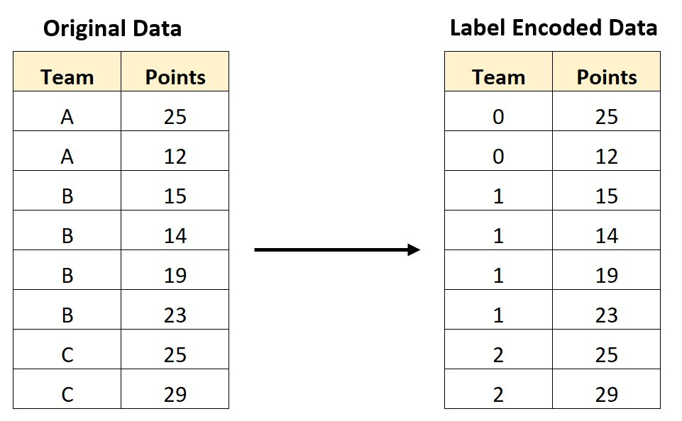
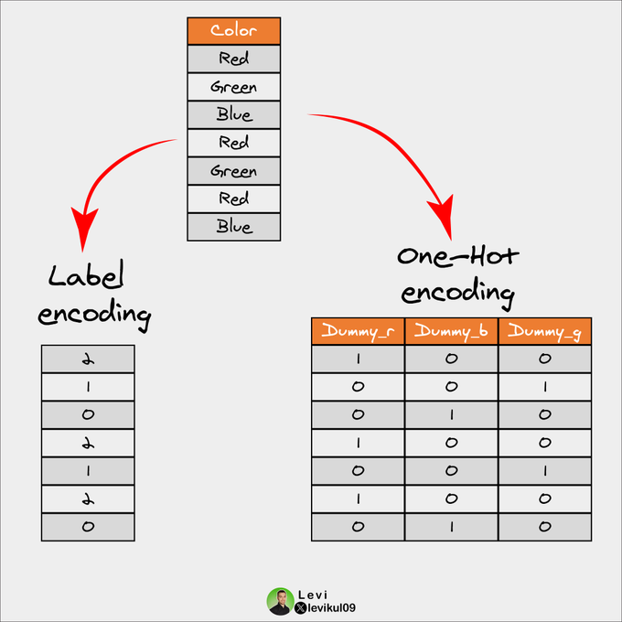
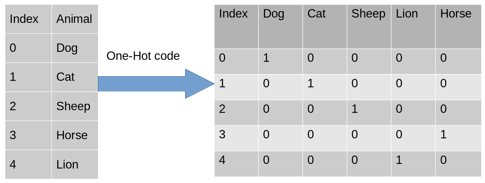
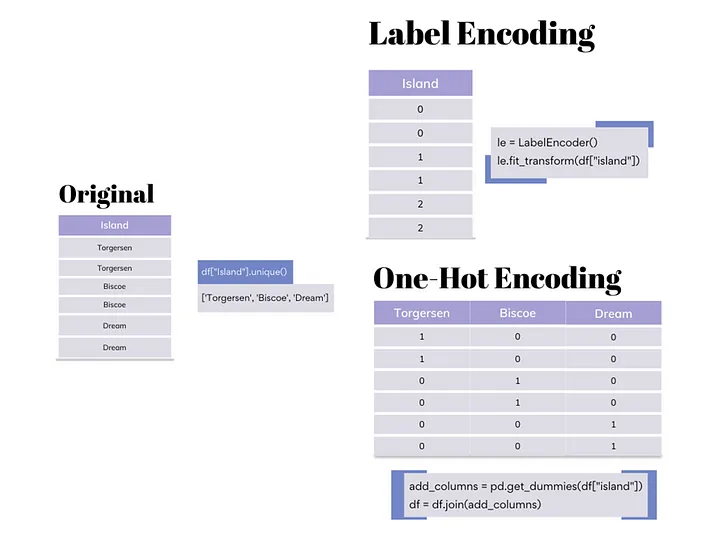
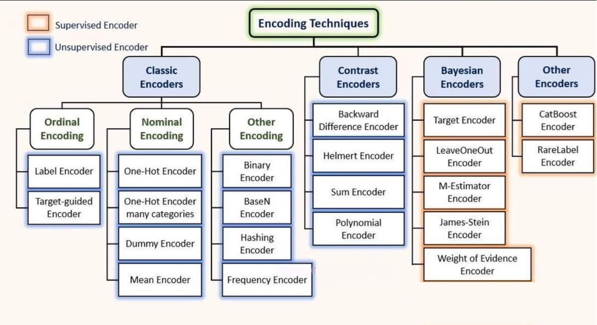
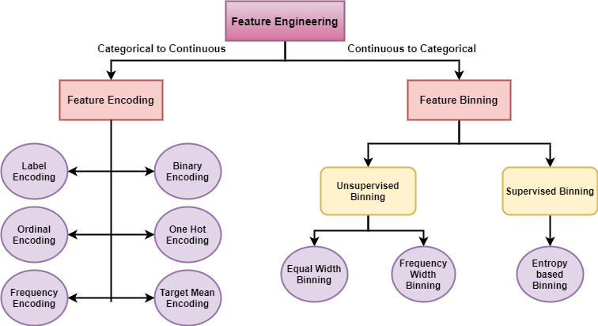
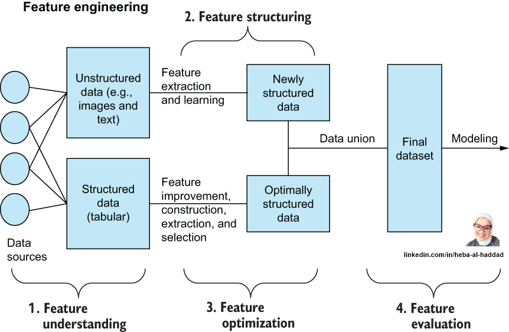

# 📊 Day 11 — Encoding Techniques in Machine Learning

Welcome to Day 11 of the #DailyMLDose challenge!

Today’s focus: **Encoding Techniques**—an essential part of feature engineering where we convert categorical data into numerical form so that models can interpret them.

---

## 🔢 What is Encoding?

Encoding converts **categorical features** (like colors, brands, or locations) into **numerical values**, allowing algorithms to process them.

Two primary types:
- **Label Encoding**: Assigns an integer to each class.
- **One-Hot Encoding**: Creates binary columns for each category.

---

## 🧠 Why Encoding Matters?

- ML models don’t understand strings or text.
- Encoding helps algorithms recognize patterns and relationships in categorical variables.
- Prevents bias in distance-based algorithms (e.g., KNN, SVM).

---

## 🧰 Popular Encoding Techniques

### 1. Label Encoding

---

### 2. One-Hot vs Label Encoding Visual

---

### 3. Basic One-Hot Encoding

---

### 4. One-Hot + Label Encoding Implementation Example

---

### 5. Complete Encoding Pipeline (Tree View)

---

### 6. Types of Encoding Techniques (Detailed Flow)

---

### 7. When to Use What? (Encoding Insights)

---

## 🧪 Sample Code

See [`code/encoding_examples.py`](code/encoding_examples.py) for a hands-on demo using:
- `LabelEncoder`
- `OneHotEncoder`
- `pandas.get_dummies`

---

## 🧠 Pro Tip

> Use Label Encoding when the **order matters**.  
> Use One-Hot Encoding when each class is **independent** and equally important.

---

## 🚀 Stay Tuned!

Tomorrow's topic: Feature Selection and Dimensionality Reduction

Let’s keep building! 💪  
#ML #DataScience #FeatureEngineering #Encoding #DailyMLDose
