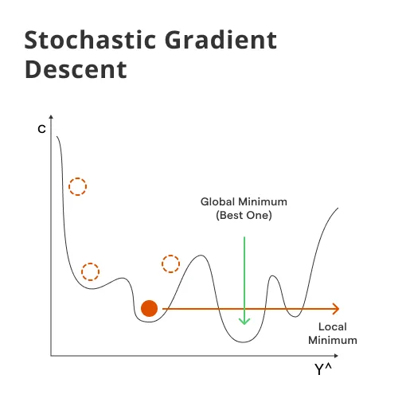

# 🛠️ Day 12 – Gradient Descent Variants: SGD, RMSProp, Adam

Welcome to **Day 12** of #DailyMLDose!

Today we’re diving into the optimization engine that powers most modern machine learning models — **Gradient Descent**, and its most powerful variants: **SGD**, **RMSProp**, and **Adam**.

---

## 📌 What is Gradient Descent?
Gradient Descent is an optimization technique that minimizes a loss function by iteratively updating model weights in the direction of the steepest descent.

w := w - learning_rate * gradient


It’s how neural networks learn — one tiny step at a time.

---

📂 Folder Structure – `day12-gradient-descent-variants/`
```
day12-gradient-descent-variants/
├── README.md
├── code/
│   └── gradient_descent_variants.py
└── images/
    ├── adam-optimization-visual.webp
    ├── adam-optimization.webp
    ├── Gradient-Descent-graph.webp
    ├── Gradient-Descent-visual.png
    ├── Gradient_Descent_Variants.webp
    ├── RMSProp_3d_graph.png
    ├── RMSProp_visual.png
    ├── Stochastic_Gradient_Descent_graph.webp
    └── Stochastic_Gradient_Descent_visual.png
```
---

## 🔍 Popular Variants of Gradient Descent

📌 **Batch Gradient Descent**
- Updates weights after computing gradient on the **entire dataset**.
- Very accurate but slow and memory-intensive.

📌 **Stochastic Gradient Descent (SGD)**
- Updates weights after each training sample (1 sample per update).
- Faster but high variance → noisy path.

📸 Visuals:
  


📌 **Mini-Batch Gradient Descent**
- Updates after small batches (e.g., 32 or 64 samples).
- Efficient, stable, and the go-to for deep learning.

📌 **RMSProp**
- Adapts learning rates using a **moving average of squared gradients**.
- Handles non-stationary objectives and vanishing gradients.

📸 Visuals:
  


📌 **Adam Optimizer**
- Combines **Momentum** and **RMSProp**.
- Maintains moving averages of gradient (1st moment) and squared gradient (2nd moment).
- Default optimizer in many DL frameworks (PyTorch, TensorFlow).

📸 Visuals:
  


---

## 🎯 Concept Visualizations
  
  


---

## 🧠 Summary Table
```
| Optimizer      | Update Speed | Path Variability | Learning Rate Adaptation | Best For                  |
|----------------|--------------|------------------|---------------------------|---------------------------|
| Batch GD       | Slow         | Low              | ❌                        | Small datasets            |
| SGD            | Fast         | High             | ❌                        | Real-time/streaming tasks |
| Mini-Batch     | Moderate     | Medium           | ❌                        | Deep learning models      |
| RMSProp        | Fast         | Smooth           | ✅                        | RNNs, non-stationary data |
| Adam           | Fastest      | Stable           | ✅                        | Deep learning & NLP       |
```
---

## ✅ Real-World Benefits
- Faster convergence in deep models  
- Better performance in noisy and sparse data  
- Handles exploding or vanishing gradients  

---

## 🔁 Previous:
[Day 11 → One-Hot vs Label Encoding](../day11-encoding)

---

## 🎨 Visual Credits:
- Adam/RMSProp Visuals: [@ml_insights](https://x.com/ml_insights)  
- Optimizer Summary Charts: [@ml_diagrams](https://x.com/ml_diagrams)  
- SGD Graphs: [@deeplearning_ai](https://x.com/deeplearning_ai)  

---

📌 Stay Connected:  
- ⭐ Star the GitHub Repo  
- 🔗 [Follow Shadabur Rahaman on LinkedIn](https://www.linkedin.com/in/shadabur-rahaman-1b5703249/)  

Let’s optimize our learning — one gradient step at a time! 🚀
