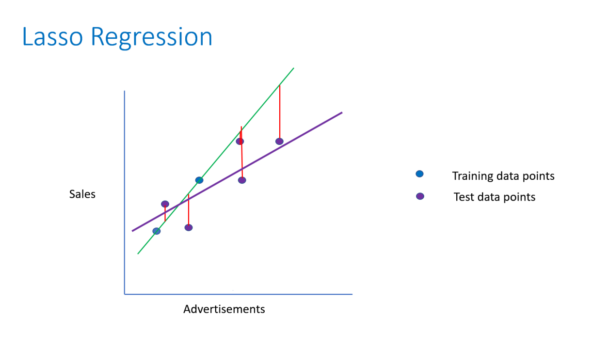
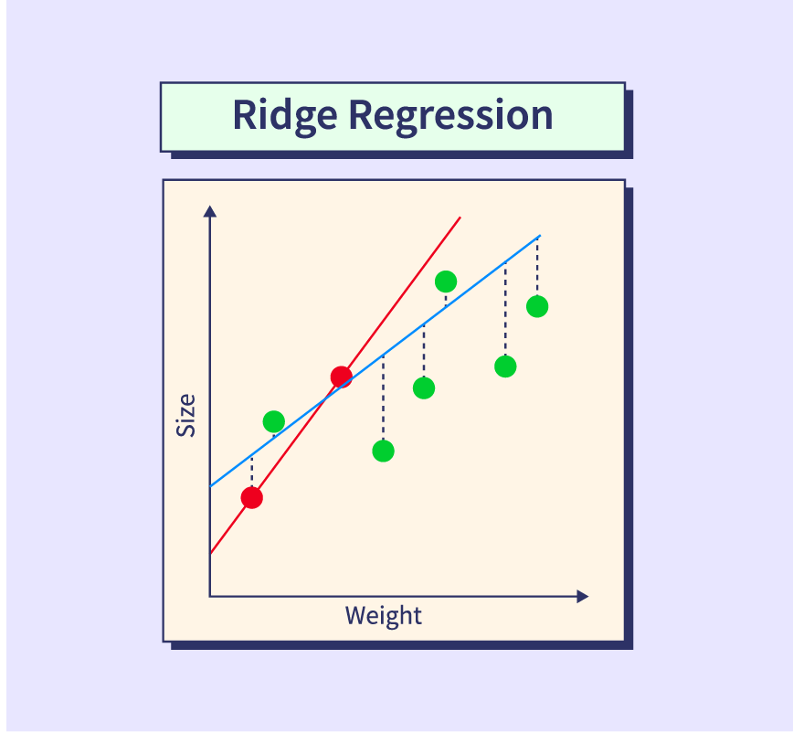
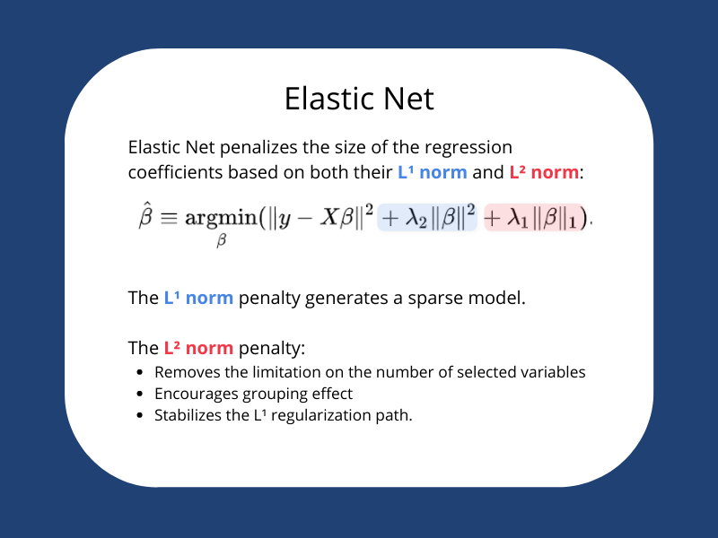
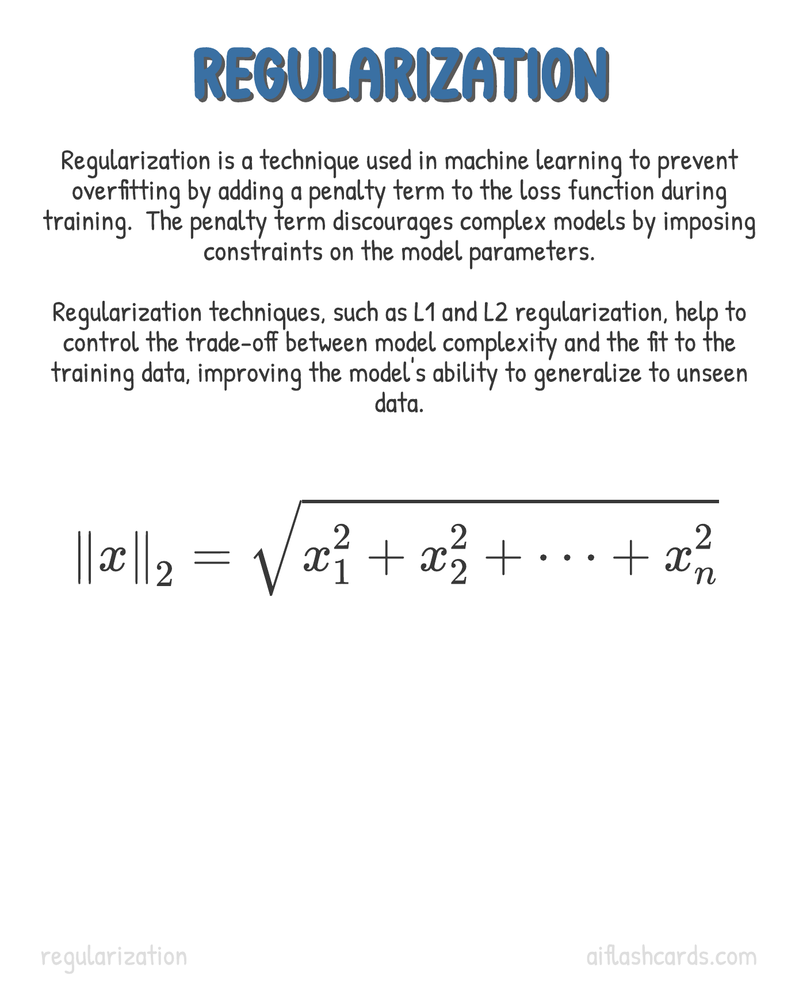
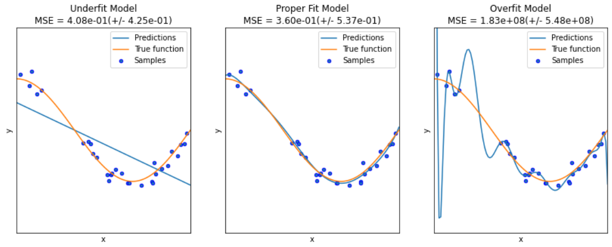

# 🧮 Day 13 – Regularization in ML: L1, L2 & ElasticNet

Welcome to **Day 13** of #DailyMLDose!

Today’s concept is **Regularization**, a powerful technique to prevent **overfitting** in machine learning models by adding a penalty term to the loss function.

---

## 📌 Why Regularization?

Machine learning models may perform **too well** on training data and generalize poorly to unseen data — this is **overfitting**.  
Regularization combats this by discouraging the model from learning overly complex patterns.

---

📂 Folder Structure – `day13-regularization/`
```
day13-regularization/
├── images/
│ ├── difference_between_L1_&L2&elasticNet.png
│ ├── elastic-net-regression-visually-equation-explained-1.webp
│ ├── formulas_of_L1&L2&elasticNet.png
│ ├── lasso_regression.png
│ ├── Regularization_explanation.png
│ ├── Regularization_formulas.jpeg
│ ├── ridge-regression-in-machine-learning.webp
│ └── vsiuals_between_L1&L2&_elasticNet.png
├── code/
│ └── regularization_examples.py
└── README.md
```

---

## 🧪 Types of Regularization

### 🔹 L1 Regularization (Lasso)
- Adds **absolute values** of coefficients as penalty.
- Can shrink some coefficients to **zero** → performs **feature selection**.

📸  


### 🔹 L2 Regularization (Ridge)
- Adds **squared values** of coefficients as penalty.
- Shrinks coefficients smoothly but doesn’t eliminate them.

📸  


### 🔹 ElasticNet
- A combination of **L1 and L2** regularization.
- Balances sparsity and smooth shrinkage.

📸  


---

## 📈 Visual Summary

📊 L1 vs L2 vs ElasticNet Comparison:  
  

📊 Visual Explanation:  
  
  
  


---

## 🧠 When to Use What?

| Regularization | Best For                              | Effect on Coefficients        |
|----------------|----------------------------------------|-------------------------------|
| L1 (Lasso)     | Feature selection, sparse models       | Some weights → 0              |
| L2 (Ridge)     | Multicollinearity, smooth solutions    | All weights shrink uniformly  |
| ElasticNet     | Combines L1 and L2 advantages          | Sparse + smooth shrinkage     |

---

## 🛠️ Sample Code

```python
from sklearn.linear_model import Lasso, Ridge, ElasticNet
from sklearn.datasets import load_boston
from sklearn.model_selection import train_test_split

X, y = load_boston(return_X_y=True)
X_train, X_test, y_train, y_test = train_test_split(X, y)

lasso = Lasso(alpha=0.1)
ridge = Ridge(alpha=1.0)
elastic = ElasticNet(alpha=0.1, l1_ratio=0.5)

lasso.fit(X_train, y_train)
ridge.fit(X_train, y_train)
elastic.fit(X_train, y_train)
```
🔁 Previous:
Day 12 → Gradient Descent Variants

🎨 Visual Credits:
Lasso/Ridge Visuals: @ml_diagrams

ElasticNet Formula: @ml_cheats

Visual Comparisons: @krishnaik06, @vijaykrishna101

📌 Stay Updated

- ⭐ Star the GitHub Repo
  
- 🔗 [Follow Shadabur Rahaman on LinkedIn](https://www.linkedin.com/in/shadabur-rahaman-1b5703249/)  

Keep your models lean, clean, and regularized. 🚀
#DailyMLDose #MachineLearning #Regularization #Lasso #Ridge #ElasticNet #MLTips #ShadaburRahaman
