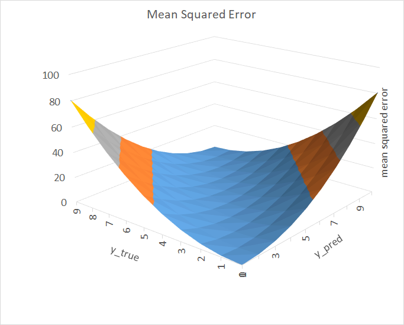
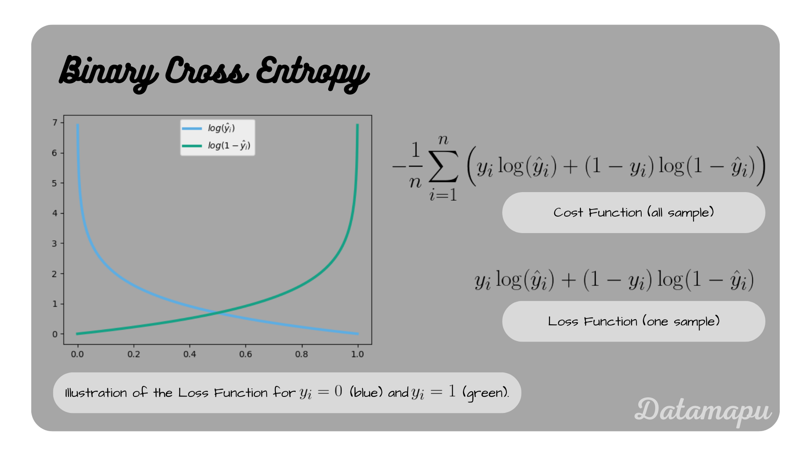
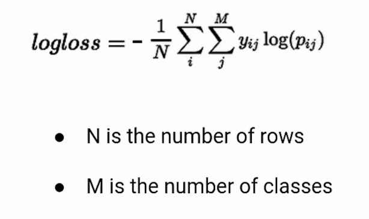
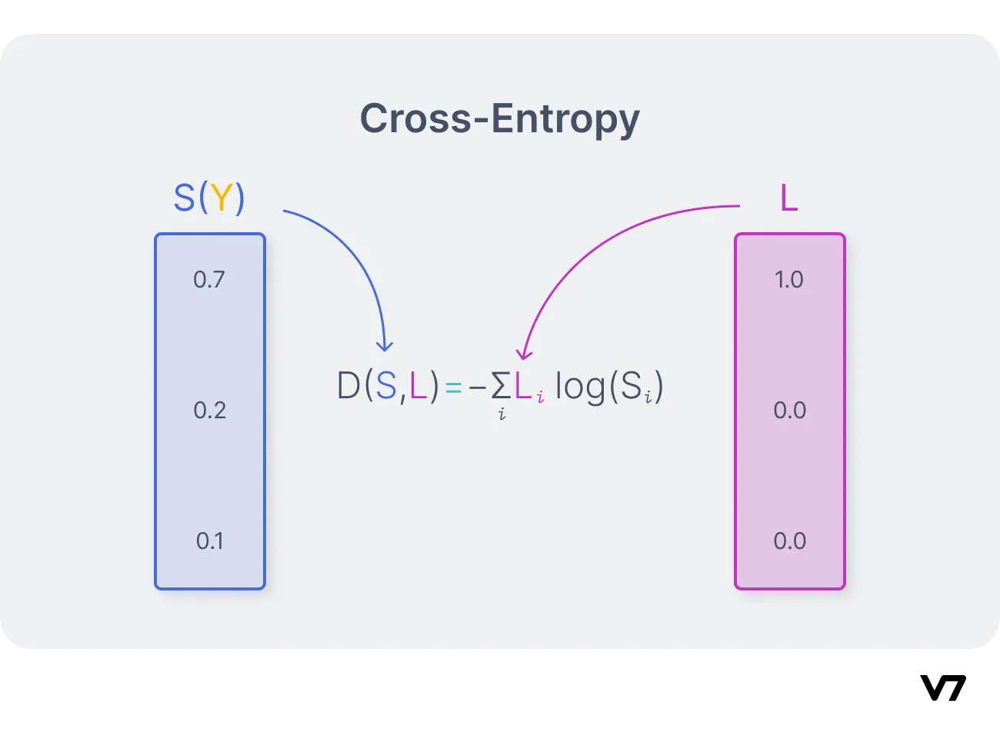
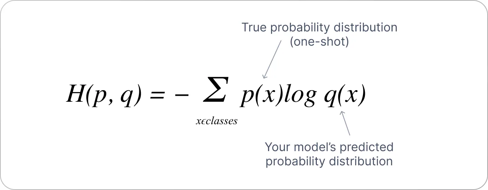
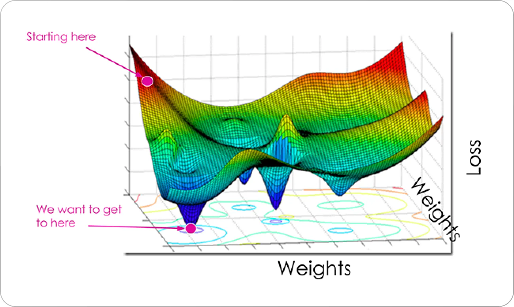
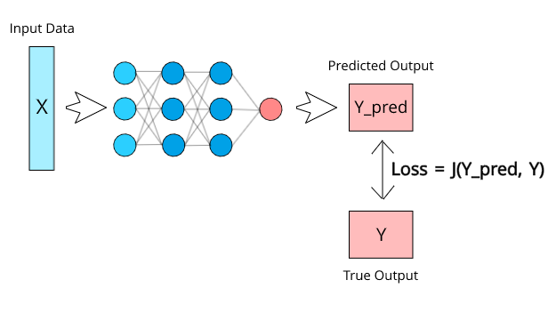

# 📉 Day 14 – Loss Functions in Machine Learning: MSE, BCE, Cross-Entropy

Welcome to **Day 14** of #DailyMLDose!

Loss functions measure how far your model's predictions are from the actual values — they are the **core signal** for model training.

---

## 📌 Why Loss Functions Matter?

Loss functions tell your model *how wrong* it is.

The optimizer uses the **gradient of the loss** to update weights and improve performance during training. Choosing the right loss function is **crucial for task-specific success**.

---

📂 Folder Structure – `day14-loss-functions/`
```
day14-loss-functions/
├── images/
│ ├── bce_visuals.png
│ ├── bse_formula.webp
│ ├── cross_entropy.webp
│ ├── cross_entropy_formula.webp
│ ├── cross_entropy_visuals.webp
│ ├── loss_functions_explained.png
│ ├── mse_formula.png
│ └── mse_visuals.png
├── code/
│ └── loss_functions_demo.py
└── README.md
```


---

## 🔍 Types of Loss Functions

### 🟩 Mean Squared Error (MSE)
- Common in **regression** tasks  
- Measures squared difference between prediction and ground truth  
- Penalizes large errors more heavily

📸  
  


---

### 🟥 Binary Cross Entropy (BCE)
- Used for **binary classification**
- Penalizes confident wrong predictions heavily

📸  
  


---

### 🟦 Cross-Entropy Loss
- Used for **multi-class classification**
- Measures the dissimilarity between two probability distributions

📸  
  
  


---

## 🧠 Visual Summary

📊  


---

## 🧪 Python Demo

See [`loss_functions_demo.py`](code/loss_functions_demo.py) for code comparing these loss functions on toy datasets.

---

## 🧩 Quick Reference Table

| Loss Function     | Task Type            | Sensitivity         | Formula Summary                        |
|-------------------|----------------------|----------------------|----------------------------------------|
| MSE               | Regression           | Large errors         | (y_pred - y_true)^2                    |
| BCE               | Binary Classification| Confident wrong preds| -[y log(p) + (1-y) log(1-p)]           |
| Cross Entropy     | Multi-class Classification | Log loss     | -Σ y log(p)                            |

---

## 🔁 Previous:
[Day 13 → Regularization: L1, L2, ElasticNet](../day13-regularization)

---

## 🎨 Visual Credits:
- BCE/MSE Graphs: @ml_diagrams  
- Cross Entropy Diagrams: @seeingthecode  
- Summary Charts: @vijaykrishna101

---

📌 Stay Connected:
- ⭐ Star this GitHub Repo  
- 🔗 [Follow Shadabur Rahaman on LinkedIn](https://www.linkedin.com/in/shadabur-rahaman-1b5703249)

Train loss? Validation loss? Now you know what they really mean. 💡  
Let’s keep optimizing! 🚀
