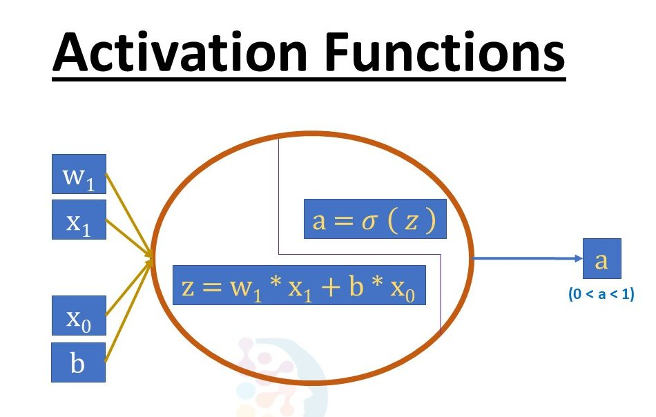
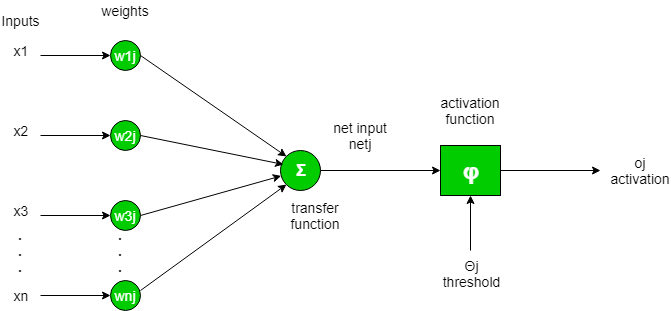
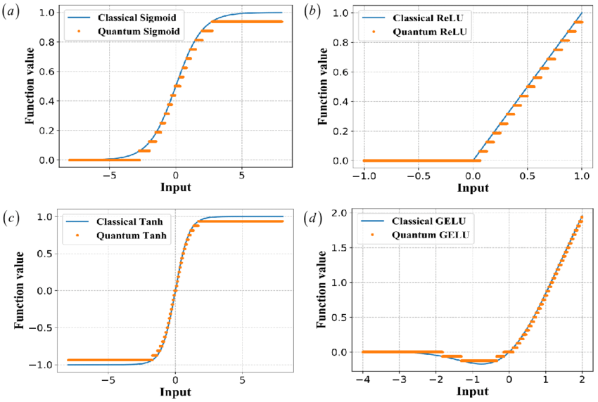
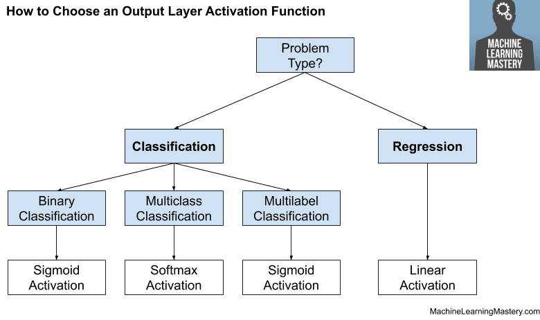
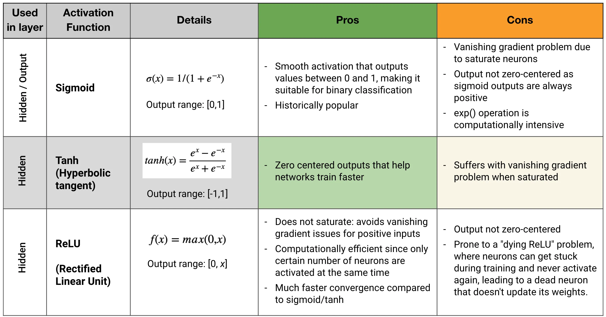

# ⚡ Day 15 – Activation Functions in ML: ReLU, Sigmoid, Tanh, GELU

Welcome to **Day 15** of #DailyMLDose!

Activation functions are what make neural networks **non-linear** and **powerful**. They help your model learn complex patterns, encode probabilities, and allow deep networks to stack multiple layers.

---

## 📌 What Are Activation Functions?

An **activation function** determines whether a neuron should be activated or not by applying a mathematical transformation to the weighted input.

They are essential to:
- Introduce **non-linearity**
- Enable **backpropagation**
- Scale outputs within a certain range

---

📂 Folder Structure – `day15-activation-functions/`
```
day15-activation-functions/
├── images/
│ ├── Activation-function-pros-and-cons-1.webp
│ ├── activation_functions.jpg
│ ├── activation_functions_flow_diagram.png
│ ├── Different-types-of-activation-functions-a-Sigmoid-b-ReLU-c-Tanh-and-d-GELU.png
│ └── How-to-Choose-an-Output-Layer-Activation-Function.webp
├── code/
│ └── activation_functions_demo.py
└── README.md
```

---

## 🔍 Key Activation Functions

### 🔸 **ReLU (Rectified Linear Unit)**
- Formula: `f(x) = max(0, x)`
- Pros: Simple, fast, works well with deep networks
- Cons: Can "die" if neurons output only 0

### 🔸 **Sigmoid**
- Formula: `f(x) = 1 / (1 + e^-x)`
- Pros: Probabilistic output (0 to 1)
- Cons: Vanishing gradients for large inputs

### 🔸 **Tanh**
- Formula: `f(x) = (e^x - e^-x) / (e^x + e^-x)`
- Pros: Output between -1 and 1 (zero-centered)
- Cons: Still suffers from vanishing gradient

### 🔸 **GELU (Gaussian Error Linear Unit)**
- Formula: `f(x) = x * Φ(x)` where Φ is the CDF of the normal distribution
- Pros: Smooth like tanh, powerful for Transformers
- Cons: More computationally intensive

---

## 🧠 Visual Comparison

📊  
  
  
  
  


---

## 🧪 Python Demo

See [`activation_functions_demo.py`](code/activation_functions_demo.py) for code examples of each function using NumPy and PyTorch.

---

## 🧩 Summary Table

| Activation | Range       | Non-Linearity | Zero-Centered | Usage                        |
|------------|-------------|----------------|---------------|------------------------------|
| Sigmoid    | 0 to 1      | ✅             | ❌            | Binary classification        |
| Tanh       | -1 to 1     | ✅             | ✅            | Hidden layers (early NN)     |
| ReLU       | 0 to ∞      | ✅             | ❌            | CNNs, deep learning models   |
| GELU       | Varies      | ✅             | ✅            | Transformers, NLP models     |

---

## 🔁 Previous:
[Day 14 → Loss Functions: MSE, BCE, Cross-Entropy](../day14-loss-functions)

---

## 🎨 Visual Credits:
- Comparison Charts: @ml_diagrams  
- Flow Visuals: @pythonengineer, @analyticsvidhya  
- Function Curves: @sebastianraschka

---

📌 Stay Connected:
- ⭐ Star the GitHub Repo  
- 🔗 [Follow Shadabur Rahaman on LinkedIn](https://www.linkedin.com/in/shadabur-rahaman-1b5703249)

Make your neurons fire right! Let’s keep learning. 🚀
