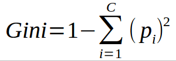
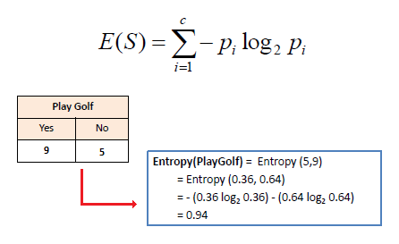
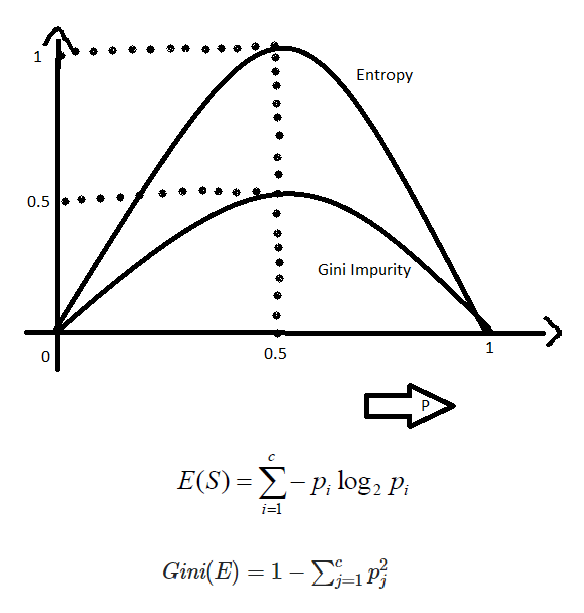
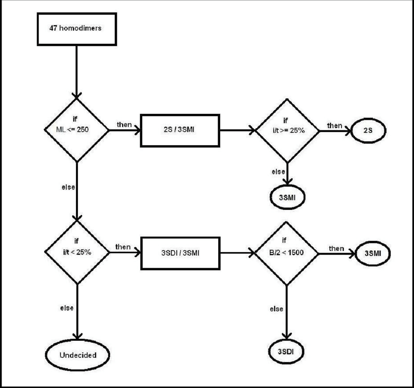

# 🌳 Day 16 – Decision Trees & Gini vs Entropy

Welcome to **Day 16** of #DailyMLDose!

Today’s focus: the classic, interpretable, and surprisingly powerful model — **Decision Trees**.  
We'll break down how they split data using **Gini Impurity** and **Entropy**.

---

## 📌 What Is a Decision Tree?

A **Decision Tree** is a supervised ML model used for both **classification** and **regression**. It splits the dataset into branches by asking the most informative questions.

At each node:
- It evaluates a **feature & threshold**
- Chooses a **split criterion**: either **Gini Impurity** or **Entropy**
- Continues recursively until stopping criteria are met

---

📂 Folder Structure – `day16-decision-trees/`
```
day16-decision-trees/
├── images/
│ ├── decision_tree_structure.png
│ ├── gini_vs_entropy_chart.webp
│ ├── entropy_formula.png
│ ├── gini_formula.png
│ ├── decision_tree_diagram_flow.png
│ └── decision_tree_cart_vs_id3.png
├── code/
│ └── decision_tree_gini_entropy_demo.py
└── README.md
```

---

## 🧠 Gini vs Entropy – What’s the Difference?

| Criteria  | Gini Impurity                         | Entropy (Information Gain)             |
|-----------|----------------------------------------|----------------------------------------|
| Formula   | 1 - Σ(pᵢ²)                             | -Σ(pᵢ log₂ pᵢ)                         |
| Range     | [0, 0.5]                               | [0, 1]                                 |
| Speed     | Faster (no log calculation)           | Slightly slower                        |
| Use Case  | CART (Classification & Regression Tree)| ID3, C4.5                              |
| Output    | Degree of impurity                    | Uncertainty or information gain        |

📸  
  
  


---

## 🌿 How a Decision Tree Works (Simplified)

1. At each node, it evaluates all possible splits
2. Measures impurity using **Gini** or **Entropy**
3. Chooses the split that reduces impurity the most
4. Repeats the process recursively

📊  


---

## 🔍 Real-World Example in Python

See [`decision_tree_gini_entropy_demo.py`](code/decision_tree_gini_entropy_demo.py)

---

## 🧪 Pros & Cons

| Pros                       | Cons                          |
|----------------------------|-------------------------------|
| Easy to interpret & visualize | Prone to overfitting         |
| No need for scaling        | Can be unstable with small data |
| Handles both numerical & categorical data | Biased toward dominant classes |

---

## 🔁 Previous:
[Day 15 → Activation Functions: ReLU, Sigmoid, Tanh, GELU](../day15-activation-functions)

---

## 🎨 Visual Credits:
- Decision Tree Charts: @ml_diagrams  
- Gini/Entropy Comparison: @sebastianraschka  
- Flow Visuals: @codingninjas

---

📌 Stay Connected:
- ⭐ Star the GitHub Repo  
- 🔗 [Follow Shadabur Rahaman on LinkedIn](https://www.linkedin.com/in/shadabur-rahaman-1b5703249)

Let’s keep branching out our ML knowledge! 🌿
