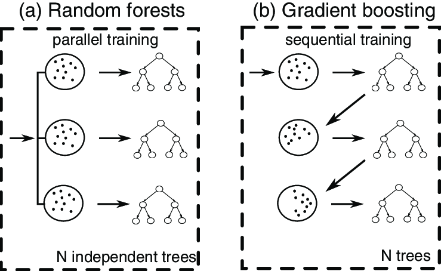

# 🌳 Day 18 – Random Forest vs Gradient Boosting


Welcome to **Day 18** of #DailyMLDose!


Today we explore two of the most widely used ensemble methods in ML: **Random Forest** and **Gradient Boosting**.


---


## 📌 What Are They?


Both are ensemble tree-based algorithms, but their learning strategies differ:


```
| Feature                | Random Forest                      | Gradient Boosting                        |

|------------------------|------------------------------------|------------------------------------------|

| Ensemble Type          | Bagging                            | Boosting                                 |

| Tree Growth            | Independent, in parallel           | Sequential, each tree corrects previous  |

| Training Speed         | Faster                             | Slower                                   |

| Overfitting Tendency   | Lower (due to randomness)          | Higher (needs regularization)            |

| Model Interpretability | Moderate                           | Moderate to low                          |

| Accuracy               | High (but slightly lower)          | Very high (often top in competitions)    |

| Use Case               | Baseline models, general purpose   | Advanced modeling, Kaggle competitions   |

```

---


## 🧠 Real-World Analogy


🔸 **Random Forest**: Like consulting multiple independent doctors and averaging their advice.  

🔸 **Gradient Boosting**: Like consulting a series of specialists, each focusing on correcting the previous diagnosis.


---


## 📂 Folder Structure – `day18-rf-vs-gb/`
```
day18-rf-vs-gb/

├── code/

│ └── rf_vs_gb_comparison.py

│

├── images/

│ ├── rf_vs_gb_workflow.png

│ ├── rf_vs_gb_comparison_table.png

│ ├── random_forest_diagram.png

│ ├── gradient_boosting_diagram.png

│ └── boosting_vs_bagging_concept.png

└── README.md
```


---


## 🔍 Visuals


📌 **Workflow & Concepts**


  

  

  

  


---


## 🧪 Python Code Demo


See `code/rf_vs_gb_comparison.py`:


```python

from sklearn.datasets import load_iris

from sklearn.ensemble import RandomForestClassifier, GradientBoostingClassifier

from sklearn.model_selection import train_test_split

from sklearn.metrics import accuracy_score

# Load dataset

X, y = load_iris(return_X_y=True)

X_train, X_test, y_train, y_test = train_test_split(X, y, test_size=0.3, random_state=42)

# Random Forest

rf_model = RandomForestClassifier(n_estimators=100, random_state=42)

rf_model.fit(X_train, y_train)

rf_preds = rf_model.predict(X_test)

# Gradient Boosting

gb_model = GradientBoostingClassifier(n_estimators=100, random_state=42)

gb_model.fit(X_train, y_train)

gb_preds = gb_model.predict(X_test)

# Accuracy

print("Random Forest Accuracy:", accuracy_score(y_test, rf_preds))

print("Gradient Boosting Accuracy:", accuracy_score(y_test, gb_preds))
```

🧩 Summary

Random Forest is great for fast, stable performance.


Gradient Boosting excels with tuning and often yields higher accuracy.


Both are powerful — choose based on dataset size, noise, and time constraints.


🔁 Previous:

[Day 17 → Ensemble Learning: Bagging vs Boosting](../day17-ensemble-learning)

🎨 Visual Credits:

Concept & Diagrams: @ml_diagrams, @xgboost, @randomforest


📌 Stay Connected:


⭐ Star the GitHub Repo


- 🔗 [Follow Shadabur Rahaman on LinkedIn](https://www.linkedin.com/in/shadabur-rahaman-1b5703249)

Let’s keep building trees — the smart way! 🌳🚀
