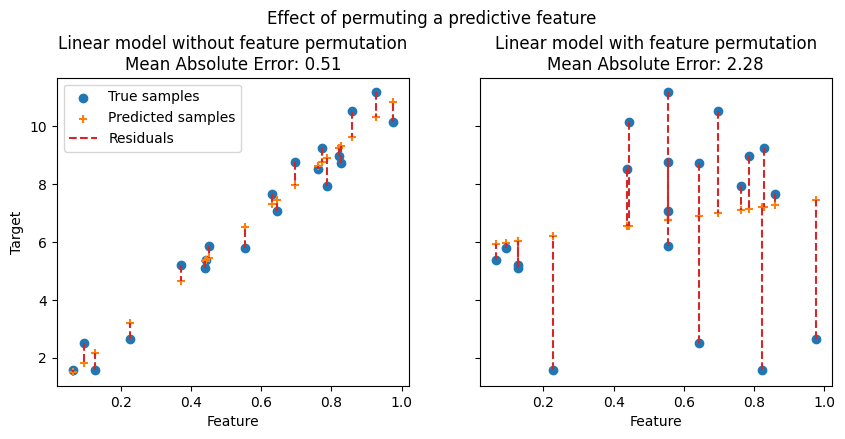

# 🌟 Day 19 – Feature Importance in Machine Learning

Welcome to **Day 19** of #DailyMLDose!

Today we uncover how models determine what features really matter: **Feature Importance**.

---

## 📌 What is Feature Importance?

Feature importance tells us which input variables (features) have the greatest influence on a machine learning model's predictions.

Knowing which features are important:
- Improves model interpretability  
- Allows dimensionality reduction  
- Helps detect data leakage  
- Boosts model performance by eliminating noise

---

## 🧠 Common Techniques

| Method                  | Description                                      | Models Used              |
|------------------------|--------------------------------------------------|--------------------------|
| Coefficients           | Absolute values of weights (linear models)      | Linear, Logistic         |
| Feature Importances    | Based on information gain / Gini importance     | Decision Trees, RF, XGB  |
| Permutation Importance | Measures accuracy drop when shuffling features  | Model-agnostic           |
| SHAP Values            | Calculates each feature's contribution per row  | Any model (especially GB)|

---

## 📂 Folder Structure – `day19-feature-importance/`
```
day19-feature-importance/
├── code/
│ └── feature_importance_demo.py
│
├── images/
│ ├── feature_importance_diagram.png
│ ├── permutation_importance.png
│ ├── shap_feature_importance.png
│ ├── tree_feature_importance.png
│ └── importance_comparison.png
└── README.md
```

---

## 🖼️ Visuals

  
  
  
  


---

## 🧪 Code Demo: Permutation & Tree-Based Importance

```python
from sklearn.ensemble import RandomForestClassifier
from sklearn.inspection import permutation_importance
from sklearn.datasets import load_breast_cancer
from sklearn.model_selection import train_test_split
import pandas as pd
import matplotlib.pyplot as plt

# Load dataset
X, y = load_breast_cancer(return_X_y=True, as_frame=True)
X_train, X_test, y_train, y_test = train_test_split(X, y, test_size=0.3, random_state=42)

# Train RF model
rf = RandomForestClassifier(n_estimators=100, random_state=42)
rf.fit(X_train, y_train)

# Tree-based importance
importances = pd.Series(rf.feature_importances_, index=X.columns).sort_values(ascending=False)
print(importances.head())

# Permutation importance
perm = permutation_importance(rf, X_test, y_test, n_repeats=10, random_state=42)
perm_sorted = pd.Series(perm.importances_mean, index=X.columns).sort_values(ascending=False)
print(perm_sorted.head())

# Plot
importances.head(10).plot(kind='barh', title='Top 10 Feature Importances')
plt.gca().invert_yaxis()
plt.show()
```
🧩 Summary
Use feature importance to explain, debug, and improve ML models.

Combine methods (tree-based + permutation + SHAP) for deeper insights.

Use visualizations to communicate findings to non-technical stakeholders.

🔁 Previous:
Day 18 → Random Forest vs Gradient Boosting

🎨 Visual Credits:
Visualizations from: @statquest, @interpretml, @shap_ml, @sklearn

📌 Stay Connected:

⭐ Star the GitHub Repo

🔗 Follow Shadabur Rahaman on LinkedIn

Let your model tell you what truly matters. 💡
