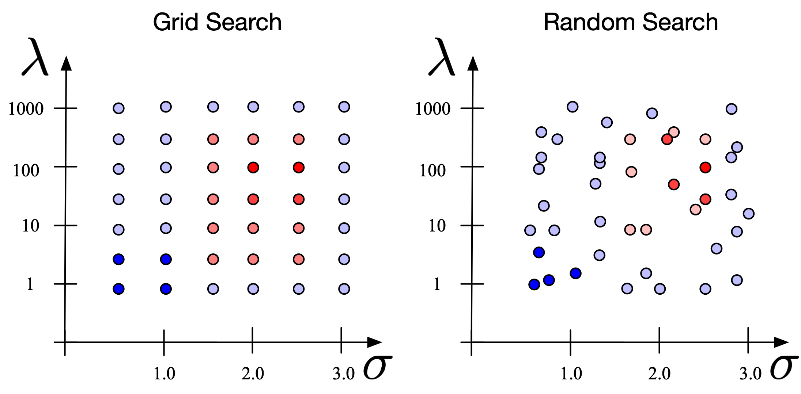
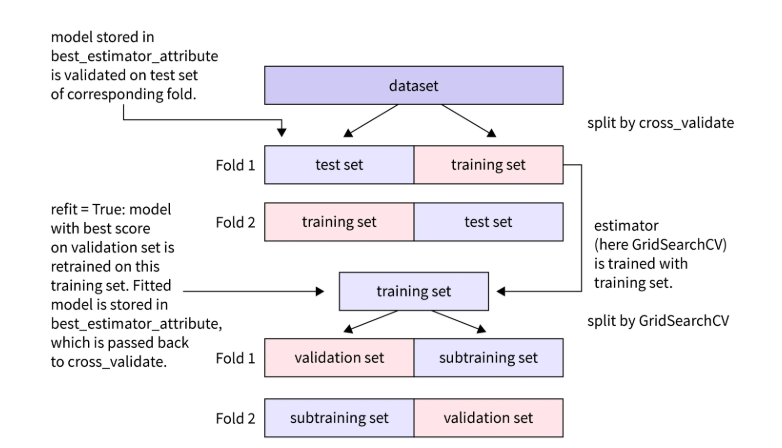
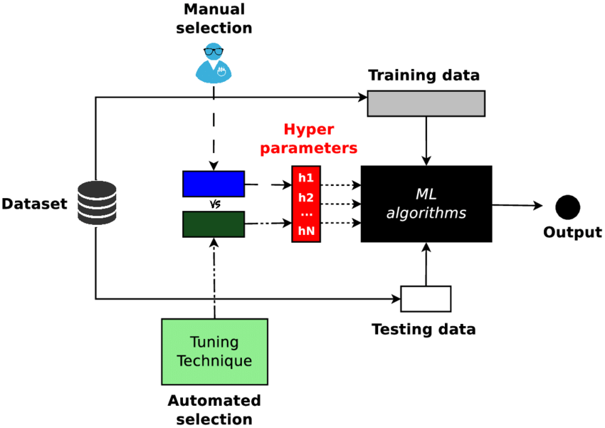

# ⚙️ Day 20 – Hyperparameter Tuning: Grid Search vs Random Search  
🔍 #DailyMLDose | 🚀 Model Optimization Made Simple

Welcome to **Day 20** of #DailyMLDose!  
Today, we master the art of **Hyperparameter Tuning** — a key step in ML model performance.  
We'll break down the two most common methods: **Grid Search** and **Random Search**, with **visuals and live code**.

---
📂 Project Folder Structure
```
day20-hyperparameter-tuning/
├── code/
│   ├── grid_search_demo.py
│   └── random_search_demo.py
│
├── images/
│   ├── grid_vs_random_search_diagram.png
│   ├── grid_search_explained.png
│   ├── random_search_explained.png
│   └── hyperparameter_tuning_visuals.png
└── README.md
```
---

## 📌 What is Hyperparameter Tuning?

**Hyperparameters** are the settings that control the behavior of your ML algorithm — but they are **not learned from the data**. You set them manually or through tuning.

### 🎯 Common Hyperparameters:
- 🧠 Learning rate  
- 🌳 `max_depth` (tree models)  
- 📈 `C`, `gamma` (SVM)  
- 🏁 `n_estimators` (ensemble models)

Tuning helps you find the **best combination** to **maximize validation accuracy** and generalize better.

---

## ⚔️ Grid Search vs Random Search – A Visual Comparison

| 🔍 Method         | 📖 Description                                 | ✅ Pros                          | ⚠️ Cons                        |
|------------------|------------------------------------------------|----------------------------------|-------------------------------|
| **🧱 Grid Search**   | Exhaustively tries **all combinations**         | 🎯 Systematic & reproducible      | 🐌 Very slow for large spaces  |
| **🎲 Random Search** | Samples a **fixed number** of random combos   | ⚡ Faster, covers wide areas      | 🎯 May miss the best combo     |

---

## 🖼️ Visual Intuition

> These diagrams will help you **visually grasp** how Grid and Random Search explore parameter space.

<div align="center">

  
⬆️ *Grid systematically covers all points, Random spreads out faster across the space.*

---

  
📊 *Exhaustive search across all combinations.*

---

  
🎯 *Random picks from ranges — less computation, still effective.*

---

  
🧠 *Complete visual of the tuning process and its impact.*

</div>

---

## 💻 Code Demos – Try It Yourself!

### 🧩 Grid Search (Exhaustive)

```python
from sklearn.datasets import load_iris
from sklearn.ensemble import RandomForestClassifier
from sklearn.model_selection import train_test_split, GridSearchCV

# Load data
X, y = load_iris(return_X_y=True)
X_train, X_test, y_train, y_test = train_test_split(X, y, random_state=42)

# Define parameter grid
param_grid = {
    'n_estimators': [50, 100, 200],
    'max_depth': [3, 5, 10]
}

# Grid Search
model = RandomForestClassifier()
grid = GridSearchCV(model, param_grid, cv=5)
grid.fit(X_train, y_train)

print("Best Params from GridSearch:", grid.best_params_)
```
🎲 Random Search (Efficient Sampling)

```
from sklearn.model_selection import RandomizedSearchCV
from scipy.stats import randint

# Random param distributions

param_dist = {
    'n_estimators': randint(50, 200),
    'max_depth': randint(3, 20)
}

# Random Search
random_search = RandomizedSearchCV(model, param_distributions=param_dist, n_iter=10, cv=5)
random_search.fit(X_train, y_train)

print("Best Params from RandomSearch:", random_search.best_params_)
```
🧠 TL;DR Summary
✅ When to Use	🚀 Recommendation
Grid Search	Small search space & you want full coverage
Random Search	Large space or you want fast results

✔️ Always use cross-validation to prevent overfitting during tuning.

🧪 Use libraries like GridSearchCV and RandomizedSearchCV from sklearn.


🔁 Previous Post
📌 [Day 19 → Feature Importance.](../day19-feature-importance)

Intuition Videos: @statquest, @learn_ml_daily

🙌 Stay Connected
- 🔗 [Follow Shadabur Rahaman on LinkedIn](https://www.linkedin.com/in/shadabur-rahaman-1b5703249)
⭐ Star the GitHub Repo
💬 Let’s keep fine-tuning our knowledge — one parameter at a time!

