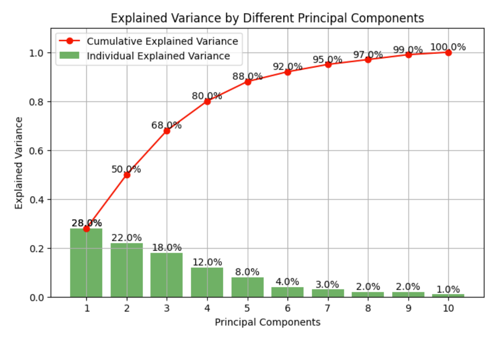
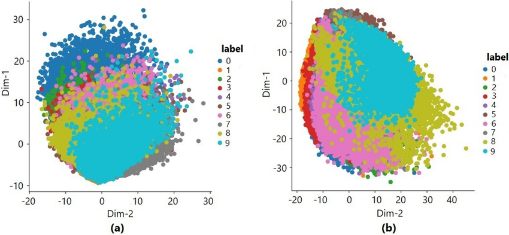

# 📉 Day 21 – PCA & Dimensionality Reduction  
🔧 #DailyMLDose | Simplify High-Dimensional Data the Smart Way

Welcome to **Day 21** of #DailyMLDose!  
Today we explore how to tackle the **curse of dimensionality** using **PCA** and other **dimensionality reduction** techniques.  
> Less noise. Faster models. Smarter insights.

---
📂 Folder Structure
```
day21-pca-dimensionality-reduction/
├── code/
│   └── pca_iris_demo.py
│
├── images/
│   ├── pca_projection.png
│   ├── pca_variance_explained.png
│   ├── mnist_pca_2d.png
|   ├── pca_in_nutshell.jpg
|   ├── pca_explained
└── README.md
```
---
## 🧠 Why Dimensionality Reduction?

High-dimensional data is:
- 🔍 Sparse and noisy  
- 📏 Hard to cluster or classify  
- 🧪 Computationally expensive  
- ❌ Bad for distance-based algorithms (KNN, SVM)

We reduce dimensions to:
✅ Improve generalization  
✅ Reduce overfitting  
✅ Visualize hidden structures  
✅ Speed up training

---

## 🧩 Principal Component Analysis (PCA)

PCA transforms original features into **principal components** that capture the most variance in the data.

### 🔢 What PCA Does:
- Linearly projects data into a new feature space  
- Maximizes variance in fewer dimensions  
- Removes correlation between features

---

## 📊 Visual Intuition

<div align="center">

### 📉 From High-D to 2D


> PCA reduces 3D or higher-D data into a few **uncorrelated axes**.

---

### 🎯 Variance Explained



> Choose top `k` components that explain **most variance**.

---

### 🧠 PCA on MNIST



> PCA reduces 784D pixel data to 2D — clusters become visible!

</div>

---

## 🧪 Python Demo

```python
from sklearn.decomposition import PCA
from sklearn.datasets import load_iris
import matplotlib.pyplot as plt

# Load data
X, y = load_iris(return_X_y=True)

# Reduce to 2D
pca = PCA(n_components=2)
X_pca = pca.fit_transform(X)

# Plot
plt.scatter(X_pca[:, 0], X_pca[:, 1], c=y, cmap='viridis')
plt.xlabel('PC1')
plt.ylabel('PC2')
plt.title('PCA – Iris Dataset')
plt.show()
```
🚀 Other Dimensionality Reduction Techniques
Technique	Key Idea	Good For
PCA	Linear, max variance	General-purpose, fast
t-SNE	Local neighborhood preserving	Data visualization (2D/3D)
UMAP	Topology + geometry preserving	Large, nonlinear datasets
Autoencoders	Neural networks that learn compression	Nonlinear, deep features

🧠 Summary
📉 Use PCA to reduce dimensionality while preserving variance

🚀 Use other nonlinear methods for better 2D/3D clustering

🔬 Helps in speeding up models and avoiding overfitting

🔁 Previous Post
📌 Day 20 → Hyperparameter Tuning

🎨 Visual Credits
Diagrams: @ml_diagrams, @statquest, @learn_ml_daily

🙌 Stay Connected
🔗 Follow Shadabur Rahaman
⭐ Star the GitHub Repo
Let’s reduce the noise — and amplify the signal! 🔊


---

### ✅ LinkedIn Post – Day 21: PCA & Dimensionality Reduction

🎯 **Day 21 of #DailyMLDose**  
📉 Today’s focus: **PCA & Dimensionality Reduction**  
Cut the noise. Boost the signal. ⚡

---

### 🧠 Why Reduce Dimensions?

High-dimensional data can:
- 🐌 Slow down training
- 🎯 Overfit easily
- ❌ Confuse distance metrics
- ❓ Be impossible to visualize

So we reduce dimensions to:
✔️ Keep the most useful features  
✔️ Improve performance  
✔️ Reveal structure in data

---

### 🧩 PCA (Principal Component Analysis)

PCA transforms your data to new axes (principal components) that:
- 🔍 Maximize variance  
- 🔁 Remove redundancy  
- ✂️ Shrink dimensions with minimal loss

---

### 🔢 Example:  
We applied PCA on the Iris dataset — and boom, it clusters beautifully in 2D!

📉 You can also reduce 784D MNIST images to 2D/3D to visualize digit clusters.

---

### 🧪 Try It Out:
✔️ Use `sklearn.decomposition.PCA`  
✔️ Plot your components in 2D  
✔️ Keep top components that explain >90% variance

📌 Bonus: Explore **UMAP**, **t-SNE**, or **Autoencoders** for nonlinear reduction!

---

📊 See code + visuals + comparison chart here →  
👉 [GitHub: Day 21 – PCA & Dimensionality Reduction](https://github.com/Shadabur-Rahaman/Daily-ML-Dose/edit/main/day21-pca-dimensionality-reduction)

---

🎨 Visuals:  
@statquest @ml_diagrams @maths_visual @learn_ml_daily

Let’s reduce the noise — and amplify the learning!  
#MachineLearning #PCA #DimensionalityReduction #tSNE #UMAP #Autoencoder #MLTips #DataScience #DailyMLDose #100DaysOfCode

---
