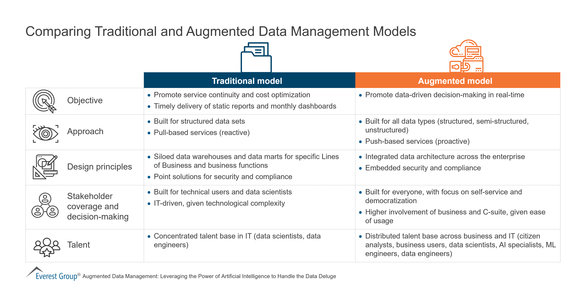
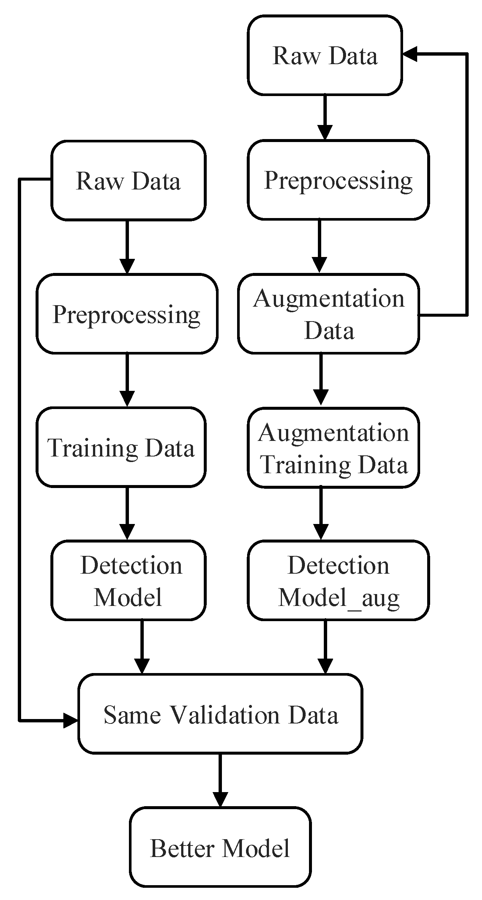

# 🧪 Day 22 – Data Augmentation  
🔁 #DailyMLDose | Teaching ML Models More with Less

Welcome to **Day 22** of #DailyMLDose!  
Today we explore how to **boost model performance** and **reduce overfitting** using **Data Augmentation** — the art of synthetically expanding your dataset.

---

## 🎯 Why Data Augmentation?

When training data is limited, overfitting is a real danger.

💡 **Data Augmentation** helps by:
- Generating **new training examples**
- Preserving **class labels**
- Improving **generalization**
- Simulating **real-world variations**

---

## 🧰 Common Augmentation Techniques

| 🧠 Technique         | 💬 Description                               | ✅ Best For              |
|----------------------|-----------------------------------------------|---------------------------|
| **Flip / Rotate**     | Mirror or spin image                         | Object detection, vision  |
| **Crop / Zoom**       | Random crops or scaled views                 | Focus variation           |
| **Brightness / Contrast** | Simulate lighting changes                  | Robustness to lighting    |
| **Noise Injection**   | Add Gaussian or salt-and-pepper noise        | Denoising, robustness     |
| **Translation / Shift** | Move image slightly                         | Position variation        |
| **Cutout / Mixup / CutMix** | Advanced blending methods              | Deep CNN training         |
| **Text Synonyms / Back-Translation** | Text-only techniques           | NLP tasks                 |
| **Time Shift / Pitch Shift** | Audio waveform perturbations            | Audio/speech models       |

---

## 🖼️ Visual Examples

<div align="center">

### 🖼 Original vs Augmented



---

### 🧠 CutMix, MixUp, Flip



</div>

---

## 🧪 Code Example – Image Augmentation (Vision)

```python
from torchvision import transforms
from PIL import Image

# Basic augmentation pipeline
augment = transforms.Compose([
    transforms.RandomHorizontalFlip(),
    transforms.RandomRotation(15),
    transforms.ColorJitter(brightness=0.2, contrast=0.2),
    transforms.RandomResizedCrop(224, scale=(0.8, 1.0)),
])
```
# Apply to image
img = Image.open('images/data_augmentation.png')
aug_img = augment(img)
aug_img.show()
📊 When Should You Use It?
✅ You have limited labeled data
✅ You want to improve model generalization
✅ You train deep models on real-world inputs

📂 Folder Structure
```
day22-data-augmentation/
├── code/
│   └── vision_aug_demo.py
│
├── images/
│   ├── data_augmentation_comparison.png
│   ├── advanced_augmentation.png
│   ├── data_augmentation.png
│   ├── data_augmentation_for_gnn.png
│   └── data_augmentation_on_optical_spectroscopy_dataset.jpg
|
└── README.md
```
🧠 Summary
🧪 Data Augmentation is data engineering for generalization

🚀 Easy to implement with frameworks like Torchvision, Albumentations, Hugging Face, NLTK

💡 Boosts model robustness with synthetic diversity

🔁 Previous Post
📌 Day 21 → PCA & Dimensionality Reduction

🔁 Previous Post
📌 [Day 21 → PCA & Dimensionality Reduction.](../day21-pca-dimensionality-reduction)

⚙️ Libraries To Explore:
Albumentations – Fast & rich vision augmentations

Torchvision / tf.image – Built-in pipelines

NLTK / TextAug – NLP-specific tools

Audiomentations – For speech/audio tasks

📂 Full post + code + visuals →
👉 GitHub: Day 22 – Data Augmentation

Let’s teach our models more — without needing more data!
#MachineLearning #DataAugmentation #ComputerVision #NLP #DataScience #DailyMLDose #DeepLearning #100DaysOfCode #AI
