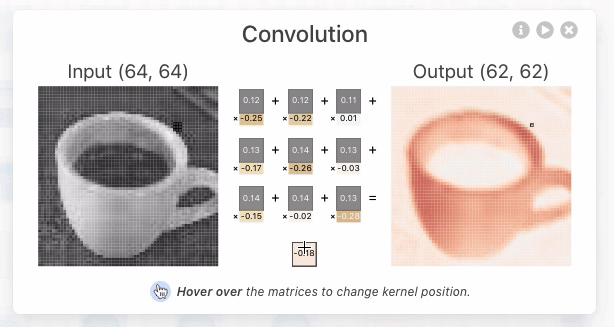
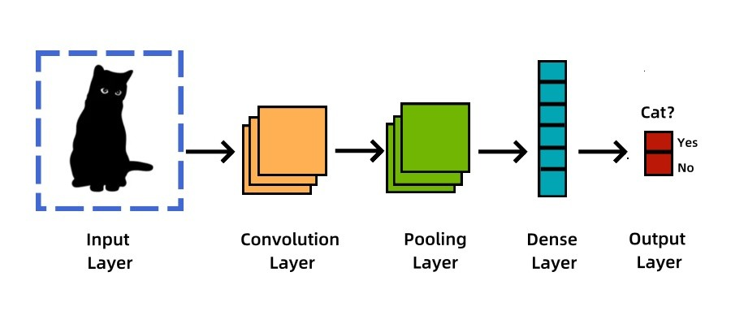
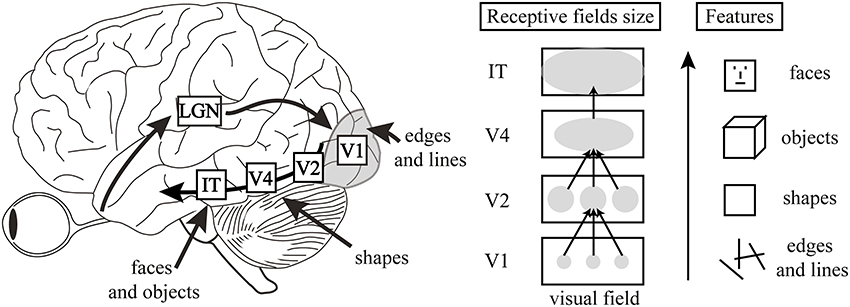
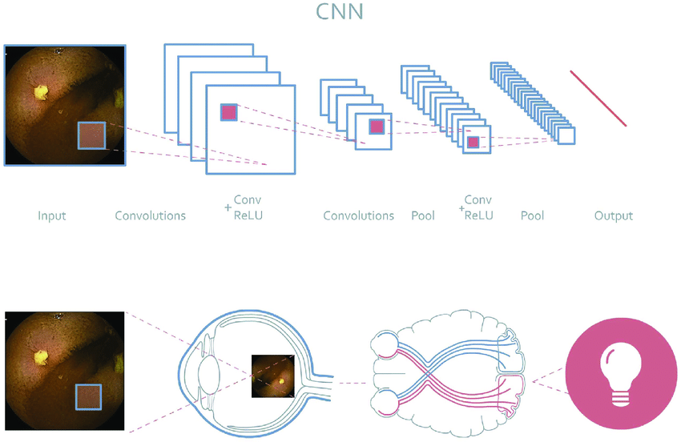

# 🧠 Day 23 – CNN Basics: Convolution & Pooling  
🧱 #DailyMLDose | How Machines See the World

Welcome to **Day 23** of #DailyMLDose!  
Today we break down the core building blocks of **Convolutional Neural Networks (CNNs)** — the magic behind computer vision!  
> Learn how your model learns from **pixels to patterns** 📷

---

## 👁️ Why CNNs?

CNNs are specialized neural networks that excel at **image tasks**:
- 🖼️ Image Classification
- 🎯 Object Detection
- 🧠 Face Recognition
- 🧪 Medical Imaging

They extract spatial features using **convolution** and **pooling** layers.

---

## 🔧 Core Components of a CNN

| 🔬 Layer           | 📖 Purpose                                 |
|--------------------|---------------------------------------------|
| **Convolution**     | Learn spatial patterns (edges, textures)    |
| **Activation**      | Apply non-linearity (ReLU, etc.)            |
| **Pooling**         | Downsample to reduce dimensions             |
| **Flatten**         | Convert 2D → 1D for Dense layer              |
| **Fully Connected** | Classification/Prediction                   |

---

## 🔍 Convolution: Feature Extractor

A **convolution** slides a filter over the input image and **captures patterns** like edges or corners.

📌 The filter **weights are learned** during training.

### 🧠 Detailed View of a Convolution Layer


---

## 🌊 Pooling: Dimensionality Reduction

**Pooling layers** (usually Max or Avg) reduce spatial size, helping with:
- Generalization
- Noise reduction
- Computation speed

### 🌊 Max Pooling (2x2)


---

## 🧠 CNN Architecture Flow

### 🧱 From Pixels to Predictions


---

## 🧬 CNN & Human Vision Analogy

CNNs mimic how the **human visual cortex** processes images —  
from local features (edges) to global understanding (objects).

| 🧠 Brain | 🤖 CNN |
|----------|--------|
| Visual Cortex (V1-V4) | Convolution Layers |
| Neuron Activation | ReLU |
| Brain Hierarchy | Deep Network |

### 👁️ Analogy Visualization




---

## 🧪 PyTorch CNN Layer Example

```python
import torch
import torch.nn as nn

class SimpleCNN(nn.Module):
    def __init__(self):
        super(SimpleCNN, self).__init__()
        self.conv = nn.Conv2d(in_channels=1, out_channels=16, kernel_size=3, padding=1)
        self.pool = nn.MaxPool2d(kernel_size=2, stride=2)
        self.relu = nn.ReLU()
        self.fc = nn.Linear(16 * 14 * 14, 10)  # for 28x28 input

    def forward(self, x):
        x = self.pool(self.relu(self.conv(x)))
        x = x.view(x.size(0), -1)
        x = self.fc(x)
        return x
```
📂 Folder Structure
```
day23-cnn-basics/
├── code/
│   └── simple_cnn.py
│
├── images/
│   ├── cnn_architecture_flow.png
│   ├── cnn_as_model_of_visual_system.jpg
│   ├── cnn_demo.jpg
│   ├── convlayer_detailedview_demo.gif
│   ├── convolution_demo.png
│   └── Schematic-representation-of-the-analogy-between-a-CNN-and-a-biologic-visual-cortical.png

```
🧠 Summary
Component	Role
Convolution Layer	Extracts features
Pooling Layer	Reduces dimensionality
ReLU	Adds non-linearity
Dense Layer	Performs final classification

🔁 Previous Post
📌 Day 22 → Data Augmentation


🙌 Stay Connected
🔗 Follow Shadabur Rahaman
⭐ Star the GitHub Repo
From pixels to predictions — CNNs make it happen! 🚀
