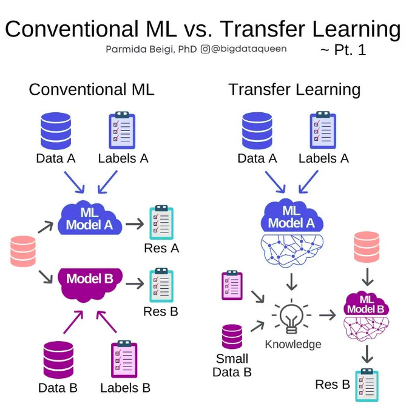
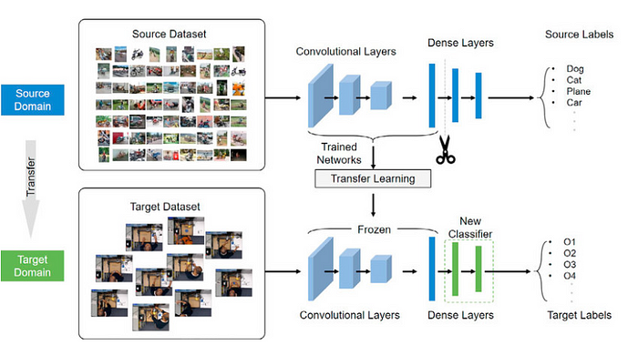
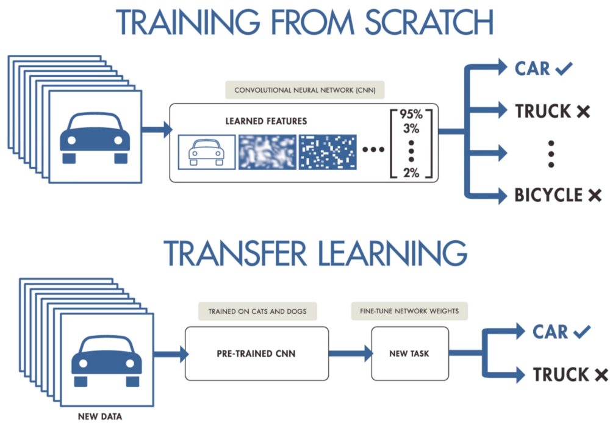
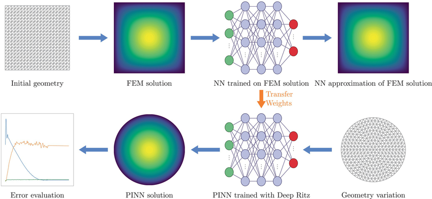

# 🔁 Day 24 – Transfer Learning  
📦 #DailyMLDose | Reusing Knowledge for Faster, Smarter Models

Welcome to **Day 24** of #DailyMLDose!  
Today we dive into **Transfer Learning** — the technique that lets you leverage **pretrained models** instead of training from scratch.

---

## 🚀 What is Transfer Learning?

Instead of training a model from the ground up, Transfer Learning uses knowledge from a model **pretrained on a large dataset** (like ImageNet) and adapts it to your task.

### 💡 Think of it like:
> A chef who’s mastered Indian cuisine can quickly learn to cook Thai —  
> They reuse core skills (knife work, spices) instead of starting fresh. 🔪🍛

---

## 🎯 When to Use It

✅ You have limited data  
✅ You need faster training  
✅ You want **high accuracy** on small tasks  
✅ You’re working on images, NLP, or speech  

---

## 🔍 Key Approaches

| Type                 | How it Works                                                 | Use Case                        |
|----------------------|--------------------------------------------------------------|----------------------------------|
| **Feature Extraction** | Freeze pretrained layers & use their outputs as features     | When your dataset is small       |
| **Fine-Tuning**        | Unfreeze top layers & re-train on your own data              | When domain is slightly different|

---

## 🖼️ Visuals & Workflow

<div align="center">

### 🔄 Conventional ML vs Transfer Learning  


---

### 🔧 Traditional vs Transfer Learning  


---

### 🔄 Transfer Learning Workflow  


---

### 🧠 TL Efficiency in CNNs  


---

### 📊 Visualized TL Pipeline  


</div>

---

## 🧪 Code – Transfer Learning using ResNet-18 (PyTorch)

```python
import torch
import torchvision.models as models
import torch.nn as nn

# Load pretrained ResNet18
model = models.resnet18(pretrained=True)

# Freeze all layers
for param in model.parameters():
    param.requires_grad = False

# Replace the final FC layer
num_ftrs = model.fc.in_features
model.fc = nn.Linear(num_ftrs, 10)  # for 10 classes

# Only train the new layer
optimizer = torch.optim.Adam(model.fc.parameters(), lr=0.001)
```
# Model ready for training on your dataset!

📂 Folder Structure
---
```
day24-transfer-learning/
├── code/
│   └── transfer_learning_resnet18.py
│
├── images/
│   ├── conventional_ml_vs_transfer_learning.png
│   ├── Efficiency_of_Transfer_Learning_in_CNN.png
│   ├── Traditional_vs_Transfer_Learning.png
│   ├── tranfer_learning_explained.png
│   ├── Transfer_Learning_Process_Flowchart.png
│   └── Visualization-of-the-suggested-transfer-learning-TL-workflow.png
```
🧠 Summary
💡 Transfer learning saves compute, time, and data

🔁 You can freeze or fine-tune parts of the model

🏁 Works best with pre-trained CNNs like ResNet, VGG, MobileNet

🔁 Previous Post


🙌 Stay Connected
🔗 Follow Shadabur Rahaman
⭐ Star the GitHub Repo
Reusing learned wisdom — that's smart learning. 💡
