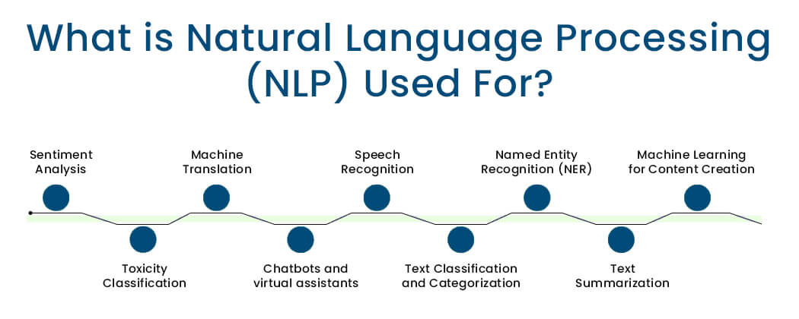
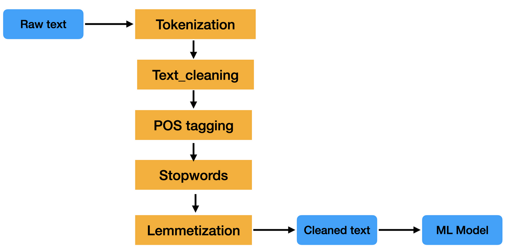
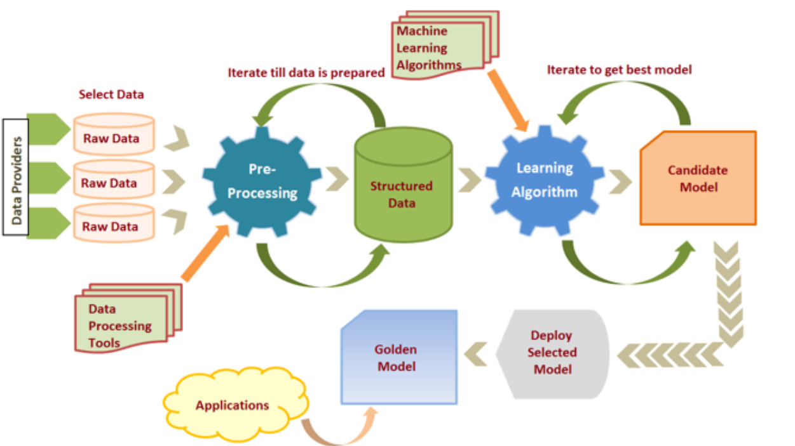
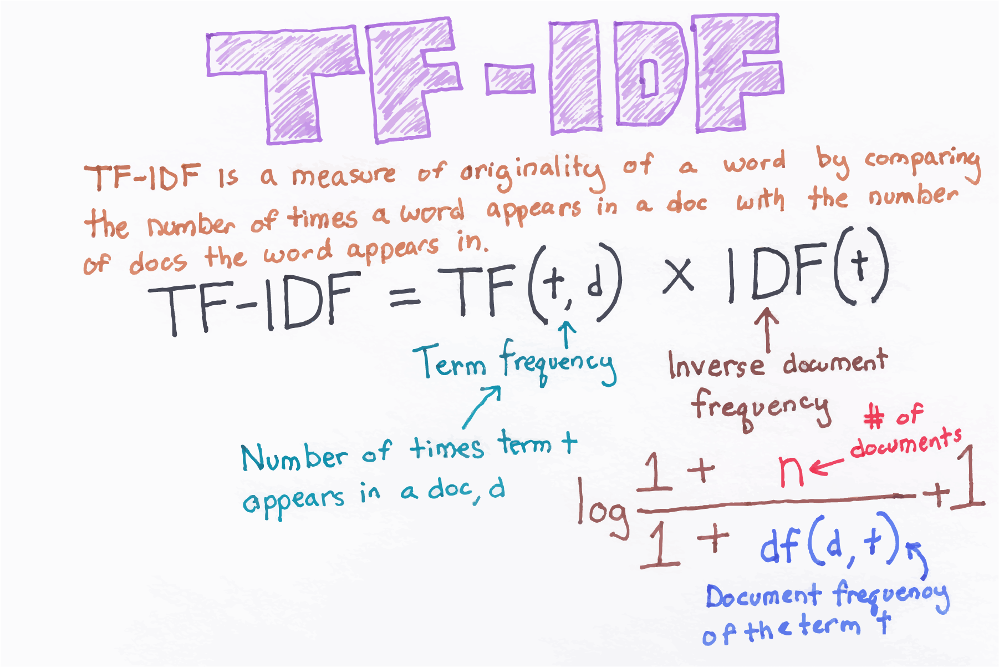
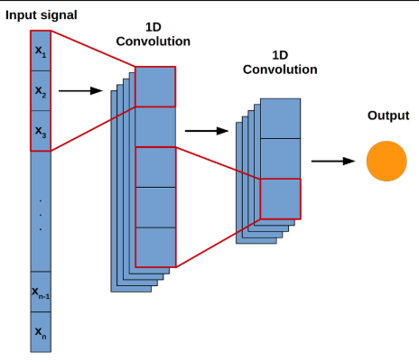
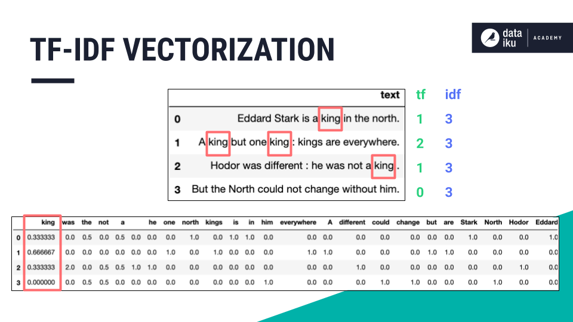
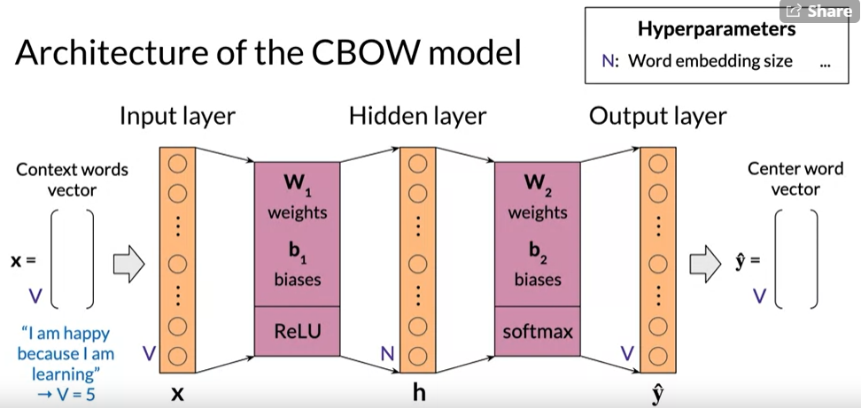
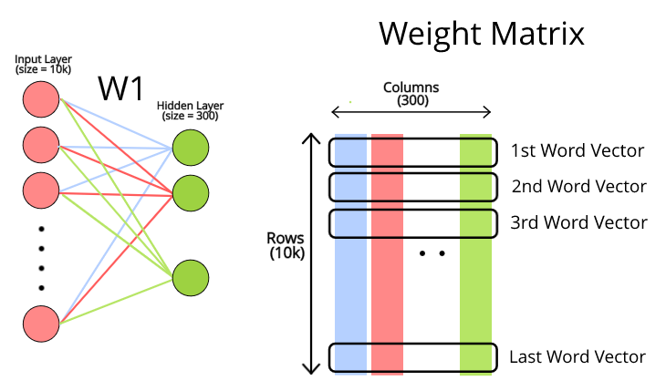
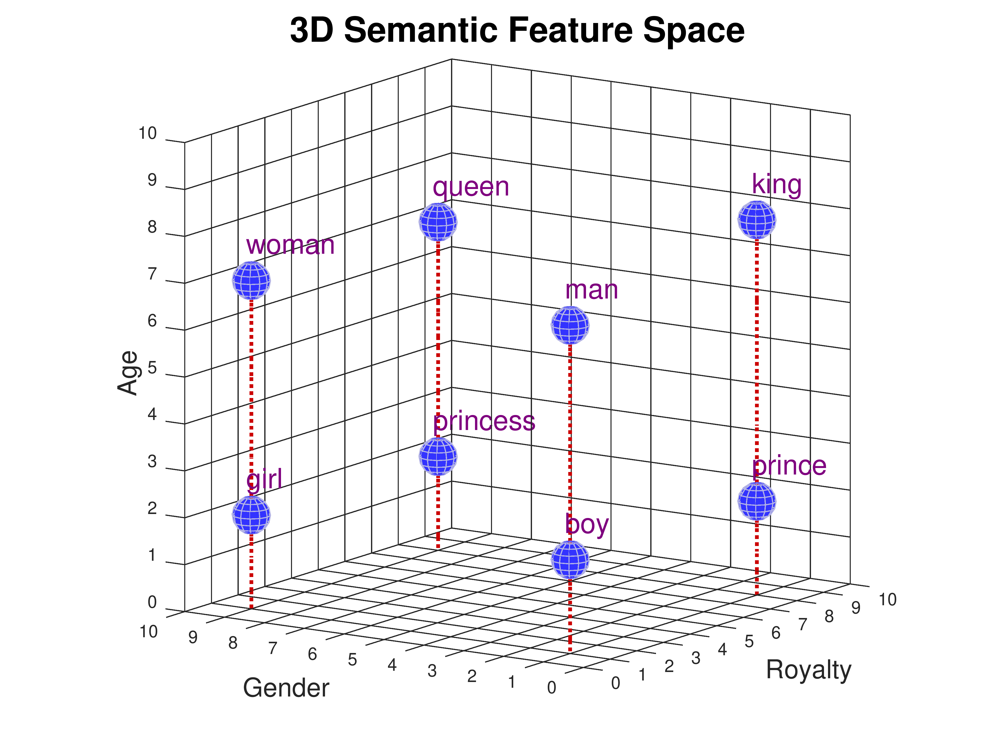

# 📚 Day 25 – NLP Basics: TF-IDF & Word2Vec  
🧠 #DailyMLDose | Giving Meaning to Language with Math

Welcome to **Day 25** of #DailyMLDose!  
Let’s explore the backbone of modern Natural Language Processing: **Text Vectorization** through **TF-IDF** and **Word2Vec**.  
> How do we convert messy text into numerical signals that machines can learn from? Let’s decode it!

---

## 🧾 What is NLP?

Natural Language Processing (NLP) enables machines to **understand, interpret, and generate** human language.  
It powers chatbots 🤖, search engines 🔍, sentiment analysis ❤️, and more.

### 🧠 NLP Applications


---

## 🛠️ NLP Pipeline Overview

  


---

## 🔢 1. TF-IDF: Term Frequency–Inverse Document Frequency

TF-IDF scores highlight **how important a word is** in a document relative to a corpus.

### 🧠 Formula:
- **TF(w, d)** = frequency of word `w` in document `d`
- **IDF(w)** = log(total docs / docs containing w)

### 🔍 Visuals:
  
  


---

## 🧠 2. Word2Vec: Dense Semantic Embeddings

Rather than counting words, Word2Vec **learns relationships** between words via context.

📌 Trained using either:
- **Skip-Gram**: predict context from center word  
- **CBOW**: predict center word from context

### 📊 Visuals:
  
  
  


---

## 🔍 Bonus Visual: NLP in Action  


---

## 🧪 Code Examples

### ✅ TF-IDF with `sklearn`

```python
from sklearn.feature_extraction.text import TfidfVectorizer

docs = ["this is a good book", "this book is good", "this is a bad book"]
vectorizer = TfidfVectorizer()
X = vectorizer.fit_transform(docs)

print(vectorizer.get_feature_names_out())
print(X.toarray())
✅ Word2Vec with gensim
python
Copy
Edit
from gensim.models import Word2Vec

sentences = [["machine", "learning", "is", "fun"],
             ["deep", "learning", "is", "a", "part", "of", "ml"]]

model = Word2Vec(sentences, vector_size=50, window=2, min_count=1, sg=1)
vector = model.wv["learning"]
print("Vector for 'learning':", vector[:5])
```
📂 Folder Structure
```
day25-nlp-basics/
├── code/
│   ├── tfidf_example.py
│   └── word2vec_example.py
│
├── images/
│   ├── do-nlp-sentiment-analysis-and-topic-modeling-projects.png
│   ├── network-of-word2vec.webp
│   ├── NLP_architecture.png
│   ├── NLP_pipeline.png
│   ├── ord2vec_training_visual.png
│   ├── tf-idf-explained.png
│   ├── tf-idf-vectorization.png
│   ├── tfidf_vectorization_demo.png
│   ├── What-is-Natural-Language-Processing-NLP-Used-For-1.jpg
│   ├── word2vec_architecture.png
│   └── word_embeddings_space_demo.png
```  
🧠 Summary
Technique	Purpose	Output	Common Use
TF-IDF	Statistical importance	Sparse Vectors	Document classification, search
Word2Vec	Semantic proximity	Dense Embeddings	Sentiment, NER, word similarity

🔁 Previous Post


🙌 Stay Connected
- 🔗 [Follow Shadabur Rahaman on LinkedIn](https://www.linkedin.com/in/shadabur-rahaman-1b5703249)
⭐ Star the GitHub Repo
From words to vectors — we’re teaching machines to speak our language. 🧠💬

