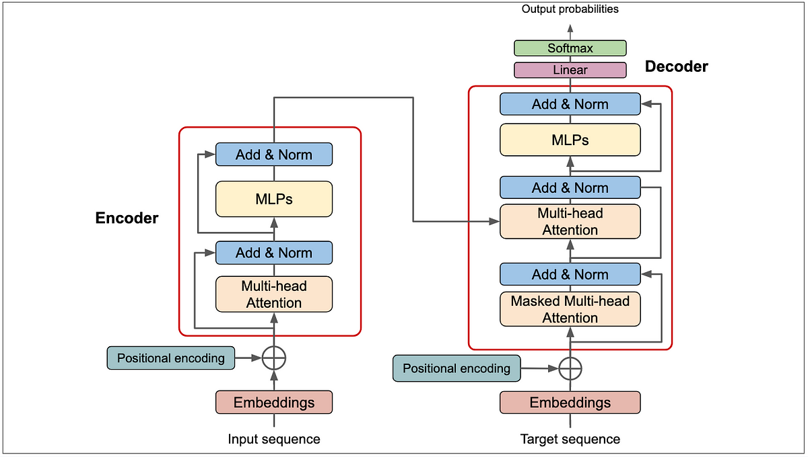
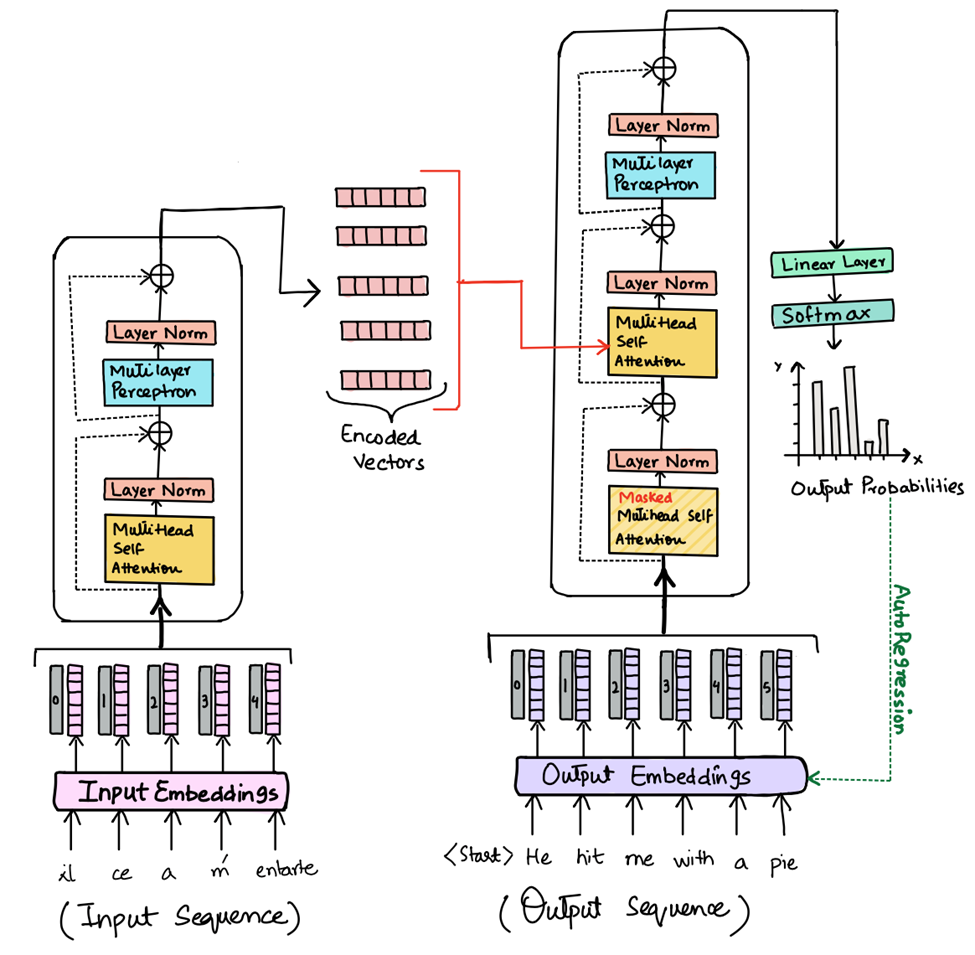
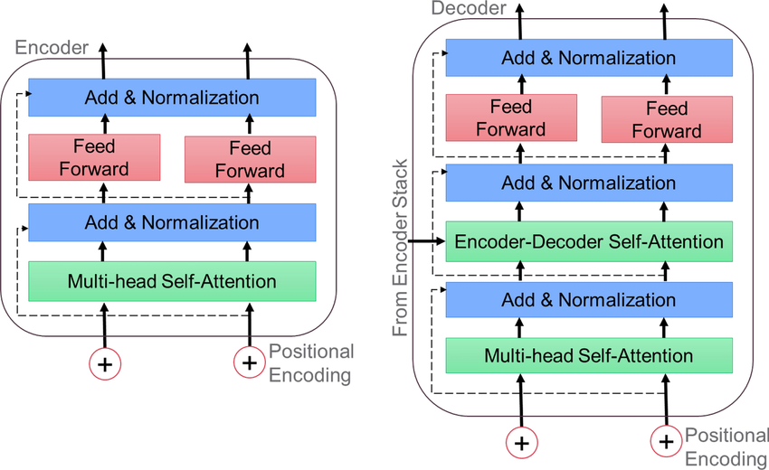
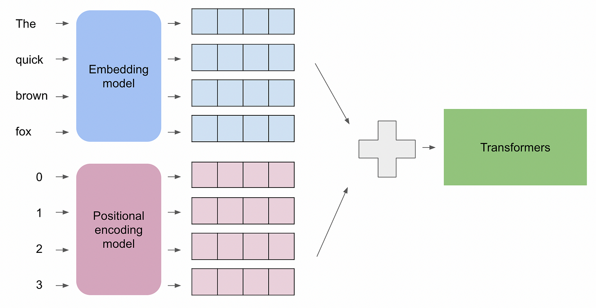
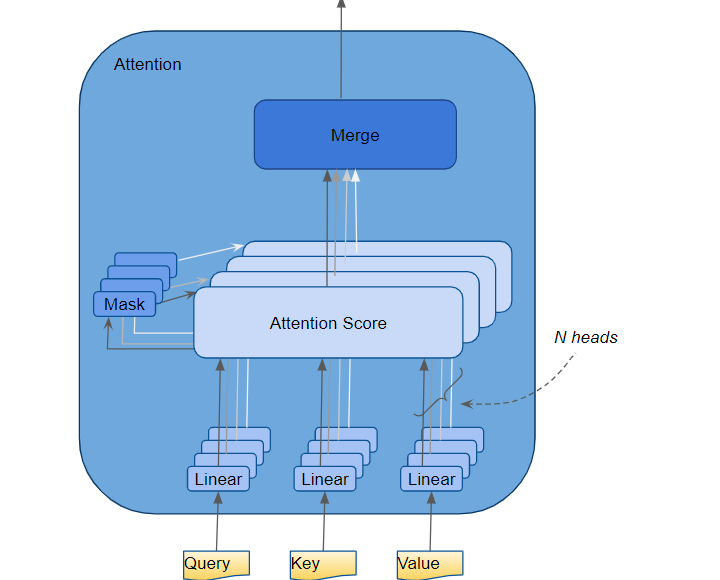

# 🤖 Day 26 – Transformers (Self-Attention, Encoder-Decoder)  
📚 #DailyMLDose | The Model That Changed Everything in AI

Welcome to **Day 26** of #DailyMLDose!  
Today we dive into the legendary **Transformer architecture**, the engine behind GPT, BERT, T5, and more.

---

## ⚡ Why Transformers?

Before Transformers, we had RNNs and LSTMs — sequential models that struggled with long dependencies.  
Transformers solved this with a simple but powerful idea:

> 💡 **Attention is all you need**

---

## 🧠 Key Concepts

| Component              | Role                                                   |
|------------------------|--------------------------------------------------------|
| **Self-Attention**     | Understand relationships between all words in a sequence |
| **Encoder**            | Encodes input into representations                     |
| **Decoder**            | Uses those representations to generate output         |
| **Positional Encoding**| Adds order to input tokens (since no recurrence)       |
| **Multi-Head Attention** | Captures different aspects of word relationships      |

---

## 🧩 Self-Attention Intuition

Imagine reading this sentence:  
> “The **animal** didn't cross the street because **it** was too tired.”  
The model must learn that **"it"** refers to **"animal"**, not "street".  
Self-attention allows this level of understanding.

---

## 🖼️ Visuals

### 🔗 Transformer Paper  


---

### 🔄 Self-Attention Demo  


---

### 🧠 Encoder-Decoder Overview  


---

### ⏳ Positional Encoding  


---

### 🎯 Scaled Dot-Product Attention  


---

### 🧩 Multi-Head Mechanism  


---

## 🧪 Code Snippets

### ✅ Self-Attention from Scratch (NumPy)

```python
import numpy as np

def softmax(x):
    e_x = np.exp(x - np.max(x))
    return e_x / e_x.sum(axis=-1, keepdims=True)

# Toy input
Q = np.random.rand(1, 4, 64)  # (batch, seq_len, d_k)
K = np.random.rand(1, 4, 64)
V = np.random.rand(1, 4, 64)

# Scaled dot-product attention
d_k = Q.shape[-1]
scores = np.matmul(Q, K.transpose(0, 2, 1)) / np.sqrt(d_k)
weights = softmax(scores)
output = np.matmul(weights, V)

print("Self-Attention Output Shape:", output.shape)
```
✅ Transformer Encoder Skeleton (PyTorch)

```python

import torch.nn as nn

class TransformerEncoderLayer(nn.Module):
    def __init__(self, embed_dim, heads, ff_dim, dropout=0.1):
        super().__init__()
        self.attn = nn.MultiheadAttention(embed_dim, heads, dropout=dropout)
        self.ff = nn.Sequential(
            nn.Linear(embed_dim, ff_dim),
            nn.ReLU(),
            nn.Linear(ff_dim, embed_dim)
        )
        self.norm1 = nn.LayerNorm(embed_dim)
        self.norm2 = nn.LayerNorm(embed_dim)

    def forward(self, x):
        attn_out, _ = self.attn(x, x, x)
        x = self.norm1(x + attn_out)
        x = self.norm2(x + self.ff(x))
        return x
```

🧠 Summary
🔍 Component	✅ Benefit
Self-Attention	Global context awareness
Encoder-Decoder	Input-output mapping (e.g., translation)
Multi-Head	Multiple attention patterns
No Recurrence	Fully parallelizable
Positional Encode	Token ordering without RNNs

🔁 Previous Post


🙌 Stay Connected
- 🔗 [Follow Shadabur Rahaman on LinkedIn](https://www.linkedin.com/in/shadabur-rahaman-1b5703249)
⭐ Star the GitHub Repo
Transform your knowledge — one head at a time. 🔁🧠
