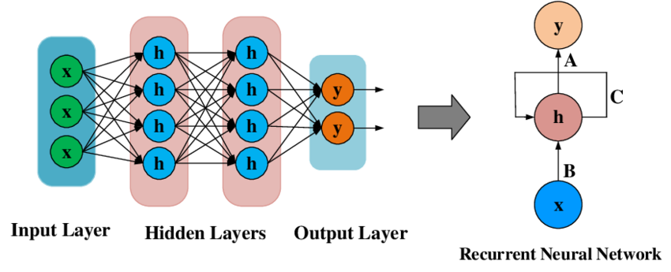
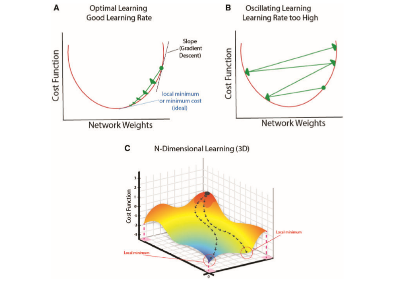
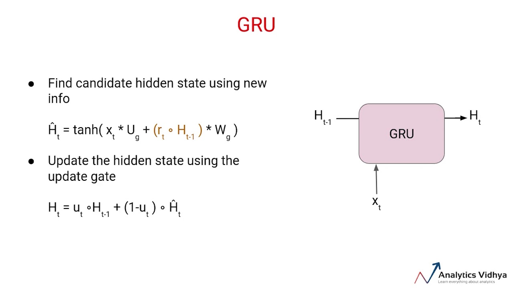
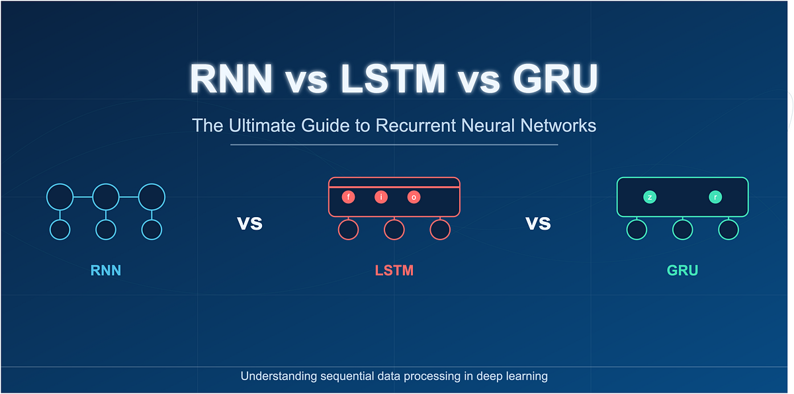

# 🔁 Day 27 – RNN / LSTM / GRU  
🧠 #DailyMLDose | Understanding Sequence Models

Welcome to **Day 27** of #DailyMLDose!  
Today, we revisit the fundamental neural architectures that were state-of-the-art before Transformers took over:  
**RNNs, LSTMs, and GRUs** – the OGs of sequence modeling. 📈

---

## 🔄 Why Sequence Models?

They’re designed for data where **order matters**:  
📝 Text → Language Modeling  
📊 Time Series → Stock Prediction  
🎵 Audio → Speech Recognition

---
✅ Folder Structure
```css

day27-rnn-lstm-gru/
├── code/
│   ├── rnn_demo.py
│   ├── lstm_demo.py
│   └── gru_demo.py
│
├── images/
│   ├── rnn_vs_lstm_vs_gru_comparison.png
│   ├── rnn_loop_architecture.png
│   ├── lstm_cell_explained.png
│   ├── gru_cell_explained.png
│   ├── rnn_exploding_gradient.png
│   └── sequence_modeling_example_diagram.png
└── README.md
```
---

## 🧩 1. RNN – Recurrent Neural Network

- Processes inputs **sequentially**
- Passes hidden state forward
- Learns time-dependent patterns

**BUT:** Suffers from vanishing/exploding gradients

🖼️ Visual:  
  


---

## 🧠 2. LSTM – Long Short-Term Memory

- Adds **gates** (input, forget, output)  
- Retains long-range dependencies  
- Solves gradient issues

🖼️ Visual:  


---

## ⚡ 3. GRU – Gated Recurrent Unit

- Simplified version of LSTM  
- Combines gates into fewer components  
- Faster, competitive performance

🖼️ Visual:  


---

## 🧠 Summary Comparison

| Feature            | RNN        | LSTM         | GRU          |
|--------------------|------------|--------------|--------------|
| Vanishing Gradient | ❌ Yes     | ✅ Resolved  | ✅ Resolved  |
| Long-Term Memory   | ❌ Weak    | ✅ Strong    | ✅ Strong    |
| Training Speed     | ⚡ Fast    | 🐢 Slower    | ⚡ Faster    |
| Architecture       | Simple     | Complex      | Medium       |

🖼️ Comparison Visual:  


---

## 🧪 Code Snippets

### 🔁 RNN with PyTorch

```python
import torch.nn as nn

rnn = nn.RNN(input_size=10, hidden_size=20, num_layers=1, batch_first=True)
```
🔁 LSTM
```python

lstm = nn.LSTM(input_size=10, hidden_size=20, num_layers=1, batch_first=True)
```
🔁 GRU
```python

gru = nn.GRU(input_size=10, hidden_size=20, num_layers=1, batch_first=True)
```
🖼️ Application Visual

🔁 Previous Post
1[📌 Day 26 → Transformers](.//day26-transformers)

🙌 Stay Connected
- 🔗 [Follow Shadabur Rahaman on LinkedIn](https://www.linkedin.com/in/shadabur-rahaman-1b5703249)
⭐ Star the GitHub Repo
Memory matters. Let your models remember wisely. 🧠🌀
