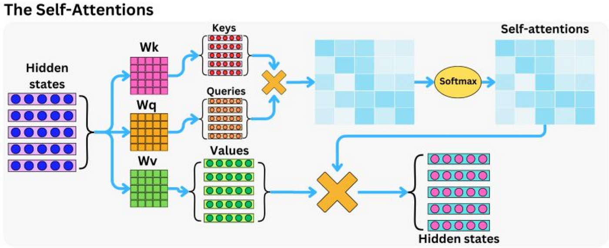
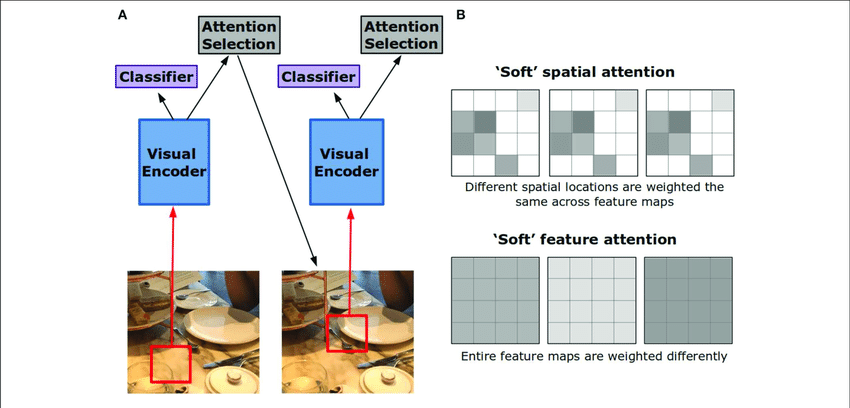

# 🎯 Day 28 – Attention Mechanisms  
🧠 #DailyMLDose | Let Your Model Learn What to Focus On

Welcome to **Day 28** of #DailyMLDose!  
Today, we spotlight one of the most powerful innovations in deep learning:  
**Attention Mechanisms** — the backbone of modern NLP and Vision models.

---
✅ Folder Structure
```css

day28-attention-mechanism/
├── code/
│   ├── basic_attention_numpy.py
│   └── pytorch_scaled_dot_product_attention.py
│
├── images/
│   ├── attention_mechanism_explained.png.png
│   ├── scaled_dot_product_attention_formula.png
│   ├── attention_score_visualization.png
│   ├── soft_vs_hard_attention.png
│   ├── attention_flow_diagram.png
│   ├── attention_vs_selfattention.png
│   └── attention_in_machine_translation.png
└── README.md
```
---
## 🤔 What is Attention?

In human learning, **we don’t read every word equally**.  
We focus more on **key information** — and attention lets machines do the same.

---

## 📌 Types of Attention

| Type           | Description                               |
|----------------|-------------------------------------------|
| Soft Attention | Uses weighted averages (differentiable)   |
| Hard Attention | Makes discrete choices (non-differentiable)|
| Self-Attention | Each word attends to every other word     |
| Cross-Attention| Target attends to source (e.g. translation) |

🖼️ Visuals:  
  


---

## 🧮 Scaled Dot-Product Attention

Given Queries (Q), Keys (K), and Values (V):

```math
Attention(Q, K, V) = softmax(QKᵀ / √dₖ) · V
```
🖼️ Visuals:


🧠 Self vs Regular Attention
Regular Attention: Decoder focuses on encoder output

Self-Attention: Sequence attends to itself (used in Transformers)

🖼️ Visuals:

🌍 Real-World Use Case
In translation:

"The cat sat on the mat." → "Le chat s’est assis sur le tapis."
Each French word focuses differently on English words.
🖼️

🧪 Python Code Demos
✅ Basic Attention in NumPy
```python
import numpy as np

def attention(Q, K, V):
    d_k = Q.shape[-1]
    scores = np.matmul(Q, K.transpose(0, 2, 1)) / np.sqrt(d_k)
    weights = np.exp(scores) / np.sum(np.exp(scores), axis=-1, keepdims=True)
    return np.matmul(weights, V)

# Toy input
Q = np.random.rand(1, 5, 64)
K = np.random.rand(1, 5, 64)
V = np.random.rand(1, 5, 64)

output = attention(Q, K, V)
print("Output shape:", output.shape)
```
✅ Scaled Dot-Product Attention (PyTorch)
```python
import torch
import torch.nn.functional as F

def scaled_dot_product_attention(Q, K, V):
    d_k = Q.size(-1)
    scores = torch.matmul(Q, K.transpose(-2, -1)) / d_k**0.5
    weights = F.softmax(scores, dim=-1)
    return torch.matmul(weights, V)

# Example
Q = torch.rand(2, 4, 64)
K = torch.rand(2, 4, 64)
V = torch.rand(2, 4, 64)

output = scaled_dot_product_attention(Q, K, V)
print("Attention Output:", output.shape)
```
🧠 Summary Table
🧩 Component	🔍 Description
Q (Query)	What you're looking for
K (Key)	What you’re comparing against
V (Value)	What to return if match is strong
Softmax(Q·Kᵀ)	Attention weights
Output = weighted V	Final attended representation

🔁 Previous Post


🙌 Stay Connected
- 🔗 [Follow Shadabur Rahaman on LinkedIn](https://www.linkedin.com/in/shadabur-rahaman-1b5703249)
⭐ Star the GitHub Repo
Train your models to focus — that’s where intelligence begins. 🎯
