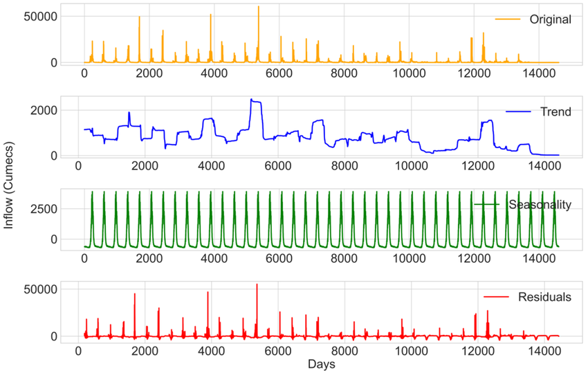
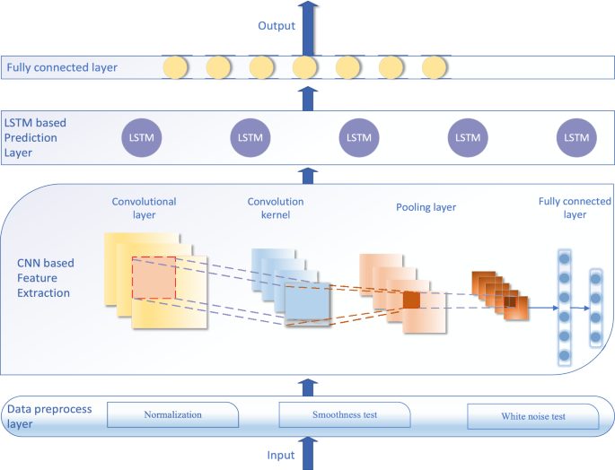
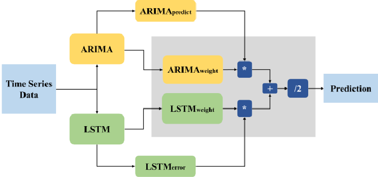
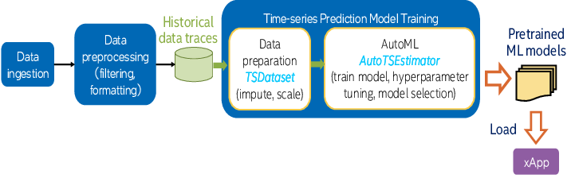

# 📈 Day 29 – Time Series Forecasting (ARIMA, LSTM)  
📚 #DailyMLDose | Predicting the Future — One Time Step at a Time

Welcome to **Day 29** of #DailyMLDose!  
Time Series Forecasting helps us answer:  
> “What happens **next**?”

From stock markets to energy demand and weather — time series models are everywhere.  
Today, we explore both **ARIMA (statistical)** and **LSTM (neural)** forecasting approaches.

---
✅ Folder Structure
```css
day29-time-series-forecasting/
├── code/
│   ├── arima_forecasting.py
│   └── lstm_forecasting_keras.py
│
├── images/
│   ├── arima_model_diagram.png
│   ├── lstm_for_timeseries_visual.png
│   ├── trend_seasonality_residuals.png
│   ├── arima_vs_lstm.png
│   ├── timeseries_data_pipeline.png
│   └── time_series_example_forecast.png
└── README.md
```
---
## 🧮 1. ARIMA – AutoRegressive Integrated Moving Average

📊 Works well for:
- Stationary time series
- Data with clear trend and seasonality

🖼️ Visuals:  
  


---

## 🧠 2. LSTM – Long Short-Term Memory for Sequences

⚡ Deep learning model that:
- Learns from past sequences
- Detects temporal dependencies
- Great for non-linear, noisy, complex data

🖼️ Visuals:  
  


---

## 🔀 Pipeline



---

## 🧪 Code Snippets

### ✅ ARIMA (Statsmodels)

```python
from statsmodels.tsa.arima.model import ARIMA
import pandas as pd

# Load your time series (e.g., daily prices)
data = pd.read_csv("your_timeseries.csv", index_col='Date', parse_dates=True)
series = data['Close']

# Fit ARIMA
model = ARIMA(series, order=(5,1,0))
model_fit = model.fit()

# Forecast
forecast = model_fit.forecast(steps=10)
print(forecast)
```
✅ LSTM (Keras)
```python

import numpy as np
from tensorflow.keras.models import Sequential
from tensorflow.keras.layers import LSTM, Dense

# Prepare data (X: sequences, y: next step)
X = np.random.rand(100, 10, 1)  # (samples, timesteps, features)
y = np.random.rand(100, 1)

model = Sequential([
    LSTM(64, input_shape=(10, 1)),
    Dense(1)
])

model.compile(loss='mse', optimizer='adam')
model.fit(X, y, epochs=10, batch_size=16)
```
⚔️ ARIMA vs LSTM
Feature	ARIMA	LSTM
Type	Statistical	Deep Learning
Handles Trend	✅	✅
Handles Seasonality	✅	✅ (with enough data)
Non-linearity	❌	✅
Interpretability	✅ High	❌ Lower
Data Needed	Low	High

🔁 Previous Post


🙌 Stay Connected
- 🔗 [Follow Shadabur Rahaman on LinkedIn](https://www.linkedin.com/in/shadabur-rahaman-1b5703249)
⭐ Star the GitHub Repo
Let’s make the future a little more predictable. 🔮
