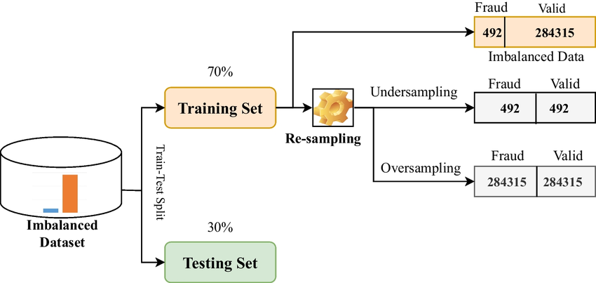
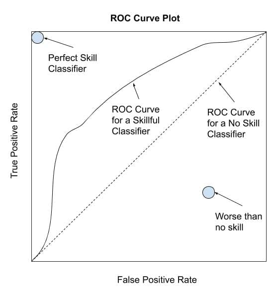
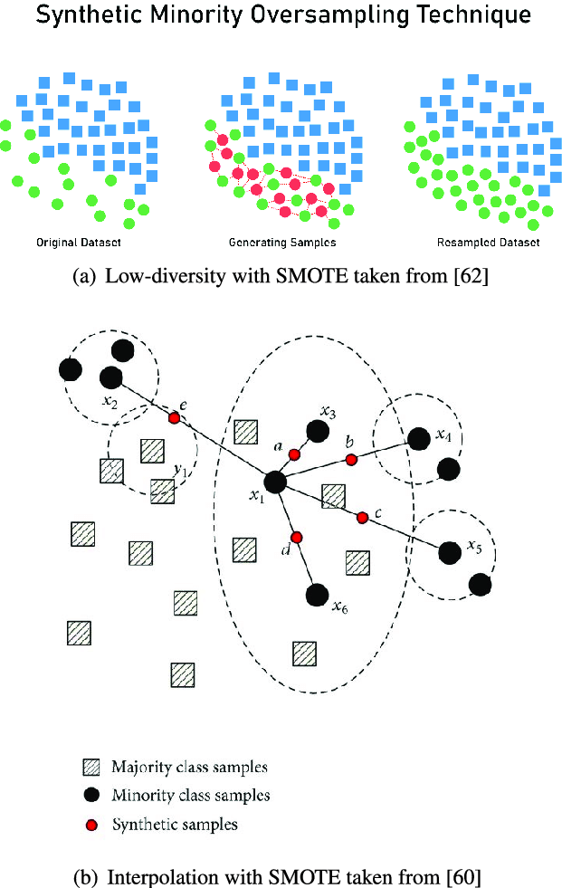
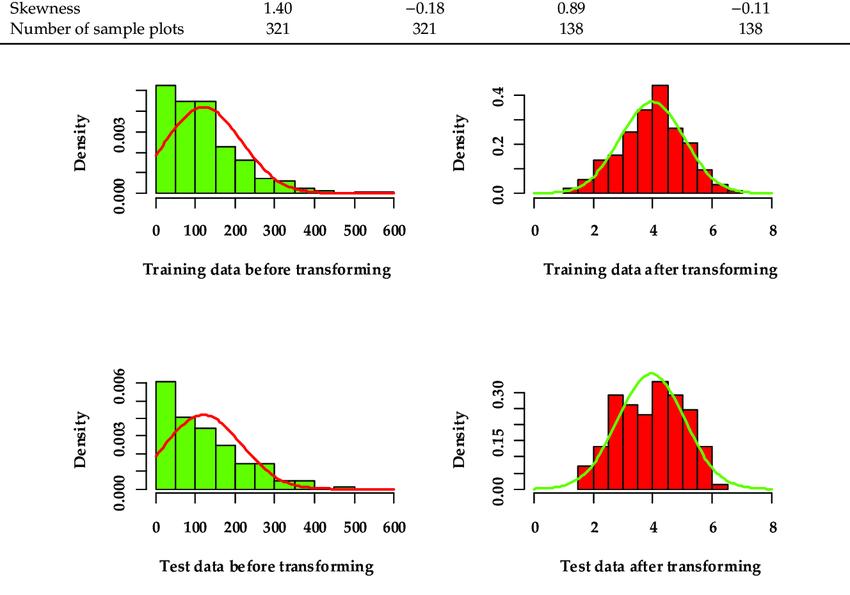
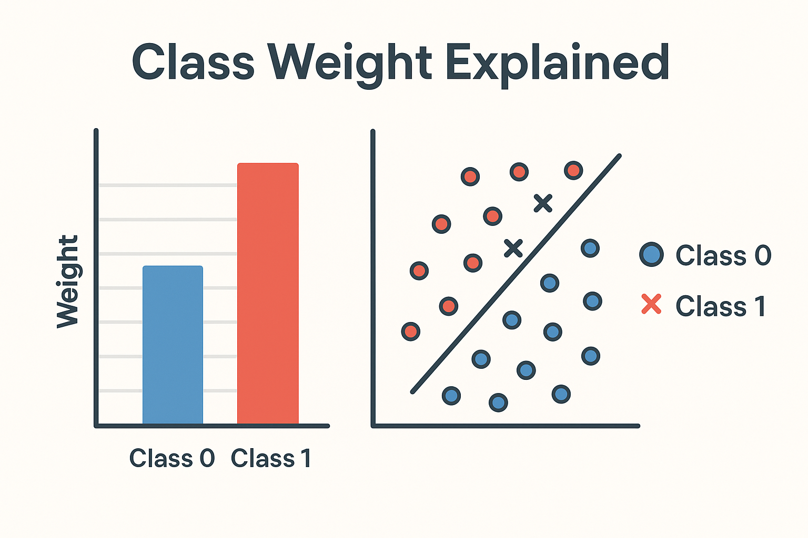

# ⚖️ Day 30 – Imbalanced Data Techniques (SMOTE, Class Weights)  
🧠 #DailyMLDose | Giving Minority Classes a Fair Chance

Welcome to **Day 30** of #DailyMLDose!  
Today we explore how to tackle one of the most common real-world problems in ML — **imbalanced datasets**.

Whether it's fraud detection, medical diagnosis, or spam filtering — the **minority class matters**!

---
✅ Folder Structure
```css
day30-imbalanced-data-techniques/
├── code/
│   ├── smote_demo.py
│   └── class_weight_sklearn.py
│
├── images/
│   ├── smote_visualization.png
│   ├── class_weight_explained.png
│   ├── data_distribution_before_after.png
│   ├── imbalance_problem_diagram.png
│   ├── evaluation_metrics_imbalance.jpg
│   └── confusion_matrix_imbalanced.png
└── README.md
```
---
## 📉 The Problem

When one class heavily outweighs the other(s), most models tend to predict the **majority class** all the time.  
Accuracy becomes misleading and F1 Score, Precision, and Recall become more important.

🖼️ Visuals:  
  


---

## 🧪 Technique 1: SMOTE (Synthetic Minority Over-sampling Technique)

📌 Creates synthetic examples of the minority class using k-NN interpolation  
✅ More balanced training set  
⚠️ Risk of overfitting if used improperly

🖼️ Visuals:  
  


---

## 🧪 Technique 2: Class Weights

📌 Tells the model to **"pay more attention"** to the minority class  
✅ Works great with tree models and neural networks  
💡 Many libraries support `class_weight='balanced'`

🖼️ Visual:  


---

## 🔬 Evaluation Metrics for Imbalanced Data

- **Precision**: Of all predicted positives, how many were correct?
- **Recall**: Of all actual positives, how many did we catch?
- **F1 Score**: Balance between precision and recall
- **Confusion Matrix**: Deeper insight

🖼️ Confusion Matrix:  


---

## 🧪 Code Demos

### 🔁 SMOTE Example (Imbalanced-learn)

```python
from imblearn.over_sampling import SMOTE
from sklearn.datasets import make_classification

X, y = make_classification(n_samples=1000, n_classes=2, weights=[0.9, 0.1], random_state=42)

smote = SMOTE()
X_res, y_res = smote.fit_resample(X, y)

print("Before SMOTE:", dict(zip(*np.unique(y, return_counts=True))))
print("After SMOTE:", dict(zip(*np.unique(y_res, return_counts=True))))
```
⚖️ Class Weight in Sklearn
```python
from sklearn.linear_model import LogisticRegression
from sklearn.utils.class_weight import compute_class_weight
import numpy as np

classes = np.array([0, 1])
weights = compute_class_weight(class_weight='balanced', classes=classes, y=y)
print("Class Weights:", dict(zip(classes, weights)))

model = LogisticRegression(class_weight='balanced')
model.fit(X, y)
```
✅ Summary Table
Technique	When to Use	Pros	Cons
SMOTE	Low-data scenarios	Boosts minority signal	Risk of overfitting
Class Weights	Most models	Easy & effective	May underperform on noisy data
Undersampling	Large majority class	Fast	Risk of losing information

🔁 Previous Post
📌 Day 29 → Time Series Forecasting (ARIMA, LSTM)

🎨 Visual Credits
@imbalanced-learn, @Scikit-learn, @KDnuggets, @TowardsDataScience

🙌 Thank You for Joining #DailyMLDose 🎉
🔗 Follow Shadabur Rahaman
⭐ Star the GitHub Repo
Let’s keep fixing biases — in data and in life. 💡
