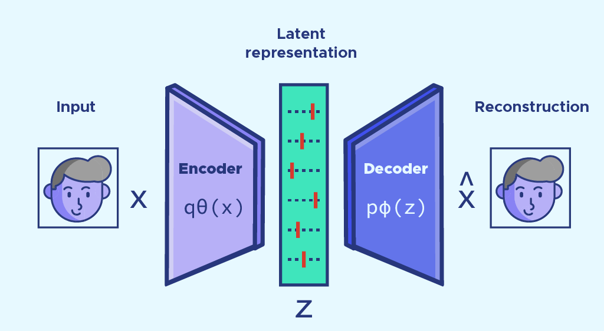
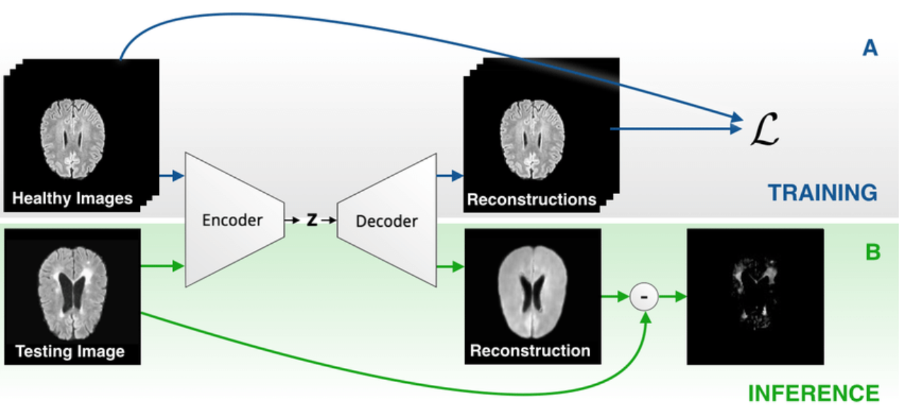
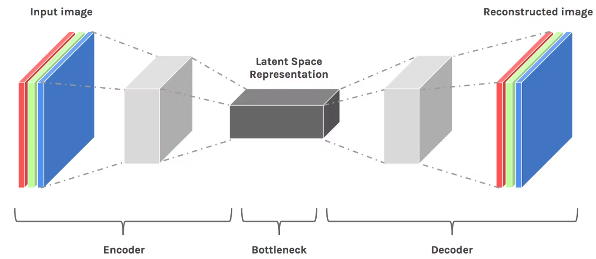
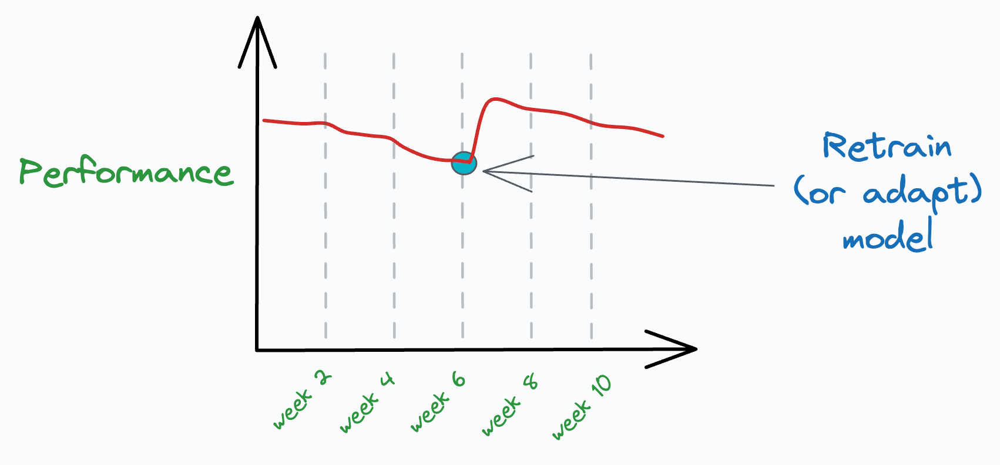
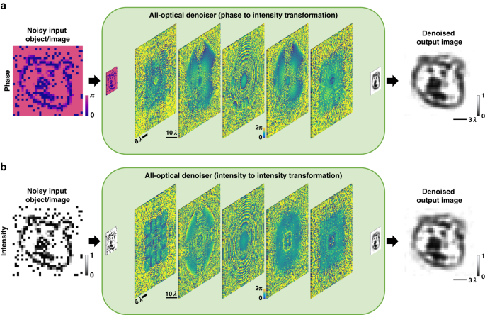

# 🧠 Day 31 – Autoencoders: Learn to Compress & Reconstruct  
🎯 #DailyMLDose (Bonus Post) | Unsupervised Learning Powerhouses

Welcome to **Day 31** of #DailyMLDose!  
Today we explore **Autoencoders** - neural networks that learn efficient data representations through compression and reconstruction.

---

## 🚀 What are Autoencoders?

Autoencoders are unsupervised neural networks that:
1. **Compress** input data into a latent-space representation
2. **Reconstruct** the original input from this compressed form

### 💡 Think of it like:
> An archivist who summarizes complex documents into concise abstracts,  
> then reconstructs the full document from those summaries. 📄➡️📝➡️📄

---

## 🎯 When to Use Autoencoders

✅ Dimensionality reduction  
✅ Anomaly detection  
✅ Image denoising  
✅ Feature extraction  
✅ Data generation (with variational autoencoders)

---

## 🔑 Key Components

| Component         | Function                                      | Importance |
|-------------------|-----------------------------------------------|------------|
| **Encoder**       | Compresses input → latent space (bottleneck)  | Learns efficient representations |
| **Latent Space**  | Compressed knowledge representation           | Critical information bottleneck |
| **Decoder**       | Reconstructs input from latent representation | Tests representation quality |

---

## 🧩 Types of Autoencoders

| Type                | Special Feature                       | Use Case                  |
|---------------------|----------------------------------------|---------------------------|
| **Undercomplete**   | Bottleneck layer smaller than input    | Feature learning          |
| **Denoising**       | Trained on corrupted inputs           | Data cleaning             |
| **Variational (VAE)**| Probabilistic latent space            | Data generation           |
| **Sparse**          | Activation constraints                | Interpretable features    |

---

## 🖼️ Autoencoder Visualizations

<div align="center">

### 🏗️ Basic Architecture  
  

### 🔍 Input vs Reconstruction  
  

### ⚠️ Anomaly Detection  
  

### 🌀 Latent Space Visualization  
  

### 📉 Training Progress  
  

### ✨ Denoising Effect  
  
</div>

---

## 🧪 Code Examples

### Basic Autoencoder (Keras)
```python
from tensorflow.keras import layers, Model

# Encoder
input_img = layers.Input(shape=(784,))
encoded = layers.Dense(128, activation='relu')(input_img)
encoded = layers.Dense(64, activation='relu')(encoded)
encoded = layers.Dense(32, activation='relu')(encoded)  # Latent space

# Decoder
decoded = layers.Dense(64, activation='relu')(encoded)
decoded = layers.Dense(128, activation='relu')(decoded)
decoded = layers.Dense(784, activation='sigmoid')(decoded)

# Autoencoder model
autoencoder = Model(input_img, decoded)
autoencoder.compile(optimizer='adam', loss='binary_crossentropy')
```
Denoising Autoencoder
```python
# Corrupt input with noise
noisy_imgs = original_imgs + 0.5 * np.random.normal(size=original_imgs.shape)

# Train to reconstruct original from noisy input
autoencoder.fit(noisy_imgs, original_imgs, 
                epochs=50, 
                batch_size=256)
```
Anomaly Detection
```python
# Calculate reconstruction error
reconstructions = autoencoder.predict(test_data)
mse = np.mean(np.power(test_data - reconstructions, 2), axis=1)

# Flag anomalies (high reconstruction error)
threshold = np.percentile(mse, 95)
anomalies = test_data[mse > threshold]
```
📂 Folder Structure
```css
day31-autoencoders/
├── code/
│   ├── autoencoder_basic_keras.py
│   ├── autoencoder_anomaly_detection.py
│   └── autoencoder_denoising_mnist.py
│
├── images/
│   ├── autoencoder_architecture.png
│   ├── input_vs_reconstruction.png
│   ├── anomaly_detection_autoencoder.png
│   ├── autoencoder_latent_space_2D.png
│   ├── reconstruction_loss_curve.png
│   └── denoising_effect_mnist.png
└── README.md
```
🧠 Summary
🔄 Autoencoders learn efficient data representations through reconstruction

🎭 Different types solve specific problems (denoising, generation, etc.)

📦 Latent space captures essential features of input data

🕵️‍♂️ Reconstruction error enables anomaly detection

🎨 VAEs enable controlled data generation

🔁 Previous Post


🙌 Stay Connected
- 🔗 [Follow Shadabur Rahaman on LinkedIn](https://www.linkedin.com/in/shadabur-rahaman-1b5703249)
⭐ Star the GitHub Repo
"In the latent space, complexity finds its simplest truth."

The Autoencoder's Credo

⭐ Star this repo to fuel our ML journey!
