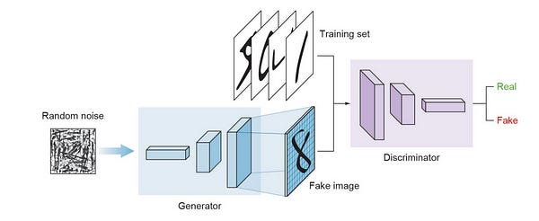
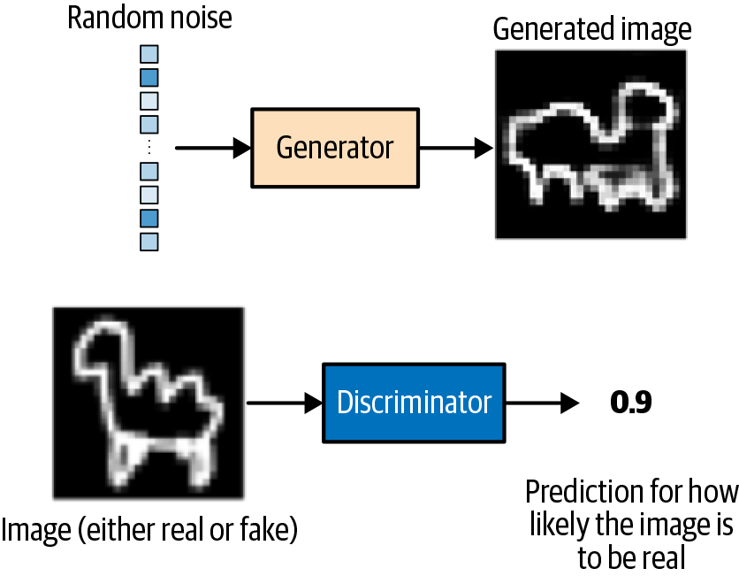
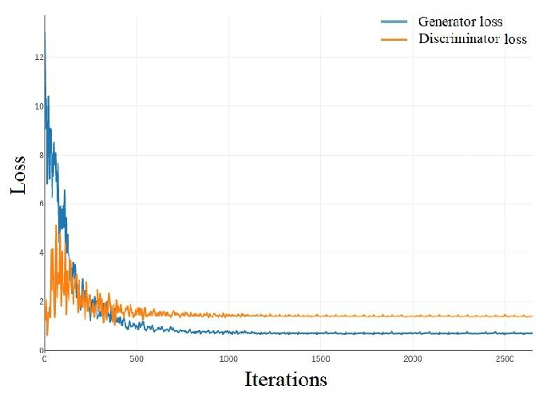
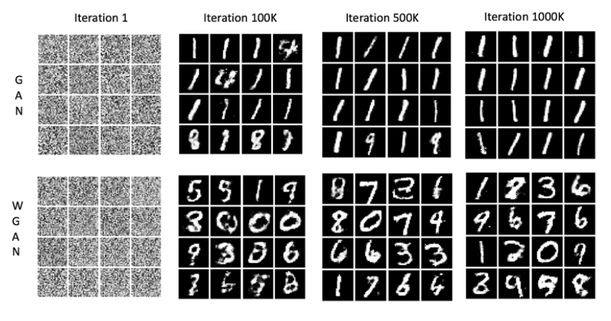

# 🎭 Day 32 – GANs (Generative Adversarial Networks)

Welcome to **Day 32** of #DailyMLDose!  
Today we enter the fascinating world of **generative modeling** with **GANs** — networks that can imagine, create, and generate synthetic data from noise!

---
```css
day32-gans/
├── code/
│   ├── gan_mnist_basic.py
│   └── gan_discriminator_vs_generator.py
│
├── images/
│   ├── gan_architecture_dig.jpg
│   ├── generator_vs_discriminator.png
│   ├── fake_vs_real_samples.jpg
│   ├── training_curve_gan.png
│   ├── how_gans_work.jpg
│   └── mode_collapse_example.png
└── README.md
```
---
## 🧠 What are GANs?

A **GAN** consists of two competing neural networks:

- **🧪 Generator**: Creates fake data from random noise  
- **🔍 Discriminator**: Tries to distinguish real from fake

Over time, both networks get better — the generator learns to **fool** the discriminator, while the discriminator learns to **spot** fakes.

🖼️ Visuals:
  


---

## 💡 Use Cases
- 🎨 AI Art Generation  
- 🧬 Synthetic Medical Images  
- 🧑‍🤖 Deepfake Creation / Detection  
- 🧪 Drug Discovery  
- 🎮 Game Asset Generation

---

## 🔬 Training Dynamics

- **Zero-sum game** between Generator and Discriminator  
- Training is notoriously unstable  
- Problems: Mode collapse, vanishing gradients

🖼️ Visuals:
  


---

## 🧪 Code Demos

### ✅ 1. Basic GAN with MNIST (`gan_mnist_basic.py`)

```python
from tensorflow.keras.layers import Dense, LeakyReLU, Reshape, Flatten
from tensorflow.keras.models import Sequential
from tensorflow.keras.optimizers import Adam
import numpy as np
from tensorflow.keras.datasets import mnist
import matplotlib.pyplot as plt

# Load data
(X_train, _), _ = mnist.load_data()
X_train = (X_train.astype(np.float32) - 127.5) / 127.5
X_train = X_train.reshape(-1, 784)

# Generator
def build_generator():
    model = Sequential([
        Dense(128, input_dim=100),
        LeakyReLU(0.2),
        Dense(784, activation='tanh'),
        Reshape((28, 28))
    ])
    return model

# Discriminator
def build_discriminator():
    model = Sequential([
        Flatten(input_shape=(28, 28)),
        Dense(128),
        LeakyReLU(0.2),
        Dense(1, activation='sigmoid')
    ])
    return model

# Build and compile
generator = build_generator()
discriminator = build_discriminator()
discriminator.compile(optimizer=Adam(0.0002), loss='binary_crossentropy', metrics=['accuracy'])

# GAN model
discriminator.trainable = False
gan = Sequential([generator, discriminator])
gan.compile(optimizer=Adam(0.0002), loss='binary_crossentropy')

# Training loop
def train(epochs=10000, batch_size=64):
    for epoch in range(epochs):
        # Real images
        idx = np.random.randint(0, X_train.shape[0], batch_size)
        real_imgs = X_train[idx]
        
        # Fake images
        noise = np.random.normal(0, 1, (batch_size, 100))
        fake_imgs = generator.predict(noise)
        
        # Train discriminator
        d_loss_real = discriminator.train_on_batch(real_imgs, np.ones((batch_size, 1)))
        d_loss_fake = discriminator.train_on_batch(fake_imgs, np.zeros((batch_size, 1)))
        
        # Train generator
        noise = np.random.normal(0, 1, (batch_size, 100))
        g_loss = gan.train_on_batch(noise, np.ones((batch_size, 1)))
        
        # Print progress
        if epoch % 1000 == 0:
            print(f"Epoch {epoch}, D loss: {0.5*(d_loss_real[0] + d_loss_fake[0])}, G loss: {g_loss}")
            save_images(generator, epoch)

# Save generated images
def save_images(generator, epoch):
    noise = np.random.normal(0, 1, (25, 100))
    gen_imgs = generator.predict(noise)
    gen_imgs = 0.5 * gen_imgs + 0.5

    fig, axs = plt.subplots(5, 5)
    for i in range(25):
        axs[i//5, i%5].imshow(gen_imgs[i], cmap='gray')
        axs[i//5, i%5].axis('off')
    plt.tight_layout()
    plt.savefig(f"images/gan_generated_{epoch}.png")
    plt.close()

train()
```
✅ Summary
Component	Description
Generator	Learns to mimic real data distribution
Discriminator	Learns to distinguish real vs fake
GAN Objective	Minimax game between the two
Challenges	Mode collapse, unstable gradients

Generated visualizations via matplotlib

🔁 Previous Post


🙌 Stay Connected
- 🔗 [Follow Shadabur Rahaman on LinkedIn](https://www.linkedin.com/in/shadabur-rahaman-1b5703249)
- ⭐ Star the GitHub Repo
GANs can be tricky, but also revolutionary — let’s keep generating brilliance! 🚀

