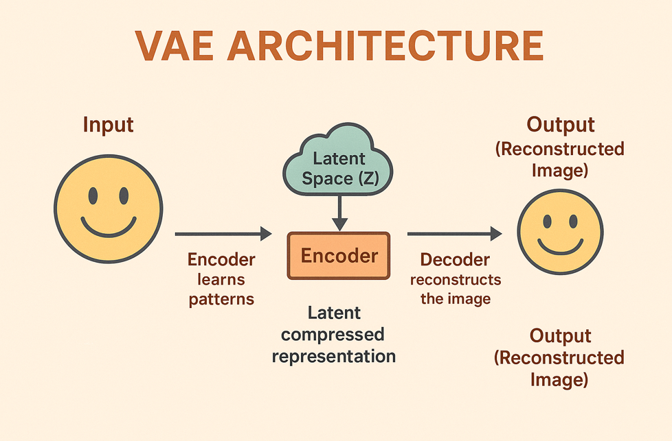
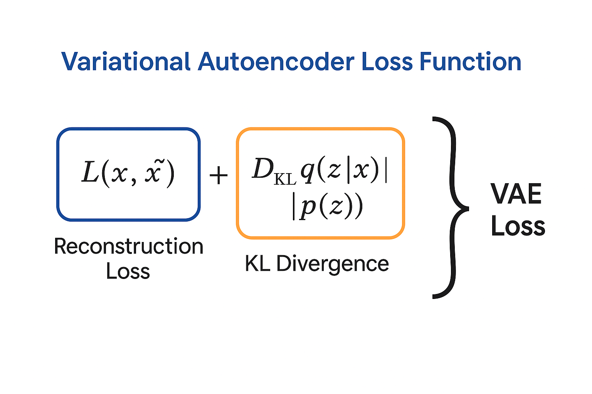
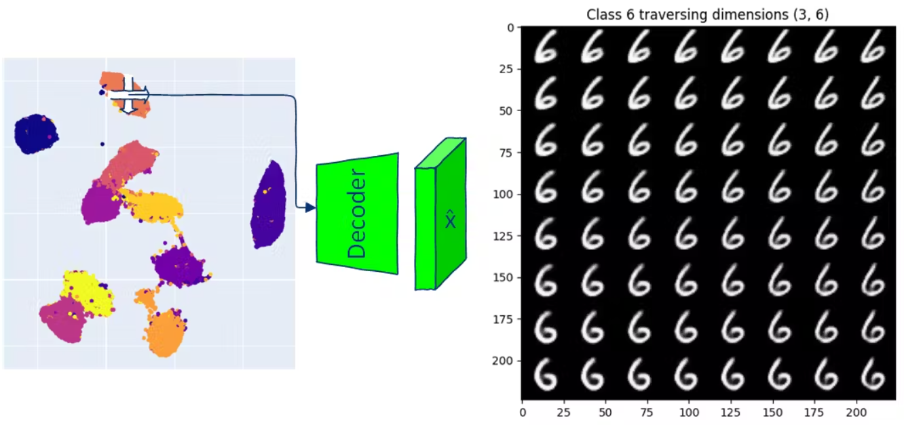
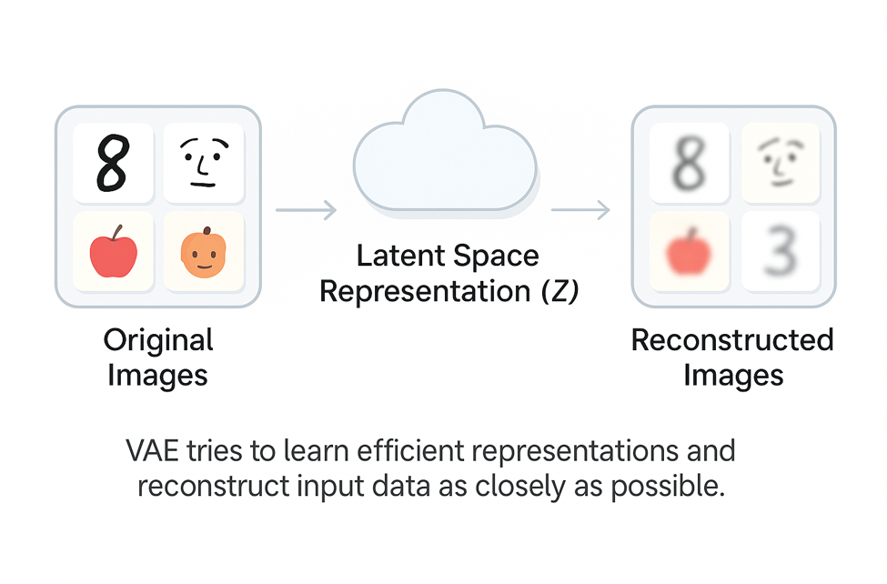
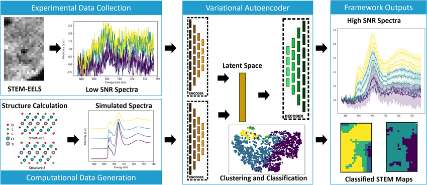

# 🧠 Day 33 – Variational Autoencoders (VAEs): Structure in Generation  
🎯 #DailyMLDose | Probabilistic Neural Architectures for Generative Modeling

Welcome to **Day 33** of #DailyMLDose!  
Today we explore **Variational Autoencoders (VAEs)** — the probabilistic twist on traditional Autoencoders that enables powerful data generation.

---

## 🚀 What are Variational Autoencoders?

VAEs are generative models that learn not just to compress and reconstruct data — but to **generate new, meaningful samples** by learning the **distribution** of the latent space.

---

### 💡 Analogy:
> Imagine translating every photo into a coordinate on a map.  
> The map allows you to explore infinite new combinations, creating new “photos”  
> by simply navigating to different points. 🗺️🧭🖼️

---

## 🎯 Why Use VAEs?

✅ Learn smooth, continuous latent spaces  
✅ Generate new data from noise  
✅ Interpolate between classes  
✅ Enable semi-supervised learning  
✅ Build deep probabilistic models

---

## 🔑 Key Concepts

| Concept               | Description                                      |
|------------------------|--------------------------------------------------|
| **Latent Distribution**| Enforced prior (e.g., Gaussian) on embeddings   |
| **Reparameterization** | Trick to enable backprop through sampling       |
| **KL Divergence**      | Regularizes latent distribution                 |
| **Decoder**            | Generates output from latent points             |

---

## 🧩 VAE vs Autoencoder

| Feature            | Autoencoder                | VAE                          |
|--------------------|----------------------------|------------------------------|
| Latent Space       | Deterministic               | Probabilistic                |
| Sampling           | Not possible                | Can sample from latent space |
| Use Case           | Compression/Reconstruction  | Generation, Representation   |
| Loss Function      | MSE                         | MSE + KL Divergence          |

---

## 🖼️ VAE Visualizations

<div align="center">

### 🧠 Architecture  


### 📉 Loss Breakdown  


### 🔍 Latent Space  


### 🌀 Reconstruction  


### 🔁 Full Pipeline  


</div>

---

## 🧪 Code Examples

### ✨ VAE (Keras - Basic MNIST)

```python
# encoder
z_mean = Dense(latent_dim)(h)
z_log_var = Dense(latent_dim)(h)

# sampling
def sample(args):
    z_mean, z_log_var = args
    epsilon = K.random_normal(shape=(K.shape(z_mean)[0], latent_dim))
    return z_mean + K.exp(0.5 * z_log_var) * epsilon

z = Lambda(sample)([z_mean, z_log_var])
```
🧠 Loss = Reconstruction + KL Divergence
```python
def vae_loss(x, x_decoded, z_mean, z_log_var):
    recon = binary_crossentropy(x, x_decoded)
    kl = -0.5 * K.sum(1 + z_log_var - K.square(z_mean) - K.exp(z_log_var), axis=-1)
    return K.mean(recon + kl)
```
📂 Folder Structure
```css
day33-variational-autoencoders/
├── code/
│   ├── vae_mnist_basic.py
│   └── vae_encoder_decoder.py
│
├── images/
│   ├── vae_latent_space_demo.png
│   ├── vae_architecture.png
│   ├── vae_loss_function.png
│   ├── vae_reconstruction_demo.png
│   └── variational_autoencoder_workflow.png
└── README.md
```
🧠 Summary
🔄 VAEs add probabilistic reasoning to compression & reconstruction
🧬 The latent space becomes a generative canvas
📦 Learn structure, interpolate meaningfully, and generate new data
🌌 Ideal for semi-supervised, generative, and unsupervised learning tasks

🔁 Previous Posts

---

---
🙌 Stay Connected
- 🔗 [Follow Shadabur Rahaman on LinkedIn](https://www.linkedin.com/in/shadabur-rahaman-1b5703249)
⭐ Star the DailyMLDose GitHub Repo
