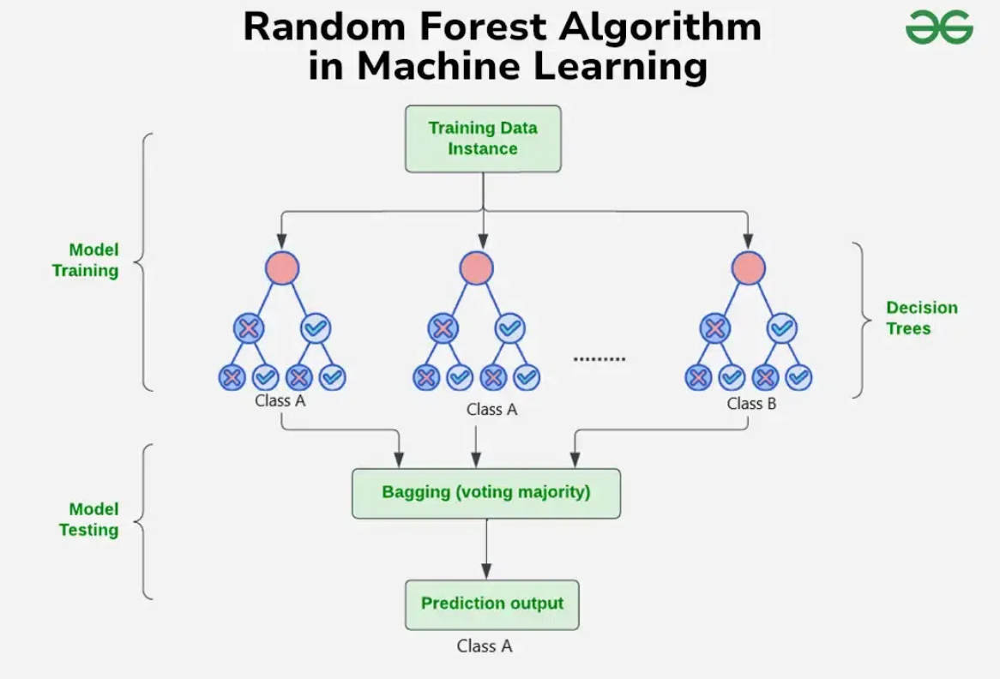
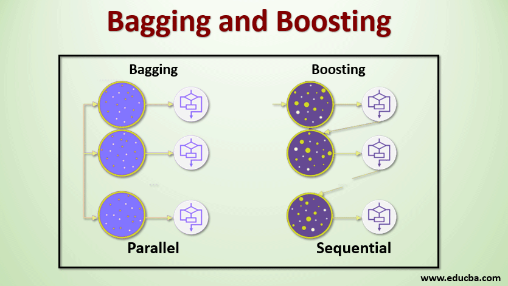
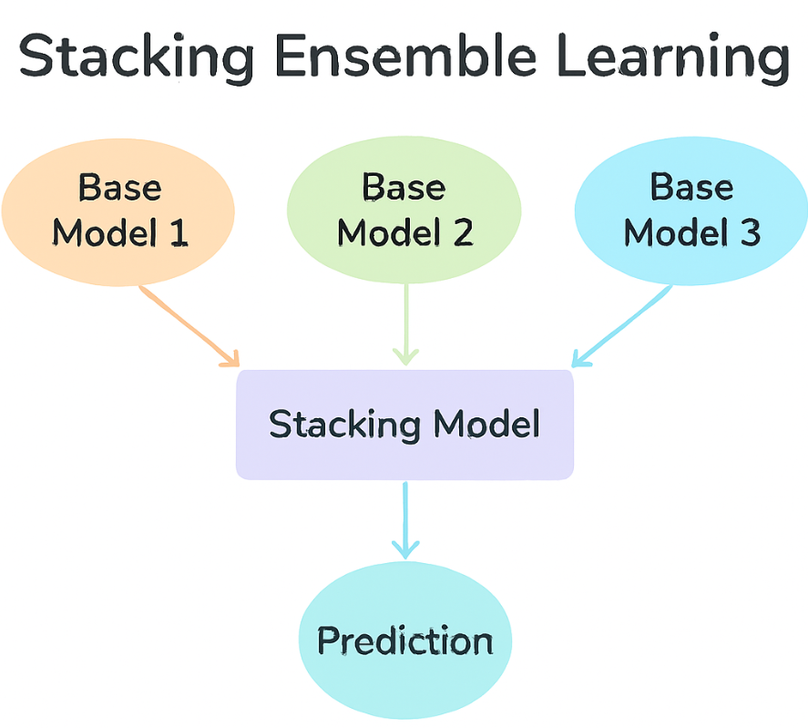
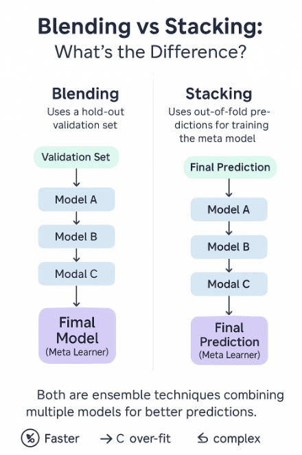
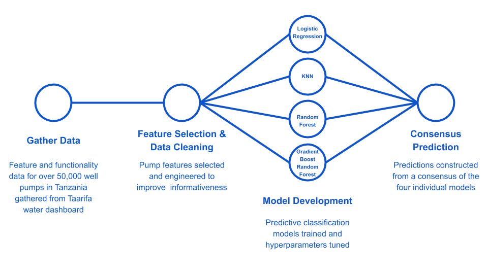

# 🧩 Day 36 – Ensemble Learning Techniques

Welcome to **Day 36** of the #DailyMLDose challenge!

Today, we dive into **Ensemble Learning** — a powerful method where **multiple models** collaborate to produce better, more stable predictions.

---

## 🔍 What is Ensemble Learning?

> Ensemble learning combines multiple base models to produce one optimal predictive model.


This method often **outperforms individual models** in terms of **accuracy, generalization**, and **robustness**.

---

## 📚 Common Ensemble Techniques

### 🧺 Bagging (Bootstrap Aggregating)

> Trains multiple models on different **random subsets** of the training data (with replacement), then aggregates their predictions.

- Reduces variance.
- Works best with high-variance models like Decision Trees.



### 🚀 Boosting

> Trains models **sequentially**, where each new model focuses on the **errors** made by the previous ones.

- Reduces bias and variance.
- Examples: AdaBoost, Gradient Boosting, XGBoost, CatBoost.



### 🧠 Stacking

> Combines **diverse models** (base learners), then uses a **meta-learner** to learn from their combined outputs.

- Great for capturing non-linear interactions.
- Often used in ML competitions like Kaggle.



### 🤝 Blending

> Similar to stacking but uses a **validation set** (instead of cross-validation) to train the meta-learner.

- Quicker but more prone to overfitting.



### ⚖️ Voting

> Combines predictions from multiple models using **hard voting** (majority rule) or **soft voting** (average probabilities).



---
## 📁 Folder Structure

```css
📁 day36-ensemble-learning/
├── code/
│   ├── bagging_random_forest.py
│   ├── xgboost_vs_stacking.py 
│   ├── catboost_classifier_blending.py 
│   └── voting_classifier_comparison.py
|       
├── images/
│   ├── bagging_vs_boosting.png
│   ├── random_forest_bagging_architecture.png
│   ├── stacking_architecture_diagram.png
│   ├── xgboost_vs_stacking_chart.png
│   ├── blending_vs_stacking_visual.png
│   ├── catboost_blending_flow.png
│   ├── voting_classifier_types.png
│   └── ensemble_methods_overview.png
└── README.md
```
🖼️ Visual Understanding
🔹 Bagging with Random Forest

🔹 Boosting vs Bagging

🔹 Stacking Architecture

🔹 Blending vs Stacking

🔹 Voting Classifier (Hard vs Soft)

🧪 Code Highlights
✅ Bagging with Random Forest
```python
Copy
Edit
model = RandomForestClassifier(n_estimators=100, max_depth=5)
model.fit(X_train, y_train)
```
✅ Stacking Models
```python
estimators = [
    ('lr', LogisticRegression()),
    ('svc', SVC(probability=True))
]
clf = StackingClassifier(estimators=estimators, final_estimator=GradientBoostingClassifier())
```
✅ Blending with CatBoost
```python
cat = CatBoostClassifier(verbose=0)
cat.fit(X_train_blend, y_train)
📊 Why Use Ensembles?
✅ Reduce Variance
✅ Reduce Bias
✅ Boost Accuracy
✅ Improve Generalization
```
🔗 Previous Topics


🙌 Stay Connected
- 🔗 [Follow Shadabur Rahaman on LinkedIn](https://www.linkedin.com/in/shadabur-rahaman-1b5703249)
⭐ Star the DailyMLDose GitHub Repo
📘 Let's learn ML, one dose a day!

🔥 Summary
Ensemble methods are among the most powerful tools in the ML toolbox. Whether you're building competition-grade models or optimizing production pipelines — mastering them is a must! 💪

📅 Stay Tuned
📌 Next Up: Day 37 – 🧠 Explainable AI (XAI): Building Trust in ML Models

#️⃣ #MachineLearning #EnsembleLearning #RandomForest #Boosting #Stacking #Blending #VotingClassifier #DataScience #DailyMLDose
