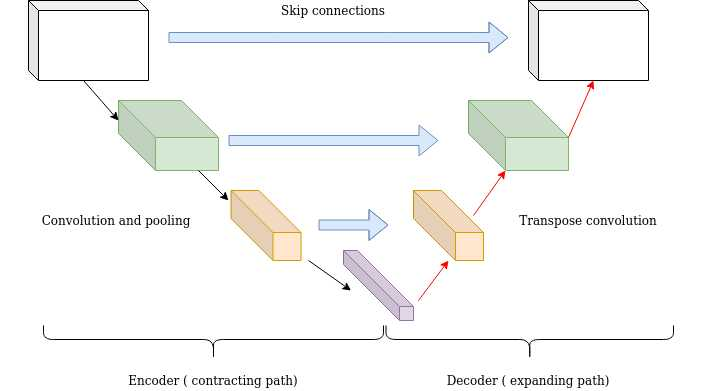

# 🖼️ Day 38 – Deep Learning for Computer Vision  
🔍 #DailyMLDose | Teaching Machines to See

Welcome to **Day 38** of #DailyMLDose!  
Today, we unlock the powerful world of **deep learning for images** — from CNN architectures to transfer learning.

Whether it's recognizing faces, detecting objects, or generating art, **computer vision** is one of the most practical and powerful domains in ML!

---

✅ Folder Structure
```css
day38-deep-learning-cv/
├── code/
│   ├── cnn_basics_image_classification.py
│   ├── transfer_learning_resnet.py
│   └── fine_tuning_efficientnet.py
│
├── images/
│   ├── cnn_architecture_diagram.png
│   ├── conv_pooling_layers.png
│   ├── resnet_skip_connection.jpg
│   ├── transfer_learning_flow.png
│   ├── fine_tuning_vs_feature_extraction.jpg
└── README.md
```
🧠 What is Deep Learning for CV?
Deep Learning in CV primarily uses Convolutional Neural Networks (CNNs), designed to automatically extract spatial hierarchies of features from images.


A basic CNN includes: 
Convolution Layers: Extract spatial features using filters

ReLU Activations: Introduce non-linearity

Pooling Layers: Downsample feature maps

Fully Connected Layers: Classify based on extracted features

🖼️ Visuals:
  
---
  
---
  
---
  
---
🔁 Transfer Learning
Why train from scratch when we can leverage pre-trained models like ResNet, VGG, EfficientNet?

Use pre-trained weights on large datasets (e.g., ImageNet)

Adapt the final layers to your task

Great for small or medium datasets

🖼️ Visuals:

🔁 Fine-Tuning vs Feature Extraction
Feature Extraction: Freeze all base layers, only train classifier head

Fine-Tuning: Unfreeze deeper layers and retrain

🖼️ Visual:

🧪 Code Demos
📦 CNN from Scratch (Keras)
```python

from tensorflow.keras.models import Sequential
from tensorflow.keras.layers import Conv2D, MaxPooling2D, Flatten, Dense

model = Sequential([
    Conv2D(32, (3,3), activation='relu', input_shape=(64, 64, 3)),
    MaxPooling2D(2, 2),
    Flatten(),
    Dense(128, activation='relu'),
    Dense(10, activation='softmax')
])
model.compile(optimizer='adam', loss='categorical_crossentropy', metrics=['accuracy'])
```
🔁 Transfer Learning with ResNet50

```python
from tensorflow.keras.applications import ResNet50
from tensorflow.keras.models import Model
from tensorflow.keras.layers import Dense, GlobalAveragePooling2D

base_model = ResNet50(weights='imagenet', include_top=False, input_shape=(224,224,3))
x = GlobalAveragePooling2D()(base_model.output)
output = Dense(5, activation='softmax')(x)

model = Model(inputs=base_model.input, outputs=output)
for layer in base_model.layers:
    layer.trainable = False  # Feature extraction
model.compile(optimizer='adam', loss='categorical_crossentropy', metrics=['accuracy'])
```
🎯 Fine-Tuning EfficientNet
```python

from tensorflow.keras.applications import EfficientNetB0

base_model = EfficientNetB0(include_top=False, weights='imagenet', input_shape=(224,224,3))
base_model.trainable = True  # Enable fine-tuning

# Freeze some early layers
for layer in base_model.layers[:100]:
    layer.trainable = False

x = GlobalAveragePooling2D()(base_model.output)
output = Dense(3, activation='softmax')(x)
model = Model(inputs=base_model.input, outputs=output)

model.compile(optimizer='adam', loss='categorical_crossentropy', metrics=['accuracy'])
```
🧠 Summary Table
Concept	Description
CNNs	Core of image classification
Transfer Learning	Reusing weights from pre-trained networks
Feature Extraction	Freeze base, train head only
Fine-Tuning	Unfreeze deeper layers + retrain
EfficientNet/ResNet	Powerful, scalable CV architectures

📌 Previous Post →


🙌 Thank You for Following #DailyMLDose 🙌
💬 Let’s keep learning, experimenting, and deploying smarter ML systems every day.

🙌 Let’s Connect!
📎 Connect With Me
- 🔗 [Follow Shadabur Rahaman on LinkedIn](https://www.linkedin.com/in/shadabur-rahaman-1b5703249)
---
⭐ Star the GitHub Repo
---
🔁 Share this if it helped!
