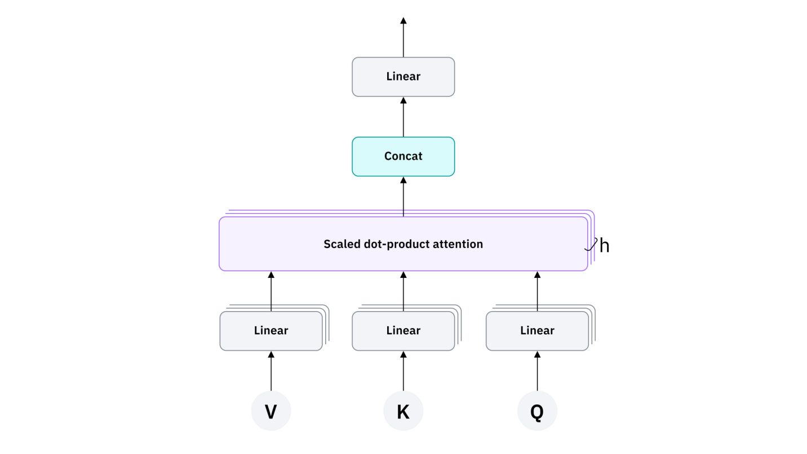
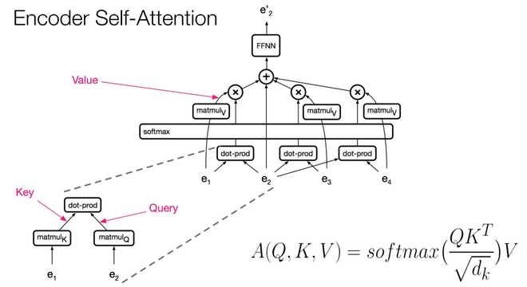
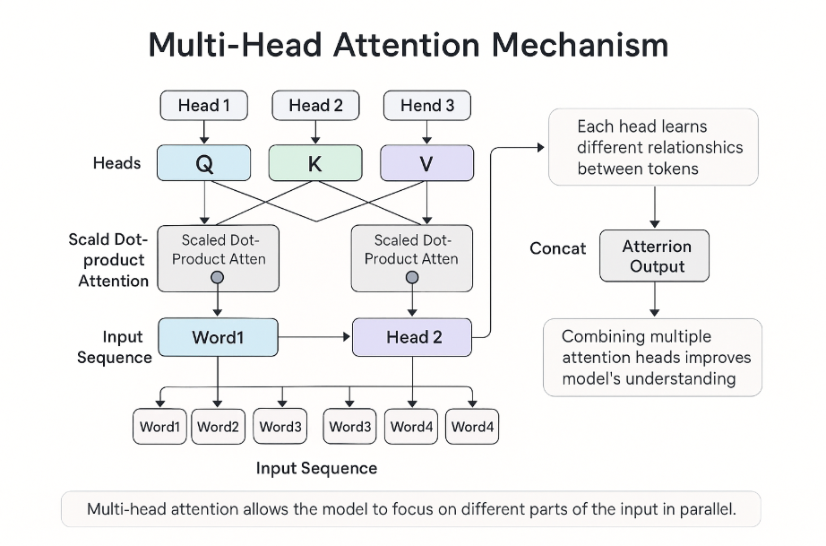
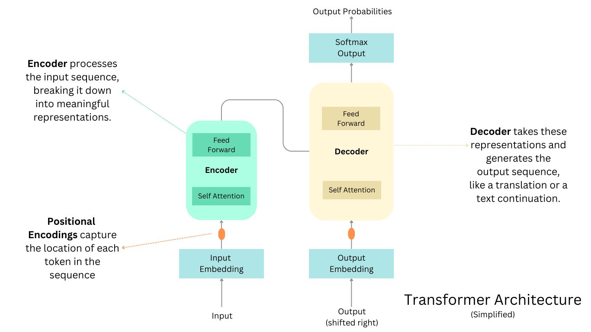

# 🧠 Day 40 – Attention Mechanisms  
📅 #DailyMLDose | #Transformers | #DeepLearning

> “Attention is all you need.” — The paper that changed AI forever

Welcome to **Day 40** of the #DailyMLDose challenge!  
Today, we explore the heart of modern Deep Learning models: **Attention** — the mechanism that powers GPT, BERT, Vision Transformers, and more.

---

## 🔍 What You’ll Learn

✅ What is Attention in Neural Networks  
✅ **Soft vs Hard Attention**  
✅ How **Self-Attention** works  
✅ **Multi-Head Attention** in Transformers  
✅ Use cases in NLP (BERT, GPT) and CV (ViT, DETR)



---

## 🧠 Key Concepts

| Mechanism             | Description |
|----------------------|-------------|
| **Attention**         | Focuses on relevant parts of the input when making predictions |
| **Self-Attention**    | Allows a model to relate different positions of a single sequence |
| **Multi-Head Attention** | Learns from multiple representation subspaces jointly |
| **Positional Encoding** | Adds order information in sequences |
| **Transformers**      | Entirely based on self-attention mechanisms, no recurrence/convolution |

---

## 📊 Visual Guide

### 🎯 1. Self-Attention Explained  


---

### 🧩 2. Multi-Head Attention  


---

### 📐 3. Attention in Transformers (Encoder-Decoder)  


---

## 📁 Folder Structure

```css
📁 day40-attention-mechanisms/
├── code/
│   ├── basic_self_attention.py
│   ├── multihead_attention_demo.py
│   ├── positional_encoding_visual.py
│   └── transformer_encoder_simulation.py
│
├── images/
│   ├── attention_overview.png
│   ├── self_attention_diagram.png
│   ├── multihead_attention.png
│   └── transformer_architecture.png
└── README.md
```
🧪 Code Highlights
✅ Self-Attention (Scaled Dot-Product)

```python

import torch
import torch.nn.functional as F

Q = torch.randn(1, 5, 64)  # Query
K = torch.randn(1, 5, 64)  # Key
V = torch.randn(1, 5, 64)  # Value

scores = torch.matmul(Q, K.transpose(-2, -1)) / torch.sqrt(torch.tensor(64.0))
weights = F.softmax(scores, dim=-1)
output = torch.matmul(weights, V)
```
✅ Positional Encoding Example

```python

import numpy as np

def positional_encoding(position, d_model):
    angle_rads = np.arange(position)[:, np.newaxis] / np.power(10000, (2 * (np.arange(d_model)[np.newaxis, :]//2)) / np.float32(d_model))
    pos_encoding = np.zeros(angle_rads.shape)
    pos_encoding[:, 0::2] = np.sin(angle_rads[:, 0::2])
    pos_encoding[:, 1::2] = np.cos(angle_rads[:, 1::2])
    return pos_encoding
```
🔗 Previous Topics


🔥 Summary
Attention mechanisms have revolutionized the field of AI by allowing models to focus on the most relevant information.
From language models to image transformers, this concept is now the foundation of modern deep learning.

---

🙌 Let’s Connect!
📎 Connect With Me
- 🔗 [Follow Shadabur Rahaman on LinkedIn](https://www.linkedin.com/in/shadabur-rahaman-1b5703249)
---

Learn how two networks compete to generate photorealistic outputs 🎨

#️⃣ #MachineLearning #AttentionIsAllYouNeed #DeepLearning #Transformers #SelfAttention #VisionTransformer #NLP #DailyMLDose #100DaysOfML
