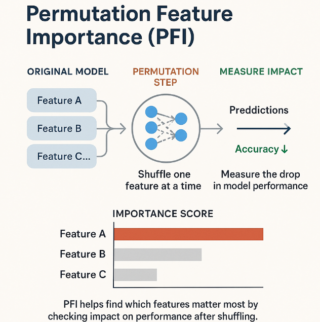
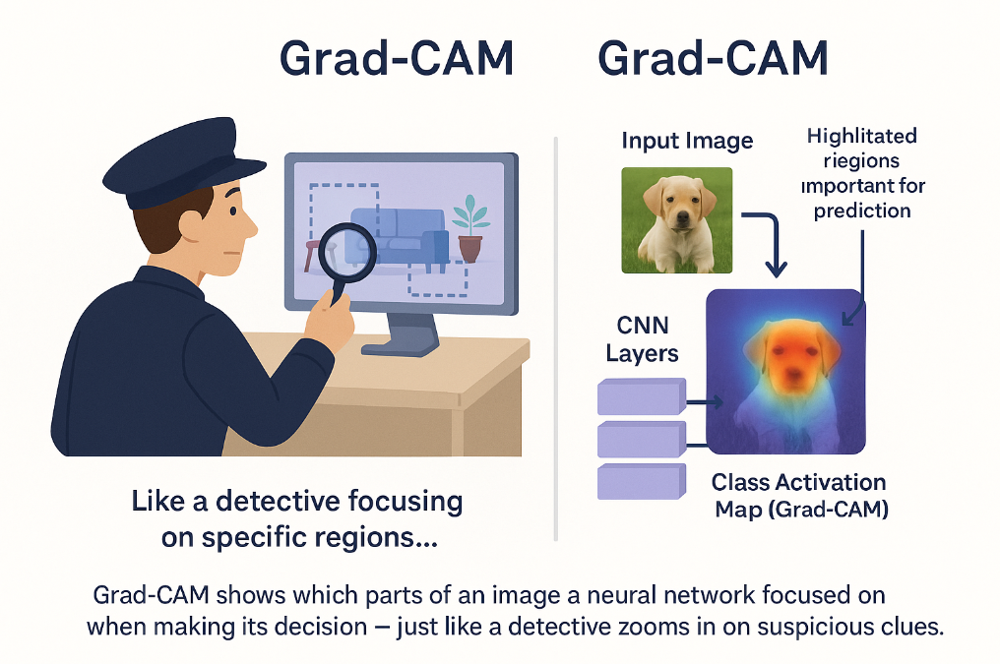

# 🧠 Day 42 – Model Explainability & Interpretability  
**#DailyMLDose** | Understanding How and Why ML Models Make Decisions

As machine learning models grow more complex, **understanding their decisions** becomes crucial. Interpretability helps **build trust**, ensure **fairness**, and **debug** models efficiently.

---

## 🔍 Overview  
Today we cover:

- 🧭 What is Model Interpretability?
- 🔍 SHAP (SHapley Additive Explanations)
- 🌟 LIME (Local Interpretable Model-agnostic Explanations)
- 📊 Feature Importance (Tree-based, Permutation)
- 🎨 Visual Explanations (e.g., Grad-CAM for CNNs)
- 🧪 Use Cases in Real World

---

## 🖼️ Visuals

### 1. SHAP Summary Plot  


---

### 2. LIME Explanation for a Prediction  


---

### 3. Permutation Feature Importance  


---

### 4. Grad-CAM for CNN Image Classification  


---

## 🧪 Code Highlights

### ✅ SHAP with XGBoost
```python
import shap
import xgboost as xgb
from sklearn.datasets import load_breast_cancer

X, y = load_breast_cancer(return_X_y=True)
model = xgb.XGBClassifier().fit(X, y)

explainer = shap.Explainer(model)
shap_values = explainer(X)
shap.summary_plot(shap_values, X)
```
✅ LIME for Tabular Model
```python
 
import lime
import lime.lime_tabular
from sklearn.ensemble import RandomForestClassifier
from sklearn.datasets import load_iris

iris = load_iris()
X, y = iris.data, iris.target
model = RandomForestClassifier().fit(X, y)

explainer = lime.lime_tabular.LimeTabularExplainer(X, feature_names=iris.feature_names, class_names=iris.target_names)
exp = explainer.explain_instance(X[0], model.predict_proba)
exp.show_in_notebook()
```
✅ Grad-CAM for CNNs
```python
 
from pytorch_grad_cam import GradCAM
from pytorch_grad_cam.utils.image import show_cam_on_image
from torchvision.models import resnet18
import torchvision.transforms as T
from PIL import Image

model = resnet18(pretrained=True)
target_layer = model.layer4[-1]

cam = GradCAM(model=model, target_layers=[target_layer])
img = Image.open("cat.jpg")
transform = T.Compose([T.Resize((224, 224)), T.ToTensor()])
input_tensor = transform(img).unsqueeze(0)

grayscale_cam = cam(input_tensor=input_tensor)[0]
visualization = show_cam_on_image(input_tensor.squeeze().permute(1, 2, 0).numpy(), grayscale_cam, use_rgb=True)
```
📁 Folder Structure
```css
 
📁 day42-model-interpretability/
├── code/
│   ├── shap_xgboost_explain.py
│   ├── lime_tabular_example.py
│   ├── permutation_feature_importance.py
│   ├── gradcam_cnn_example.py
│
├── images/
│   ├── shap_summary_plot.png
│   ├── lime_explanation.png
│   ├── permutation_importance.png
│   └── gradcam_example.png
└── README.md
```
🔗 Related Posts

🔗 Related Posts


---
⭐ Star the GitHub Repo
---
🔁 Share this if it helped!

🙌 Let’s Connect!
📎 Connect With Me
- 🔗 [Follow Shadabur Rahaman on LinkedIn](https://www.linkedin.com/in/shadabur-rahaman-1b5703249)
---

📚 References:

SHAP: https://github.com/slundberg/shap

LIME: https://github.com/marcotcr/lime

GradCAM: https://github.com/jacobgil/pytorch-grad-cam

Interpretable ML Book: https://christophm.github.io/interpretable-ml-book/

