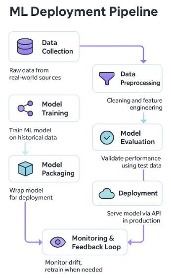
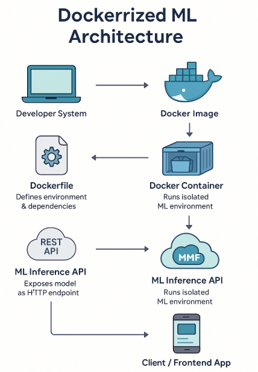
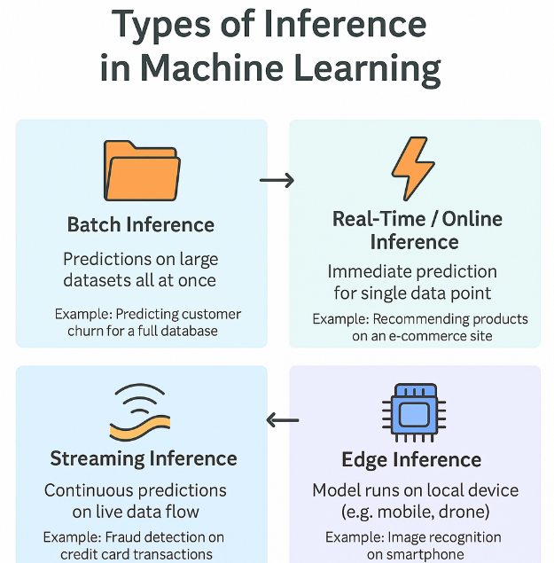
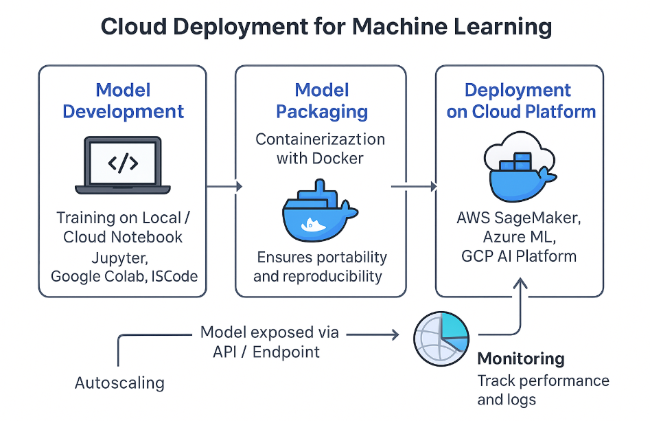

# 🚀 Day 43 – Model Deployment Strategies  
**#DailyMLDose** | Taking Machine Learning Models to Production

Deployment is where your models meet the real world. Whether it's powering recommendations, fraud detection, or voice assistants, deployment transforms static models into real-time value engines.  

---

## 🔍 Overview  
Today we explore:

- 🛠️ Model Deployment Basics  
- 🌐 Serving ML Models via APIs  
- 📦 Serialization Formats  
- 🐳 Docker & Containerization  
- ☁️ Cloud Deployment Options  
- 🔁 CI/CD for ML Projects  
- 🧠 Monitoring and Logging  
- 🧪 Testing Before Production

---

## 🖼️ Visuals

### 1. End-to-End ML Deployment Pipeline  


---

### 2. Dockerized ML Stack Architecture  


---

### 3. Real-time vs Batch Inference  


---

### 4. Cloud Deployment Options Comparison  


---

## 🧪 Code Highlights

### ✅ 1. Flask API for ML Model

```python
from flask import Flask, request, jsonify
import pickle

model = pickle.load(open('model.pkl', 'rb'))
app = Flask(__name__)

@app.route('/predict', methods=['POST'])
def predict():
    data = request.get_json()
    prediction = model.predict([data['features']])
    return jsonify({'prediction': prediction.tolist()})

if __name__ == '__main__':
    app.run(debug=True)
```
✅ 2. Dockerfile for Model Service
```dockerfile
 
FROM python:3.9-slim

WORKDIR /app

COPY requirements.txt .  
RUN pip install --no-cache-dir -r requirements.txt

COPY . .

CMD ["python", "app.py"]
```
✅ 3. Serialize Model with Joblib
```python
 
from sklearn.ensemble import RandomForestClassifier
import joblib

model = RandomForestClassifier()
model.fit(X_train, y_train)

joblib.dump(model, 'model.joblib')
✅ 4. Simple GitHub Action for CI
```yaml
 
name: ML Model CI

on: [push]

jobs:
  build:
    runs-on: ubuntu-latest
    steps:
    - uses: actions/checkout@v2
    - name: Set up Python
      uses: actions/setup-python@v2
      with:
        python-version: '3.9'
    - name: Install dependencies
      run: pip install -r requirements.txt
    - name: Run tests
      run: pytest
```
✅ 5. Monitoring Latency with Prometheus
```python
 
from prometheus_client import start_http_server, Summary

REQUEST_TIME = Summary('request_processing_seconds', 'Time spent processing request')

@app.route('/predict', methods=['POST'])
@REQUEST_TIME.time()
def predict():
```
📁 Folder Structure
```css
 
📁 day43-model-deployment/
├── code/
│   ├── flask_api.py
│   ├── dockerfile
│   ├── serialize_model.py
│   ├── github_actions_ci.yml
│   └── prometheus_monitoring.py
│
├── images/
│   ├── ml_deployment_pipeline.png
│   ├── docker_ml_architecture.png
│   ├── inference_types.png
│   └── cloud_deployment.png
└── README.md
```
🔗 Related Posts


⭐ Star the GitHub Repo if you're enjoying the #DailyMLDose series
🔁 Share to help fellow learners!
📎 Follow me on LinkedIn

📚 References
Google Cloud AI Platform

AWS SageMaker

FastAPI & Flask Docs

Docker Docs

MLflow, Prometheus

