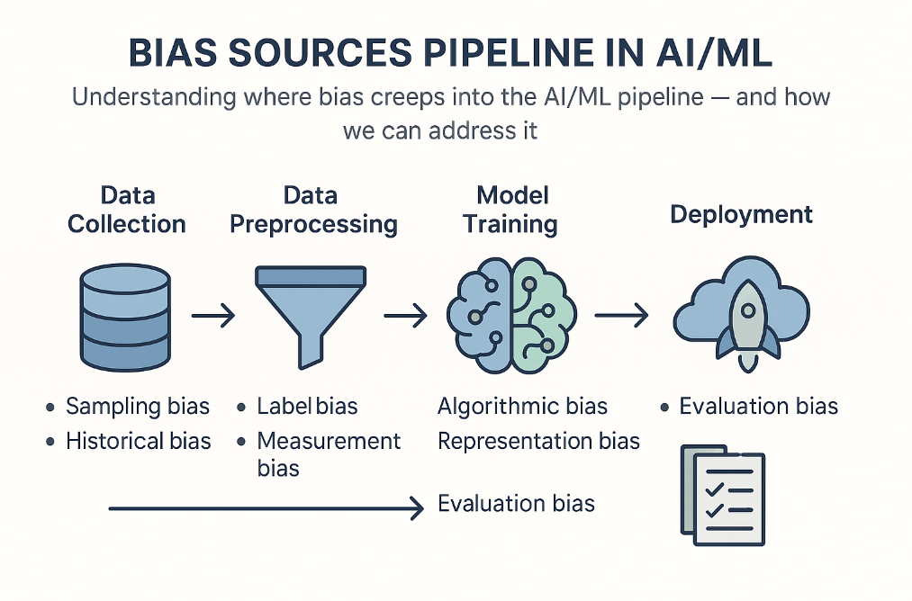
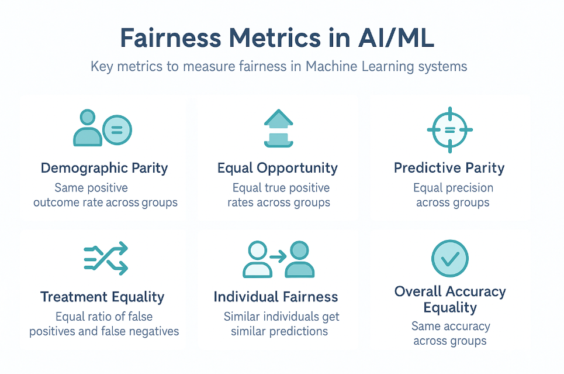
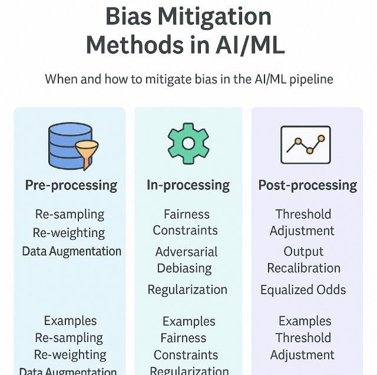
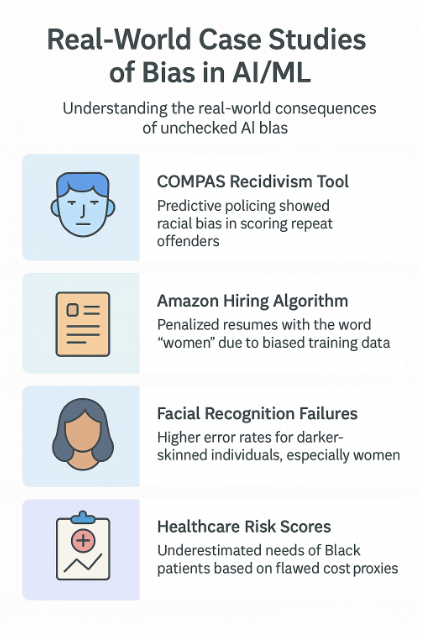

# 🚀 Day 44 – Fairness and Bias in Machine Learning  
**#DailyMLDose** | Ensuring Equity in AI Models

Machine learning models are powerful—but with power comes responsibility. Bias in data or algorithms can lead to unfair, even harmful, decisions. Today, we’ll explore how to detect, evaluate, and mitigate bias to build more trustworthy AI systems.

---

## 🔍 Overview  
Today we explore:

- 🧠 Understanding Bias in ML  
- ⚖️ Types of Bias (Label, Selection, Measurement)  
- 📊 Fairness Metrics  
- 🛠️ Bias Mitigation Techniques  
- 🧪 Testing Model Fairness  
- 🔎 Tools: AIF360, Fairlearn  
- 🌍 Ethical Implications of ML  
- 🔁 Post-deployment Monitoring

---

## 🖼️ Visuals

### 1. Sources of Bias in ML Pipeline  


---

### 2. Fairness Metrics Cheat Sheet  


---

### 3. Pre vs In vs Post Processing Techniques  


---

### 4. Real-world Case Studies of Bias  


---

## 🧪 Code Highlights

### ✅ 1. Check for Demographic Parity with Fairlearn

```python
from fairlearn.metrics import demographic_parity_difference
from sklearn.metrics import accuracy_score

dp_diff = demographic_parity_difference(y_true, y_pred, sensitive_features=gender)
print(f"Demographic Parity Difference: {dp_diff:.3f}")
```
✅ 2. Bias Mitigation using AIF360 Reweighing

```python
 
from aif360.algorithms.preprocessing import Reweighing
from aif360.datasets import BinaryLabelDataset

RW = Reweighing(unprivileged_groups, privileged_groups)
dataset_transf = RW.fit_transform(dataset_orig_train)
```
✅ 3. Serialize and Load Fair Model

```python
 
import joblib
joblib.dump(fair_model, 'fair_model.pkl')
model = joblib.load('fair_model.pkl')
```
✅ 4. GitHub Action for Fairness Testing

```yaml
 
name: Bias Check CI

on: [push]

jobs:
  test-bias:
    runs-on: ubuntu-latest
    steps:
    - uses: actions/checkout@v2
    - name: Set up Python
      uses: actions/setup-python@v2
      with:
        python-version: '3.9'
    - name: Install dependencies
      run: pip install -r requirements.txt
    - name: Check fairness metrics
      run: python test_fairness.py
```
✅ 5. Monitor Disparity Index via Prometheus

```python
 
from prometheus_client import Gauge

disparity_index = Gauge('disparity_index', 'Bias across demographic groups')
disparity_index.set(dp_diff)
```
📁 Folder Structure

```css
 
📁 day44-fairness-bias/
├── code/
│   ├── check_fairness.py
│   ├── mitigate_bias.py
│   ├── serialize_fair_model.py
│   ├── github_fairness_ci.yml
│   └── prometheus_fairness_monitor.py
│
├── images/
│   ├── bias_sources_pipeline.png
│   ├── fairness_metrics.png
│   ├── mitigation_methods.png
│   └── case_studies_bias.png
└── README.md
