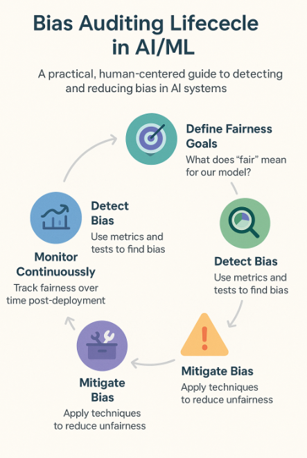
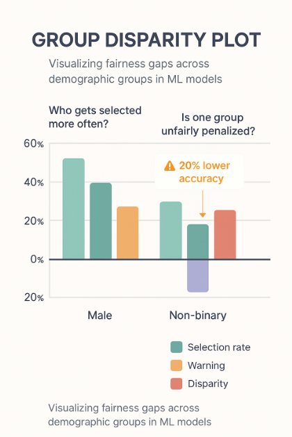
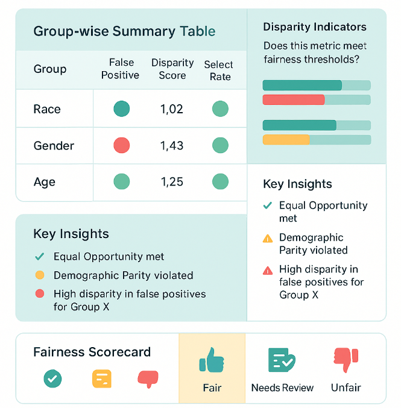

# 🚀 Day 45 – Bias Detection & Auditing in ML  
**#DailyMLDose** | Auditing AI Decisions Before They Go Live

Bias doesn't disappear just because a model was trained fairly. Regular auditing ensures models behave responsibly in real-world scenarios—across users, regions, and time.  

---

## 🔍 Overview  
Today we dive into:

- 🧠 Bias Auditing Strategies  
- 📊 Metrics for Group Fairness  
- 📉 Disparate Impact Analysis  
- 🔍 Fairness Dashboards  
- 🧰 Model Auditing Frameworks (Fairlearn, Aequitas, What-If Tool)  
- 🕵️ Auditing Real Models Before Deployment  
- 🔁 Continuous Fairness Monitoring

---

## 🖼️ Visuals

### 1. Bias Auditing Lifecycle  


---

### 2. Metrics Visualization Dashboard  


---

### 3. Group-wise Disparate Impact Chart  


---

### 4. Aequitas Auditing Output  


---

## 🧪 Code Highlights

### ✅ 1. Group Fairness Audit using Fairlearn Dashboard

```python
from fairlearn.widget import FairlearnDashboard

FairlearnDashboard(sensitive_features=gender, y_true=labels, y_pred=model_predictions)
```
✅ 2. Audit Report Generation with Aequitas

```python
 
from aequitas.group import Group

g = Group()
xtab, _ = g.get_crosstabs(df)
```
✅ 3. Generate Model Audit Summary

```python
 
import pandas as pd

report = pd.DataFrame({
    "Metric": ["Accuracy", "Demographic Parity", "Equal Opportunity"],
    "Score": [0.91, 0.07, 0.03]
})
print(report)
```
✅ 4. CI Job for Fairness Audits

```yaml
 
name: Fairness Audits CI

on: [push]

jobs:
  audit:
    runs-on: ubuntu-latest
    steps:
    - uses: actions/checkout@v2
    - name: Install deps
      run: pip install -r requirements.txt
    - name: Run bias audit
      run: python run_audit.py
```
✅ 5. Prometheus Export for Audit Metrics

```python
 
from prometheus_client import Gauge

dp_diff = Gauge('dp_diff', 'Demographic Parity Difference')
dp_diff.set(0.07)
```
📁 Folder Structure

```css
 
📁 day45-bias-auditing/
├── code/
│   ├── fairlearn_dashboard.py
│   ├── aequitas_audit.py
│   ├── audit_summary.py
│   ├── github_audit_ci.yml
│   └── prometheus_bias_export.py
│
├── images/
│   ├── bias_auditing_lifecycle.png
│   ├── fairness_dashboard_sample.png
│   ├── group_disparity_plot.png
│   └── aequitas_report.png
└── README.md
```
---

🔗 **Related Posts**  
- [Day 42 – Model Explainability](https://github.com/Shadabur-Rahaman/Daily-ML-Dose/tree/main/day42-model-interpretability)  
- [Day 43 – Model Deployment](https://github.com/Shadabur-Rahaman/Daily-ML-Dose/tree/main/day43-model-deployment)  
- [Day 44 – Fairness & Bias in ML](https://github.com/Shadabur-Rahaman/Daily-ML-Dose/tree/main/day44-fairness-bias)

---

⭐ Star the [GitHub Repo](https://github.com/Shadabur-Rahaman/Daily-ML-Dose) if you're enjoying the **#DailyMLDose** series  
🔁 Share to help fellow learners!  
🔗 [Follow Shadabur Rahaman on LinkedIn](https://www.linkedin.com/in/shadabur-rahaman-1b5703249)

---

📚 **References**  
- [Fairlearn](https://fairlearn.org/)  
- [Aequitas](https://github.com/dssg/aequitas)  
- [What-If Tool (Google)](https://pair-code.github.io/what-if-tool/)  
- [Responsible AI Resources – Microsoft](https://github.com/microsoft/responsible-ai-toolbox)  
- [Prometheus](https://prometheus.io/)
