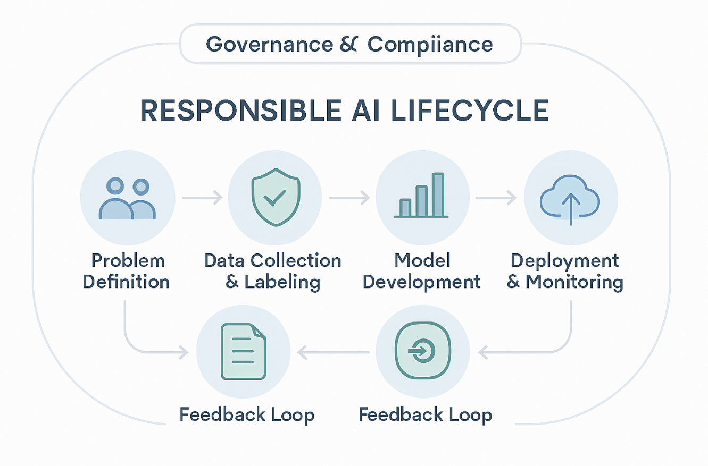
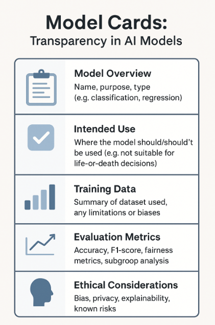
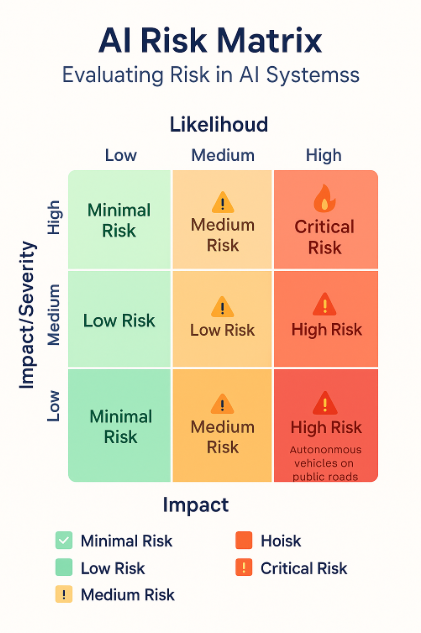
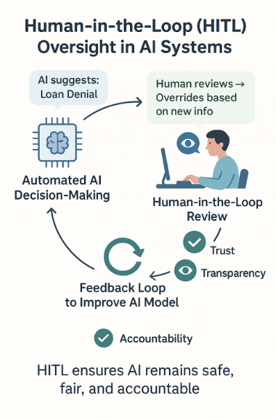

# 🚀 Day 46 – AI Governance & Accountability  
**#DailyMLDose** | Making Machine Learning Transparent, Responsible, and Traceable

As AI becomes embedded in society, governance ensures systems are not just accurate—but accountable.  
Today, we explore the principles, frameworks, and tools that drive ethical and responsible AI adoption.

---

## 🔍 Overview  
Today's highlights:

- 🧭 What is AI Governance?  
- ⚖️ Principles of Responsible AI (Transparency, Fairness, Reliability, Privacy)  
- 📋 Model Cards & Datasheets  
- 🕵️‍♀️ Auditability and Traceability  
- 🧠 Human-in-the-loop Systems  
- 📚 Regulatory Guidance (EU AI Act, NIST AI RMF, OECD)  
- 🔐 Risk Assessment & Red-Teaming for ML Models  

---

## 🖼️ Visuals

### 1. Responsible AI Lifecycle  


---

### 2. Model Documentation Templates (Model Cards)  


---

### 3. AI Risk Management Matrix  


---

### 4. Human-in-the-Loop Oversight Framework  


---

## 🧪 Code Highlights

### ✅ 1. Model Card Generator Template (JSON-based)

```json
{
  "model_details": {
    "name": "Loan Default Classifier",
    "version": "v2.1",
    "intended_use": "Loan approval screening",
    "ethical_considerations": "Avoid discriminatory bias"
  }
}
```
✅ 2. Model Audit Log Tracker

```python
 
import logging

logging.basicConfig(filename='model_audit.log', level=logging.INFO)
logging.info("Model X triggered with threshold=0.85 by user ID=3321")
```
✅ 3. Risk Scoring Function for ML Model

```python
 
def assess_risk(data_sensitivity, model_opacity, deployment_scale):
    score = data_sensitivity * 0.5 + model_opacity * 0.3 + deployment_scale * 0.2
    return "HIGH" if score > 0.7 else "MEDIUM" if score > 0.4 else "LOW"
```
✅ 4. CI Rule for Governance Checks

```yaml
 
name: Governance Audit

on: [push]

jobs:
  check-governance:
    runs-on: ubuntu-latest
    steps:
    - name: Validate Model Metadata
      run: python check_model_card.py
```
✅ 5. Trackable Prediction Explanation Output

```python
 
from lime.lime_tabular import LimeTabularExplainer
explainer = LimeTabularExplainer(X_train, feature_names=features)
explanation = explainer.explain_instance(X_test[0], model.predict_proba)
explanation.save_to_file('lime_explanation.html')
```
📁 Folder Structure

```css
 
📁 day46-governance-accountability/
├── code/
│   ├── model_card.json
│   ├── audit_logger.py
│   ├── risk_assessment.py
│   ├── ci_governance_check.yml
│   └── lime_explainer.py
│
├── images/
│   ├── responsible_ai_lifecycle.png
│   ├── model_cards.png
│   ├── ai_risk_matrix.png
│   └── hitl_oversight.png
└── README.md
```
🔗 **Related Posts**  
- [Day 42 – Model Explainability](https://github.com/Shadabur-Rahaman/Daily-ML-Dose/tree/main/day42-model-interpretability)  
- [Day 43 – Model Deployment](https://github.com/Shadabur-Rahaman/Daily-ML-Dose/tree/main/day43-model-deployment)  
- [Day 44 – Fairness & Bias in ML](https://github.com/Shadabur-Rahaman/Daily-ML-Dose/tree/main/day44-fairness-bias)

---

⭐ Star the [GitHub Repo](https://github.com/Shadabur-Rahaman/Daily-ML-Dose) if you're enjoying the **#DailyMLDose** series  
🔁 Share to help fellow learners!  
🔗 [Follow Shadabur Rahaman on LinkedIn](https://www.linkedin.com/in/shadabur-rahaman-1b5703249)

---

📚 **References**  
- [Fairlearn](https://fairlearn.org/)  
- [Aequitas](https://github.com/dssg/aequitas)  
- [What-If Tool (Google)](https://pair-code.github.io/what-if-tool/)  
- [Responsible AI Toolbox – Microsoft](https://github.com/microsoft/responsible-ai-toolbox)  
- [Prometheus](https://prometheus.io/)
