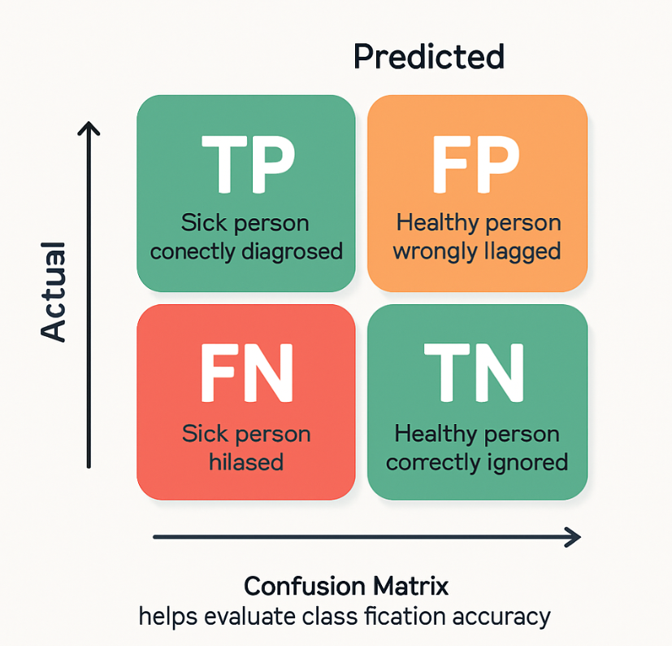
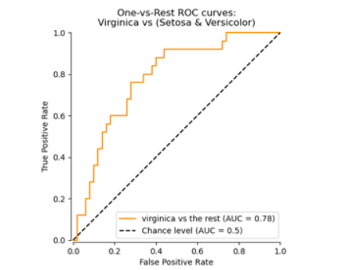
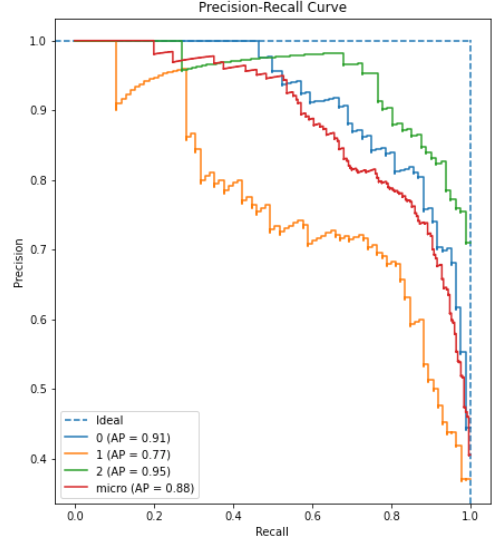

# 📅 Day 47 – Model Testing & Validation

Understanding your model’s performance goes far beyond accuracy. Today’s focus is on testing and validating ML models to ensure they generalize well and behave reliably in production.

---

## 📌 What You’ll Learn

🔹 Train-Test-Validation Splits  
🔹 K-Fold and Stratified Cross-Validation  
🔹 Precision, Recall, F1-Score, and Confusion Matrix  
🔹 ROC & AUC Curve vs Precision-Recall Curve  
🔹 Bias-Variance Tradeoff  
🔹 Drift Detection Techniques  
🔹 Validating models in real-world deployment

---

## 🧠 Why It Matters

Just like buggy code, unchecked ML models can fail silently. Robust validation protects against overfitting, identifies bias, and ensures long-term performance across changing data.

---

## 🔍 Visuals

### 📊 Confusion Matrix


### 🧪 ROC-AUC Curve


### 📈 Precision-Recall Curve


### ⚖️ Bias-Variance Tradeoff


---

## 📂 Folder Structure
```css
📁 day47-model-testing-validation/  
├── code/  
│   ├── train_test_split_demo.py  
│   ├── cross_validation.py  
│   ├── evaluation_metrics.py  
│   ├── drift_detection.py  
│   └── model_validation_utils.py  
│  
├── images/  
│   ├── confusion_matrix.png  
│   ├── roc_auc_curve.png  
│   ├── precision_recall_curve.png  
│   └── bias_variance_tradeoff.png  
└── README.md
```
---

🔗 **Related Posts**
- [Day 42 – Model Explainability](https://github.com/Shadabur-Rahaman/Daily-ML-Dose/tree/main/day42-model-interpretability)  
- [Day 43 – Model Deployment](https://github.com/Shadabur-Rahaman/Daily-ML-Dose/tree/main/day43-model-deployment)  
- [Day 44 – Fairness & Bias in ML](https://github.com/Shadabur-Rahaman/Daily-ML-Dose/tree/main/day44-fairness-bias)  
- [Day 45 – Causal Inference](https://github.com/Shadabur-Rahaman/Daily-ML-Dose/tree/main/day45-causal-inference)  
- [Day 46 – Governance & Accountability](https://github.com/Shadabur-Rahaman/Daily-ML-Dose/tree/main/day46-governance-accountability)

---

⭐ Star the [GitHub Repo](https://github.com/Shadabur-Rahaman/Daily-ML-Dose) if you're enjoying the **#DailyMLDose** series  
🔁 Share to help fellow learners!  
🔗 [Follow Shadabur Rahaman on LinkedIn](https://www.linkedin.com/in/shadabur-rahaman-1b5703249)

---

📚 **References**  
- [Fairlearn](https://fairlearn.org/)  
- [Aequitas](https://github.com/dssg/aequitas)  
- [What-If Tool (Google)](https://pair-code.github.io/what-if-tool/)  
- [Responsible AI Toolbox – Microsoft](https://github.com/microsoft/responsible-ai-toolbox)  
- [Prometheus](https://prometheus.io/)
