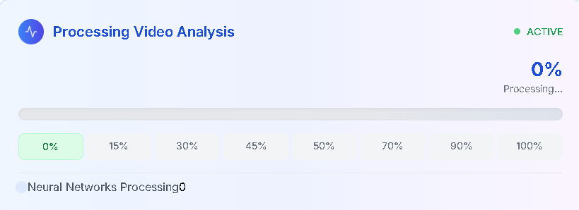

# 📘 Day 48 – Data & Model Documentation

In the world of Responsible AI, **documentation is critical** for ensuring fairness, transparency, and reproducibility. This module explores techniques and templates like **Data Sheets**, **Model Cards**, and **AI FactSheets**, and introduces ways to automate their creation.

---

## 🔍 Topics Covered

- 📄 Data Sheets for Datasets  
- 📋 Model Cards for ML Models  
- 🧾 AI FactSheets for AI Services  
- 🧠 Automation Tools for Documentation  
- 🔁 Documentation Lifecycle

---

## 🧠 Key Concepts

| 📌 Concept          | Purpose                                                                 |
|---------------------|-------------------------------------------------------------------------|
| **Data Sheets**     | Documents dataset motivation, composition, collection, and usage risks |
| **Model Cards**     | Describes model details, performance, fairness metrics, limitations    |
| **AI FactSheets**   | High-level audit-style transparency reports                             |
| **Automation**      | Scripts/templates for rapid and consistent documentation               |

---

## 🗂️ Folder Structure
```css
📁 day48-data-model-documentation/
├── code/
│ ├── generate_model_card.py
│ ├── data_sheet_template.md
│ ├── docs_generator_utils.py
│ └── example_factsheet.md
├── images/
│ ├── model_card_dashboard.png
│ ├── data_sheet_components.png
│ ├── factsheet_audit_layout.png
│ └── documentation_lifecycle.png
└── README.md
```

---

## 🧩 Visual Aids

### 📋 Model Card Dashboard  


### 📄 Data Sheet Components  


### 🧾 FactSheet Layout  


### 🔁 Documentation Lifecycle  


---

## 🧪 Python Scripts

### 🔧 `generate_model_card.py`

```python
import json

def generate_model_card(metadata):
    with open("model_card.md", "w") as f:
        f.write(f"# Model Card: {metadata['name']}\n\n")
        f.write(f"## Overview\n{metadata['overview']}\n\n")
        f.write("## Performance\n")
        for metric, value in metadata["metrics"].items():
            f.write(f"- **{metric}**: {value}\n")
        f.write("\n## Limitations\n")
        f.write(metadata["limitations"])

# Sample usage
if __name__ == "__main__":
    with open("model_metadata.json") as meta_file:
        metadata = json.load(meta_file)
    generate_model_card(metadata)
```
📝 data_sheet_template.md
```markdown
 
# 📄 Data Sheet for Dataset: [Dataset Name]

## Motivation
- Purpose of dataset creation
- Who funded or created it?

## Composition
- Number of instances and features
- Any sensitive attributes?

## Collection Process
- Methodology
- Consent and privacy considerations

## Recommended Uses
- Suitable tasks and applications

## Ethical Considerations
- Bias or fairness issues

## Licensing
- Usage rights and terms
```
🛠️ docs_generator_utils.py
```python
 
def load_metadata(path):
    import json
    with open(path, "r") as f:
        return json.load(f)

def format_metrics(metrics_dict):
    return "\n".join([f"- **{k}**: {v}" for k, v in metrics_dict.items()])
```
🧾 example_factsheet.md
```markdown
 
# AI FactSheet: Fraud Detection API

## Purpose
Prevent fraudulent transactions in real-time.

## Model Details
- Algorithm: XGBoost
- Training Data: Enriched financial logs
- Accuracy: 96.5%
- Precision: 94.8%

## Governance
- Risk Rating: Medium
- Mitigation Plan: Human-in-loop review for critical decisions

## Contact
Shadabur Rahaman – AI Product Owner
```

🔗 **Related Posts**
- [Day 45 – Human-in-the-Loop Systems](https://github.com/Shadabur-Rahaman/Daily-ML-Dose/tree/main/day45-human-in-the-loop)
- [Day 46 – Governance & Accountability](https://github.com/Shadabur-Rahaman/Daily-ML-Dose/tree/main/day46-governance-accountability)
- [Day 47 – Model Validation](https://github.com/Shadabur-Rahaman/Daily-ML-Dose/tree/main/day47-model-validation)

---

⭐ Star the [GitHub Repo](https://github.com/Shadabur-Rahaman/Daily-ML-Dose) if you're enjoying the **#DailyMLDose** series  
🔁 Share to help fellow learners!  
🔗 [Follow Shadabur Rahaman on LinkedIn](https://www.linkedin.com/in/shadabur-rahaman-1b5703249)

---

📚 **References**
- [Model Cards for Model Reporting – Google](https://arxiv.org/abs/1810.03993)
- [Data Sheets for Datasets – Gebru et al.](https://arxiv.org/abs/1803.09010)
- [IBM AI FactSheets 360](https://aifs360.mybluemix.net/)
- [ML Documentation Practices – Papers with Code](https://paperswithcode.com/about)
- [Responsible AI Toolbox – Microsoft](https://github.com/microsoft/responsible-ai-toolbox)
