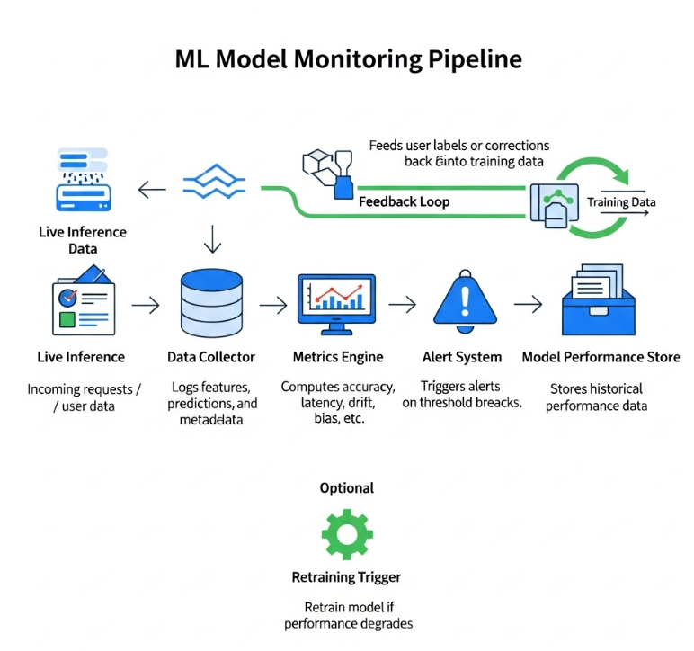
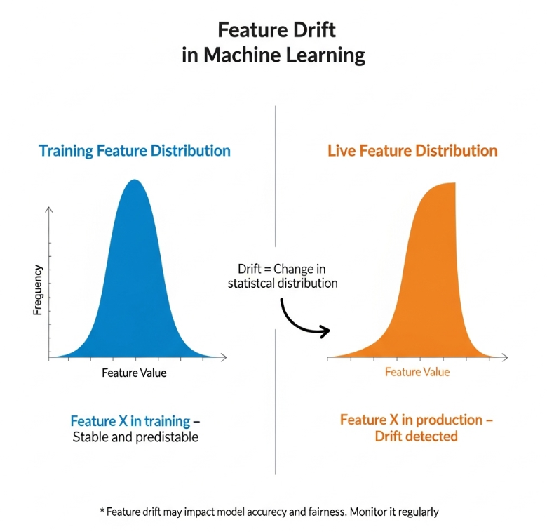
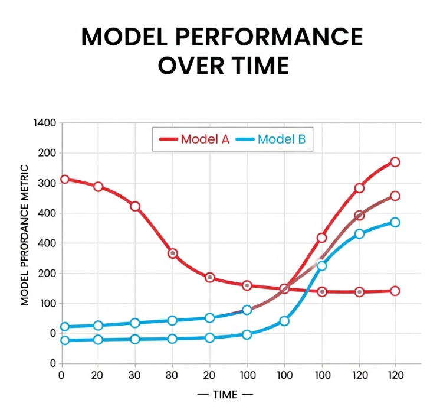
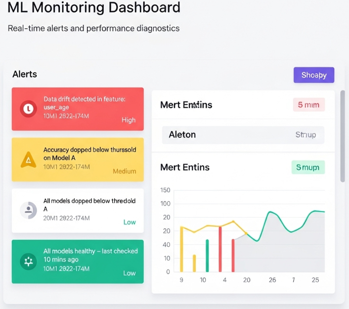

# 🧰 Day 49 – Continuous Monitoring in ML  
**#DailyMLDose** | Keeping Your Models Healthy in Production

Once deployed, ML models face changing data, shifting patterns, and potential bias creep. Continuous monitoring ensures your models stay accurate, reliable, and fair over time.  

---

## 🔍 Overview  
Today we cover:

- 📊 Tracking model performance degradation (accuracy, precision, recall, latency)  
- 🔁 Detecting data drift in input features  
- 🔄 Spotting concept drift between features and targets  
- ⚖️ Monitoring fairness metrics over time  
- 🚨 Building alerts & dashboards for real-time insights  

---

## 🖼️ Visuals

### 1. Monitoring Pipeline Lifecycle  


---

### 2. Feature Distribution Drift Plot  


---

### 3. Performance Over Time Chart  


---

### 4. Alert Dashboard Mockup  


---

## 🧪 Code Highlights

### ✅ Concept Drift Detection
```python
from sklearn.metrics import accuracy_score

def detect_concept_drift(y_old, y_pred_old, y_new, y_pred_new, threshold=0.1):
    acc_old = accuracy_score(y_old, y_pred_old)
    acc_new = accuracy_score(y_new, y_pred_new)
    if abs(acc_new - acc_old) > threshold:
        print("⚠️ Concept drift detected!")
```
✅ Data Drift Alerting

```python
 
from scipy.stats import ks_2samp

def detect_data_drift(baseline, live):
    stat, p_value = ks_2samp(baseline, live)
    if p_value < 0.05:
        print("⚠️ Data drift detected (p < 0.05)")
```
✅ Performance Logging

```python
 
import logging
from sklearn.metrics import precision_score, recall_score

logging.basicConfig(level=logging.INFO)
def log_performance(y_true, y_pred):
    logging.info(f"Precision: {precision_score(y_true, y_pred):.2f}")
    logging.info(f"Recall:    {recall_score(y_true, y_pred):.2f}")
```
✅ Real-Time Dashboard Launch

```bash
 
streamlit run realtime_monitor_dashboard.py
```
📁 Folder Structure
```css
 
day49-continuous-monitoring/
├── code/
│   ├── concept_drift_monitor.py
│   ├── data_drift_alerting.py
│   ├── model_performance_tracker.py
│   ├── realtime_monitor_dashboard.py
│   └── utils_monitoring.py
├── images/
│   ├── monitoring_pipeline.png
│   ├── feature_drift.png
│   ├── performance_over_time.png
│   └── alert_dashboard.png
└── README.md
```
---

🔗 **Related Posts**
- [Day 45 – Human-in-the-Loop Systems](https://github.com/Shadabur-Rahaman/Daily-ML-Dose/tree/main/day45-human-in-the-loop)  
- [Day 46 – Governance & Accountability](https://github.com/Shadabur-Rahaman/Daily-ML-Dose/tree/main/day46-governance-accountability)  
- [Day 47 – Model Validation](https://github.com/Shadabur-Rahaman/Daily-ML-Dose/tree/main/day47-model-validation)  
- [Day 48 – Data & Model Documentation](https://github.com/Shadabur-Rahaman/Daily-ML-Dose/tree/main/day48-data-model-documentation)

---

⭐ Star the [GitHub Repo](https://github.com/Shadabur-Rahaman/Daily-ML-Dose) if you're enjoying the **#DailyMLDose** series  
🔁 Share this if it helped!

🙌 Let’s Connect!  
📎 Connect With Me  
🔗 [Follow Shadabur Rahaman on LinkedIn](https://www.linkedin.com/in/shadabur-rahaman-1b5703249)

---

📚 **References**
- [Evidently AI – Monitoring Tools](https://evidentlyai.com/)  
- [NannyML – Post-deployment Drift Detection](https://www.nannyml.com/)  
- [River ML – Online Learning & Monitoring](https://riverml.xyz/)  
- [Prometheus – Metrics & Alerting](https://prometheus.io/)  
- [Grafana – Visualization Dashboards](https://grafana.com/)
