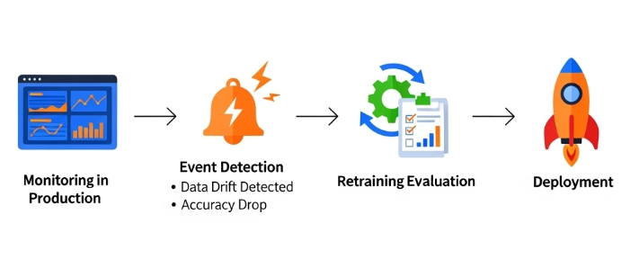
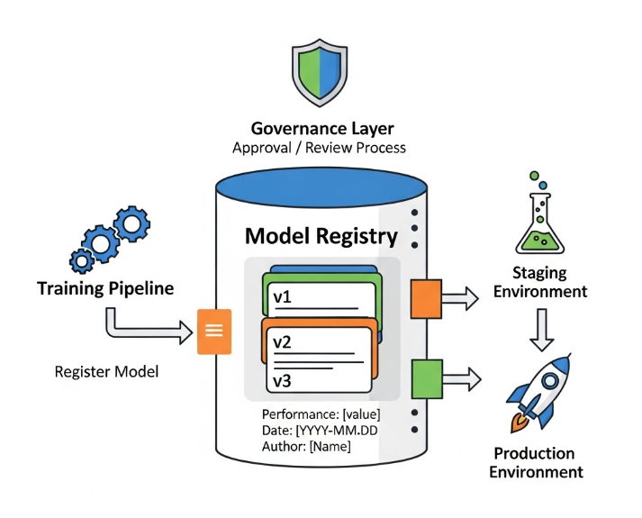
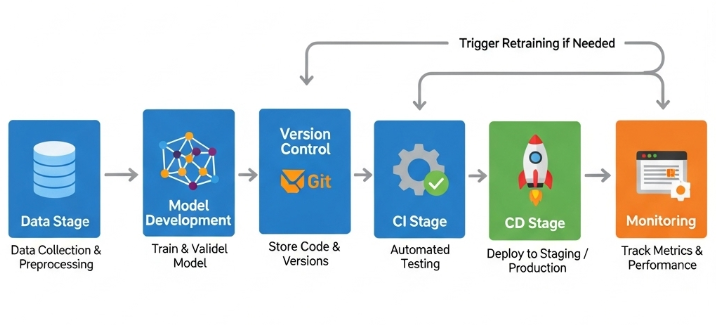

# 🔄 Day 50 – Automated Model Retraining  
> Building self-improving ML systems with scheduled & event-based retraining.  
📅 #DailyMLDose

---

## 📌 Overview

Once deployed, ML models start losing accuracy over time due to **data drift** and **concept drift**.  
Automated retraining ensures models stay relevant by regularly updating them with fresh data.  
In this session, we explore:
- When and why to retrain a model
- Scheduled vs. event-triggered retraining
- Retraining pipelines with CI/CD
- Tools like Airflow, MLflow, and Kubeflow Pipelines

---

## 🎯 Key Concepts

| Concept                         | Description |
|---------------------------------|-------------|
| **Retraining Triggers**         | Scheduled (e.g., weekly) or event-driven (e.g., drift threshold crossed) |
| **Data Versioning**             | Storing snapshots of datasets for reproducibility |
| **Pipeline Orchestration**      | Automating retraining workflows with Airflow or Kubeflow |
| **Model Registry**              | Tracking versions of models using MLflow or SageMaker Registry |
| **Validation Gates**            | Ensuring retrained models pass accuracy thresholds before deployment |
| **Canary Deployment**           | Deploying new models to a subset of users for testing |
| **Rollback Mechanism**          | Reverting to previous stable versions if retraining fails |

---

## 🧠 Visual Explanations

### 🗓️ 1. Retraining Pipeline Flow  


---

### 🔔 2. Event-Triggered Retraining  


---

### 📦 3. Model Registry & Versioning  


---

### 🚀 4. CI/CD for ML Models  


---

## 📁 Folder Structure
```css
day50-automated-retraining/
├── code/
│   ├── retrain_pipeline.py
│   ├── event_trigger.py
│   ├── model_versioning.py
│   ├── validation_gate.py
│   └── deployment_handler.py
│
├── images/
│   ├── retraining_pipeline.png
│   ├── event_trigger_retraining.png
│   ├── model_registry.png
│   └── ml_cicd.png
└── README.md
```
File Description
retrain_pipeline.py Builds and runs full retraining process
event_trigger.py Listens for drift metrics and triggers retraining
model_versioning.py Handles dataset and model versioning
validation_gate.py Tests model performance before deployment
deployment_handler.py Manages deployment and rollback logic

🧪 Sample Snippet

```python
from datetime import datetime
from airflow import DAG
from airflow.operators.python import PythonOperator
from retrain_pipeline import run_retraining

with DAG('model_retraining', start_date=datetime(2025, 8, 1), schedule_interval='@weekly') as dag:
    retrain_task = PythonOperator(
        task_id='retrain_model',
        python_callable=run_retraining
    )
```
---

🔗 **Related Posts**
- [Day 47 – Model Drift Detection](https://github.com/Shadabur-Rahaman/Daily-ML-Dose/tree/main/day47-model-drift-detection)
- [Day 48 – Data Drift Monitoring](https://github.com/Shadabur-Rahaman/Daily-ML-Dose/tree/main/day48-data-drift-monitoring)
- [Day 49 – ML Monitoring & Alerting](https://github.com/Shadabur-Rahaman/Daily-ML-Dose/tree/main/day49-ml-monitoring-alerting)

---

📚 **References**
- [Apache Airflow](https://airflow.apache.org/)
- [MLflow Model Registry](https://mlflow.org/docs/latest/model-registry.html)
- [Kubeflow Pipelines](https://www.kubeflow.org/docs/components/pipelines/)
- [AWS SageMaker Model Monitor](https://docs.aws.amazon.com/sagemaker/latest/dg/model-monitor.html)

---

⭐ Star the [GitHub Repo](https://github.com/Shadabur-Rahaman/Daily-ML-Dose) if you're enjoying the **#DailyMLDose** series  
🔁 Share to help fellow learners!  
🔗 [Follow Shadabur Rahaman on LinkedIn](https://www.linkedin.com/in/shadabur-rahaman-1b5703249)

---
